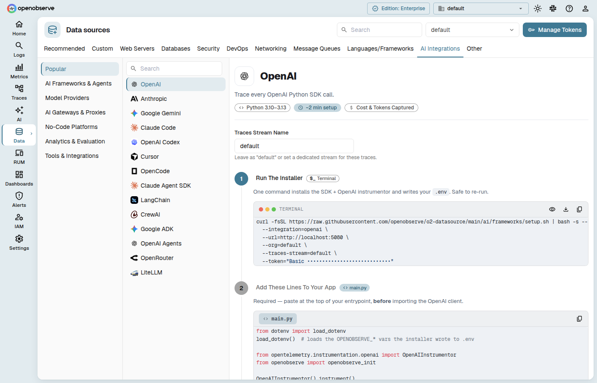

# AI & LLM Observability Integrations

OpenObserve provides comprehensive observability for AI and LLM applications, collecting traces, metrics, and logs from AI frameworks, LLM providers, gateways, no-code tools, and AI developer utilities. Monitor token usage, latency, agent runs, and model behavior across your entire AI stack.

These integrations use OpenTelemetry to send traces and metrics to OpenObserve, giving you a unified view of your AI application performance, cost, and reliability.

## AI Integration Categories

- [Frameworks](frameworks/index.md): Instrument AI orchestration and agent frameworks (LangChain, CrewAI, LlamaIndex, AutoGen, and more)
- [Providers](providers/index.md): Trace LLM provider calls (OpenAI, Anthropic, Google Gemini, Mistral, Ollama, and more)
- [Gateways](gateways/index.md): Monitor AI gateway traffic (Portkey, LiteLLM Proxy, OpenRouter, Kong AI Gateway, and more)
- [No-Code Tools](no-code/index.md): Observe no-code and low-code AI platforms (n8n, Flowise, LangFlow, OpenWebUI, and more)
- [Tools](tools/index.md): Integrate AI developer tools and utilities (Promptfoo, Milvus, Firecrawl, PostHog, and more)
- [Model Context Protocol (MCP)](mcp/index.md): Connect AI agents and IDEs to OpenObserve for natural-language observability queries

## Using the AI Data Sources Tab

The AI Data Sources tab in OpenObserve provides a guided setup experience for each AI integration. Instead of a generic code snippet, each integration now has a rich, content-driven card that walks you through installation, paste the instrumentation into your app, and verifying that telemetry is flowing.

### Category Tabs and the Popular Section

The left sidebar organizes integrations into **category tabs** (Frameworks, Model Providers, Gateways, Tools, and more). A **Popular** tab surfaces the most commonly used integrations first. Tab content and ordering are driven by a content manifest, so new integrations appear automatically without a UI update.

Each integration entry shows a **provider logo** in the sidebar. If a logo image is not available, a lettered monogram tile is displayed instead.

### Rich Setup Cards

When you select an integration that has rich content, the detail panel displays a stepped setup card:

1. **Install** — a copyable terminal command that installs the instrumentation package for your provider or framework
2. **Paste into your app** — a code snippet you add to your application to initialize tracing
3. **Test** — a live span-detection check that confirms telemetry is arriving in OpenObserve

Each code block includes a **Copy** button that copies the raw command (with real values), and optional **Reveal/Hide** toggle when sensitive tokens are pre-filled. A **Download .env** button is available on install steps that set environment variables.

### Reading Standard Markdown Cards

For integrations without the rich stepped wizard, the detail panel renders a standard markdown-based card. The card is parsed from the integration's content and includes a header with a display name, category badge, and a documentation link. Sections are presented top-to-bottom with syntax-highlighted code blocks.

### Span Detection

The **Test** button on rich cards runs a live check against your OpenObserve instance to verify that spans (or logs) are flowing from your app:

1. **Stream existence check** — confirms the target stream has been created (streams are created when the first telemetry arrives)
2. **Count query** — runs a SQL `COUNT` over a recent time window, filtering by the provider's identifying attribute

The status bar shows one of four states:

- **Not Tested Yet** — run your app and click Test
- **Checking for spans…** — the query is in progress
- **Connected — Traces Are Flowing** — spans detected; click **View Logs** or **View Traces** to explore the data
- **No Spans Found Yet** — the stream exists but contains no matching spans; a **Most Likely Fix** panel suggests re-ordering instrumentation code

### Stream Name Configuration

Some integrations show a **Stream Name** input field before the steps. The value you enter flows into both the install commands (replacing `{stream}`) and the live detection check, keeping the stream the installer writes to and the stream the card monitors in sync.

## Additional Guides

- [LLM Applications](llm-applications.md): General guide for instrumenting LLM-powered applications
- [Claude Code Tracing](claude-code-tracing.md): Trace Claude Code CLI sessions with OpenObserve
