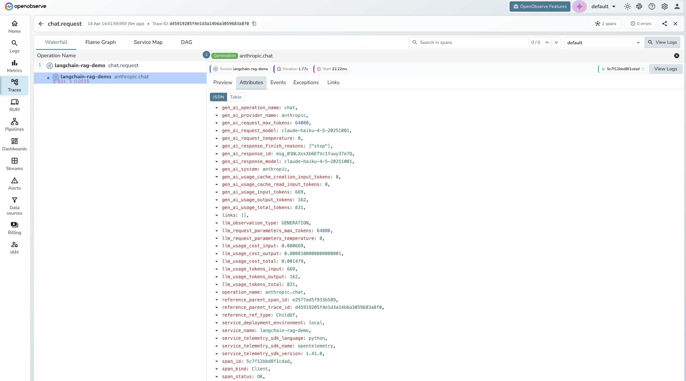

# Langfuse LLM Observability with OpenObserve

Use Langfuse to instrument your LLM applications and send trace data to OpenObserve for unified observability across your AI workloads and infrastructure.

## What is Langfuse?

[Langfuse](https://langfuse.com) is an open-source LLM engineering platform that provides tracing, evaluation, and prompt management for AI applications. It captures every LLM call (including model parameters, token usage, cost, latency, and multi-turn session context) and structures it as OpenTelemetry traces.

Because Langfuse is built natively on OpenTelemetry, its trace data can be sent to **any OTLP-compatible backend**, including OpenObserve.

## How the Integration Works

Langfuse's SDK configures an OpenTelemetry tracer provider under the hood. You point the OTLP exporter at OpenObserve's OTLP/HTTP endpoint, and every LLM call your app makes is captured as a span and shipped to OpenObserve automatically.


You can send to both simultaneously: Langfuse handles its own ingestion, and the OTel exporter sends the same spans to OpenObserve.

## Prerequisites

- Python 3.8+ **or** Node.js 18+
- An [OpenObserve](https://openobserve.ai/) account (cloud or self-hosted)
- A [Langfuse](https://langfuse.com/) account (cloud or self-hosted)
- Your OpenObserve **organisation ID** and **Base64-encoded auth token**
- Your Langfuse **public key** and **secret key**


## Setup

??? "Step 1: Install dependencies"

    **Python**

    ```bash
    pip install langfuse opentelemetry-sdk opentelemetry-exporter-otlp-proto-http
    ```

    **Node.js / TypeScript**

    ```bash
    npm install langfuse @opentelemetry/sdk-node @opentelemetry/exporter-trace-otlp-http
    ```

??? "Step 2: Generate your OpenObserve auth token"

    OpenObserve uses HTTP Basic Auth encoded as Base64. Run the following command with your OpenObserve email and password:

    ```bash
    echo -n "your-email@example.com:your-password" | base64
    ```

    The output is your `<base64_token>`. You will use it as `Basic <base64_token>` in the auth header below.

    For **OpenObserve Cloud**, the OTLP endpoint is:

    ```
    https://api.openobserve.ai/api/<your-org-id>/traces
    ```

    For **self-hosted OpenObserve** (default port 5080):

    ```
    http://localhost:5080/api/<your-org-id>/traces
    ```

??? "Step 3: Configure environment variables"

    Create a `.env` file in your project root:

    ```bash
    # Langfuse credentials
    LANGFUSE_PUBLIC_KEY=pk-lf-...
    LANGFUSE_SECRET_KEY=sk-lf-...
    LANGFUSE_HOST=https://cloud.langfuse.com   # or your self-hosted URL

    # OpenObserve OTLP endpoint
    OTEL_EXPORTER_OTLP_ENDPOINT=https://api.openobserve.ai/api/<your-org-id>/traces
    OTEL_EXPORTER_OTLP_HEADERS=Authorization=Basic <your-base64-token>

    # OpenAI / Anthropic API keys (if using these providers)
    OPENAI_API_KEY=sk-...
    ANTHROPIC_API_KEY=sk-ant-...
    ```

    | Variable | Description | Required |
    |---|---|---|
    | `LANGFUSE_PUBLIC_KEY` | Langfuse project public key | Yes |
    | `LANGFUSE_SECRET_KEY` | Langfuse project secret key | Yes |
    | `LANGFUSE_HOST` | Langfuse instance URL | Yes |
    | `OTEL_EXPORTER_OTLP_ENDPOINT` | OpenObserve OTLP/HTTP traces URL | Yes |
    | `OTEL_EXPORTER_OTLP_HEADERS` | Basic auth header for OpenObserve | Yes |

??? "Step 4: Instrument your Python application"

    Initialize Langfuse with OpenTelemetry and configure the OTLP exporter to point at OpenObserve.

    ```python
    import os
    from dotenv import load_dotenv
    from langfuse import Langfuse
    from langfuse.openai import openai  # drop-in replacement for openai client

    from opentelemetry import trace
    from opentelemetry.sdk.trace import TracerProvider
    from opentelemetry.sdk.trace.export import BatchSpanProcessor
    from opentelemetry.exporter.otlp.proto.http.trace_exporter import OTLPSpanExporter

    load_dotenv()

    # Configure OTLP exporter → OpenObserve
    otlp_exporter = OTLPSpanExporter(
        endpoint=os.environ["OTEL_EXPORTER_OTLP_ENDPOINT"],
        headers={"Authorization": os.environ["OTEL_EXPORTER_OTLP_HEADERS"].split("=", 1)[1]},
    )

    provider = TracerProvider()
    provider.add_span_processor(BatchSpanProcessor(otlp_exporter))
    trace.set_tracer_provider(provider)

    # Initialize Langfuse (handles its own ingestion separately)
    langfuse = Langfuse()

    # Use Langfuse's drop-in OpenAI client; traces captured automatically
    response = openai.chat.completions.create(
        model="gpt-4o",
        messages=[{"role": "user", "content": "Explain distributed tracing in one sentence."}],
    )

    print(response.choices[0].message.content)
    langfuse.flush()
    ```

    Every call to `openai.chat.completions.create` is now captured as an OpenTelemetry span and exported to both Langfuse and OpenObserve.

??? "Step 5: Instrument your Node.js / TypeScript application"

    ```typescript
    import * as dotenv from "dotenv";
    dotenv.config();

    import { NodeSDK } from "@opentelemetry/sdk-node";
    import { OTLPTraceExporter } from "@opentelemetry/exporter-trace-otlp-http";
    import { BatchSpanProcessor } from "@opentelemetry/sdk-trace-base";
    import OpenAI from "openai";
    import { observeOpenAI } from "langfuse";

    // Configure OTLP exporter → OpenObserve
    const otlpExporter = new OTLPTraceExporter({
      url: process.env.OTEL_EXPORTER_OTLP_ENDPOINT,
      headers: {
        Authorization: process.env.OTEL_EXPORTER_OTLP_HEADERS?.split("=").slice(1).join("="),
      },
    });

    const sdk = new NodeSDK({
      spanProcessor: new BatchSpanProcessor(otlpExporter),
    });
    sdk.start();

    // Wrap the OpenAI client with Langfuse observation
    const openai = observeOpenAI(new OpenAI());

    async function main() {
      const response = await openai.chat.completions.create({
        model: "gpt-4o",
        messages: [{ role: "user", content: "Explain distributed tracing in one sentence." }],
      });
      console.log(response.choices[0].message.content);
      await sdk.shutdown();
    }

    main();
    ```

??? "Step 6: Verify traces are flowing"

    Run your application and then open your OpenObserve instance:

    1. Navigate to **Traces** in the left sidebar
    2. Set the time range to **Last 15 minutes**
    3. Filter by service name (defaults to your application name or `langfuse`)
    4. Click any trace to drill into individual spans

    You should see spans for each LLM call with token counts, latency, and model metadata attached.


## What Gets Captured

Each LLM call is exported as an OpenTelemetry span with the following attributes:

| Attribute | Description |
|---|---|
| `gen_ai.system` | LLM provider (e.g. `openai`, `anthropic`) |
| `gen_ai.request.model` | Model name (e.g. `gpt-4o`, `claude-3-5-sonnet`) |
| `gen_ai.usage.input_tokens` | Tokens in the prompt |
| `gen_ai.usage.output_tokens` | Tokens in the response |
| `gen_ai.request.temperature` | Temperature parameter |
| `gen_ai.request.max_tokens` | Max tokens parameter |
| `langfuse.session.id` | Session ID for multi-turn conversations |
| `langfuse.user.id` | End-user identifier |
| `duration` | End-to-end request latency |
| `error` | Exception details if the request failed |


## Viewing Traces in OpenObserve

1. Log in to your OpenObserve instance
2. Navigate to **Traces** in the left sidebar
3. Filter by **service name**, model, or time range
4. Click any span to inspect token counts, latency, cost, and full request metadata



Use the **Fields** panel on the left to build queries, for example:

```sql
-- Find all calls to gpt-4o in the last hour
SELECT * FROM traces WHERE "gen_ai.request.model" = 'gpt-4o'
```


## Troubleshooting

**Traces are not appearing in OpenObserve**

- Verify `OTEL_EXPORTER_OTLP_ENDPOINT` ends with `/traces` (not just the base URL)
- Confirm the `Authorization` header value is `Basic <base64_token>`; the `Basic ` prefix is required
- Check that `langfuse.flush()` (Python) or `sdk.shutdown()` (Node.js) is called before your process exits; otherwise buffered spans may be dropped
- Set `OTEL_LOG_LEVEL=debug` to print exporter output to stderr

**Spans appear in Langfuse but not in OpenObserve**

- The Langfuse SDK and the OTel exporter are separate pipelines; confirm the `TracerProvider` (Python) or `NodeSDK` (Node.js) is initialized **before** any LLM calls
- Check your OpenObserve org ID in the endpoint URL; a wrong org ID returns a 404 that the exporter silently swallows

**`ModuleNotFoundError` / `Cannot find module`**

- Python: `pip install opentelemetry-exporter-otlp-proto-http` (not `opentelemetry-exporter-otlp`)
- Node.js: `npm install @opentelemetry/exporter-trace-otlp-http` (HTTP variant, not gRPC; OpenObserve does not support gRPC OTLP)


## Read More

- [LLM Observability with OpenObserve](llm-applications.md)
- [Claude Code Tracing](claude-code-tracing.md)
- [Langfuse OpenTelemetry Docs](https://langfuse.com/docs/opentelemetry/introduction)
- [OpenObserve Python SDK](https://openobserve.ai/docs/opentelemetry/openobserve-python-sdk/)
