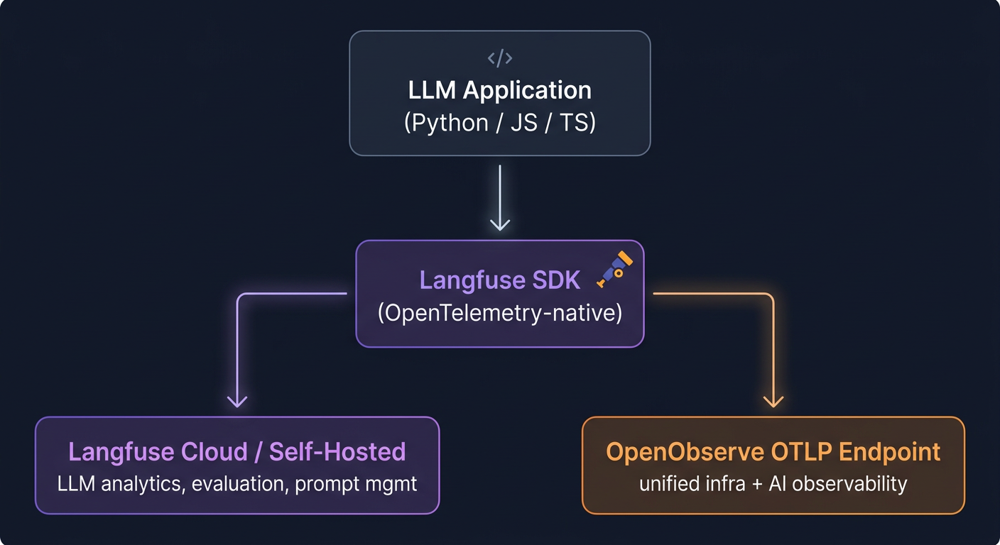
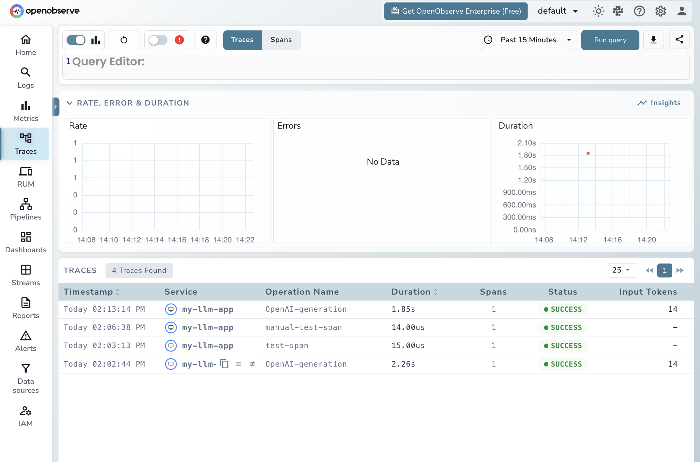

# Integrating Langfuse with OpenObserve

Langfuse SDK is OpenTelemetry-native. If you are already using it to instrument your LLM applications, sending those traces to OpenObserve requires no code changes — add the OTLP exporter config and your spans start flowing in.

## Why OpenObserve?

Langfuse is purpose-built for LLM analytics. OpenObserve gives you a unified observability platform — logs, metrics, traces, and APM in one place. If you want your LLM traces alongside the rest of your infrastructure, OpenObserve is a natural fit because both speak OpenTelemetry.

## How It Works

Langfuse SDK instruments your LLM calls and emits OpenTelemetry spans. You add an OTLP exporter pointing at OpenObserve. Spans flow to both Langfuse and OpenObserve simultaneously — no change to your existing Langfuse setup.



## Prerequisites

- An existing app instrumented with [Langfuse SDK](https://langfuse.com/docs) (credentials required)
- An [OpenObserve](https://openobserve.ai/) account (cloud or self-hosted)
- Your OpenObserve **organisation ID** and **Base64-encoded auth token**

## Setup

??? "Step 1: Install dependencies"

    **Python**

    ```bash
    pip install langfuse opentelemetry-sdk opentelemetry-exporter-otlp-proto-http python-dotenv
    ```

    **Node.js / TypeScript**

    ```bash
    npm install langfuse @opentelemetry/sdk-node @opentelemetry/exporter-trace-otlp-http
    ```

??? "Step 2: Get your OpenObserve auth token and endpoint"

    OpenObserve uses HTTP Basic Auth encoded as Base64. Run this with your OpenObserve email and password:

    ```bash
    echo -n "your-email@example.com:your-password" | base64
    ```

    Your OTLP endpoint:

    **OpenObserve Cloud:**
    ```
    https://api.openobserve.ai/api/<your-org-id>/v1/traces
    ```

    **Self-hosted OpenObserve** (default port 5080):
    ```
    http://localhost:5080/api/<your-org-id>/v1/traces
    ```

??? "Step 3: Set environment variables"

    Add these to your existing `.env` file alongside your Langfuse credentials:

    ```bash
    # Langfuse credentials (required for instrumentation to activate)
    LANGFUSE_PUBLIC_KEY=pk-lf-...
    LANGFUSE_SECRET_KEY=sk-lf-...
    LANGFUSE_HOST=https://cloud.langfuse.com

    # OpenObserve OTLP endpoint
    OTEL_EXPORTER_OTLP_ENDPOINT=https://api.openobserve.ai/api/<your-org-id>/v1/traces
    OTEL_EXPORTER_OTLP_HEADERS=Authorization=Basic <your-base64-token>

    # Service name shown in OpenObserve traces UI
    OTEL_SERVICE_NAME=my-llm-app
    ```

    | Variable | Description |
    |---|---|
    | `LANGFUSE_PUBLIC_KEY` | Langfuse project public key |
    | `LANGFUSE_SECRET_KEY` | Langfuse project secret key |
    | `OTEL_EXPORTER_OTLP_ENDPOINT` | OpenObserve OTLP/HTTP traces URL (must end with `/v1/traces`) |
    | `OTEL_EXPORTER_OTLP_HEADERS` | Basic auth header for OpenObserve |
    | `OTEL_SERVICE_NAME` | Service label shown in the OpenObserve traces UI |

??? "Step 4: Add the OpenObserve exporter (Python)"

    Add an OTLP span processor before your first LLM call. Your existing Langfuse instrumentation stays unchanged.

    ```python
    import os
    from dotenv import load_dotenv
    from langfuse.openai import openai

    from opentelemetry import trace
    from opentelemetry.sdk.trace import TracerProvider
    from opentelemetry.sdk.trace.export import BatchSpanProcessor
    from opentelemetry.exporter.otlp.proto.http.trace_exporter import OTLPSpanExporter
    from opentelemetry.sdk.resources import Resource

    load_dotenv()

    otlp_exporter = OTLPSpanExporter(
        endpoint=os.environ["OTEL_EXPORTER_OTLP_ENDPOINT"],
        headers={"Authorization": os.environ["OTEL_EXPORTER_OTLP_HEADERS"].split("=", 1)[1]},
    )

    provider = TracerProvider(
        resource=Resource(attributes={"service.name": os.environ["OTEL_SERVICE_NAME"]})
    )
    provider.add_span_processor(BatchSpanProcessor(otlp_exporter))
    trace.set_tracer_provider(provider)

    # Your existing Langfuse-instrumented code below — no changes needed
    response = openai.chat.completions.create(
        model="gpt-4o-mini",
        messages=[{"role": "user", "content": "Explain distributed tracing in one sentence."}],
    )

    print(response.choices[0].message.content)

    provider.force_flush()
    provider.shutdown()
    ```

??? "Step 5: Add the OpenObserve exporter (Node.js / TypeScript)"

    ```typescript
    import * as dotenv from "dotenv";
    dotenv.config();

    import { NodeSDK } from "@opentelemetry/sdk-node";
    import { OTLPTraceExporter } from "@opentelemetry/exporter-trace-otlp-http";
    import { BatchSpanProcessor } from "@opentelemetry/sdk-trace-base";

    const otlpExporter = new OTLPTraceExporter({
      url: process.env.OTEL_EXPORTER_OTLP_ENDPOINT,
      headers: {
        Authorization: process.env.OTEL_EXPORTER_OTLP_HEADERS?.split("=").slice(1).join("="),
      },
    });

    const sdk = new NodeSDK({
      spanProcessor: new BatchSpanProcessor(otlpExporter),
    });

    // Start before any Langfuse-instrumented LLM calls
    sdk.start();

    // ... your existing Langfuse-instrumented code below

    // Call before process exits
    await sdk.shutdown();
    ```

??? "Step 6: Verify traces are flowing"

    Run your application and open your OpenObserve instance:

    1. Navigate to **Traces** in the left sidebar
    2. Set the time range to **Last 15 minutes**
    3. Filter by `service_name = my-llm-app`
    4. Click any trace to inspect token counts, latency, cost, and model metadata

    You should see one trace per LLM call, with token counts and cost visible directly in the trace list.

## What Gets Captured

Every LLM call instrumented by Langfuse SDK appears in OpenObserve with these fields:

| Field in OpenObserve | Description |
|---|---|
| `llm_usage_tokens_input` | Prompt token count |
| `llm_usage_tokens_output` | Completion token count |
| `llm_usage_tokens_total` | Total tokens used |
| `llm_usage_cost_input` | Cost of prompt tokens |
| `llm_usage_cost_output` | Cost of completion tokens |
| `llm_usage_cost_total` | Total cost of the call |
| `llm_request_parameters_temperature` | Temperature parameter |
| `llm_request_parameters_max_tokens` | Max tokens parameter |
| `langfuse_observation_model_name` | Model used (e.g. `gpt-4o-mini-2024-07-18`) |
| `langfuse_observation_type` | Observation type (e.g. `generation`) |
| `operation_name` | Operation name (e.g. `OpenAI-generation`) |
| `service_name` | Your app name from `OTEL_SERVICE_NAME` |
| `duration` | End-to-end request latency |

## Viewing Traces in OpenObserve

1. Log in to your OpenObserve instance
2. Navigate to **Traces** in the left sidebar
3. Filter by **service name**, model, or time range
4. Click any span to inspect token counts, latency, cost, and full request metadata



Use the **Fields** panel to build queries, for example:

```sql
SELECT * FROM traces WHERE "langfuse_observation_model_name" = 'gpt-4o-mini-2024-07-18'
```

## Troubleshooting

**Traces not appearing in OpenObserve**

- Confirm the endpoint ends with `/v1/traces` — omitting this is the most common mistake
- Confirm the `Authorization` header value is `Basic <base64_token>`; the `Basic ` prefix is required
- Ensure `provider.force_flush()` + `provider.shutdown()` (Python) or `sdk.shutdown()` (Node.js) are called before the process exits
- Set `OTEL_LOG_LEVEL=debug` to surface exporter errors to stderr

**Instrumentation not activating — no spans at all**

- `langfuse.openai` requires valid `LANGFUSE_PUBLIC_KEY` and `LANGFUSE_SECRET_KEY` to activate; without them the wrapper is a no-op

**Service shows as `unknown_service` in OpenObserve**

- Set `OTEL_SERVICE_NAME` in your environment and pass it via `Resource` as shown in the code sample above

**`TracerProvider` initialised after LLM calls**

- The `TracerProvider` must be set up before any instrumented LLM call; spans created before it is registered are lost

**`ModuleNotFoundError` / `Cannot find module`**

- Python: install `opentelemetry-exporter-otlp-proto-http` (not `opentelemetry-exporter-otlp`)
- Node.js: install `@opentelemetry/exporter-trace-otlp-http` (HTTP variant; OpenObserve does not support gRPC OTLP)

## Read More

- [LLM Observability with OpenObserve](llm-applications.md)
- [Claude Code Tracing](claude-code-tracing.md)
- [Langfuse OpenTelemetry Docs](https://langfuse.com/docs/opentelemetry/introduction)
- [OpenObserve Python SDK](https://openobserve.ai/docs/opentelemetry/openobserve-python-sdk/)
