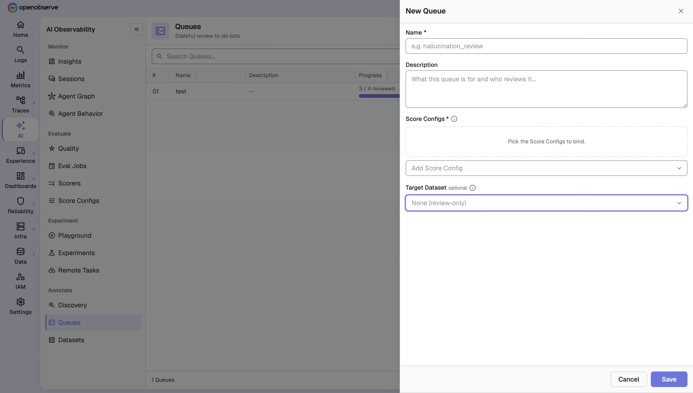
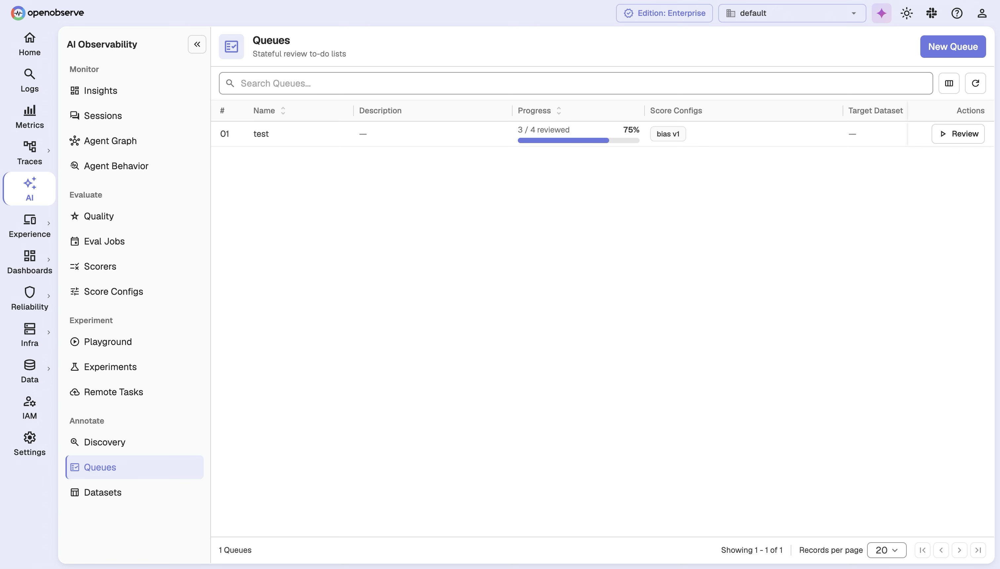
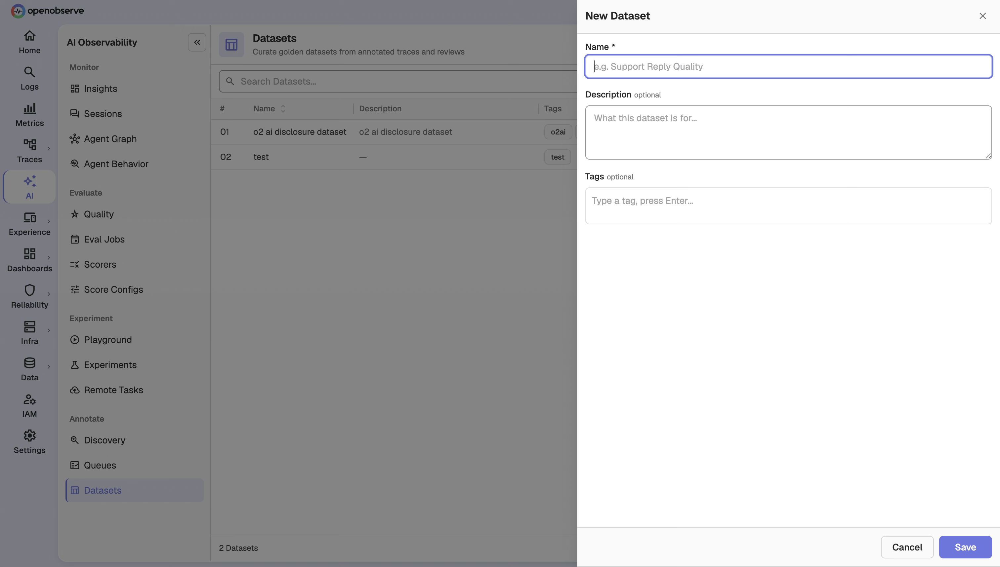
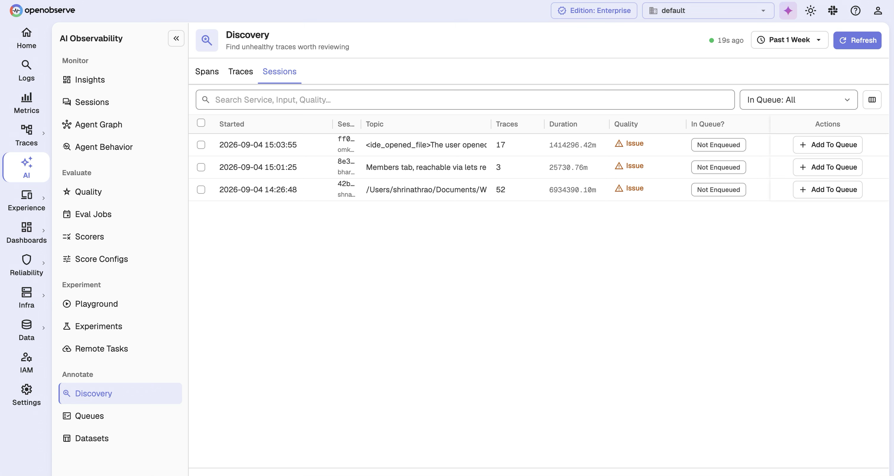
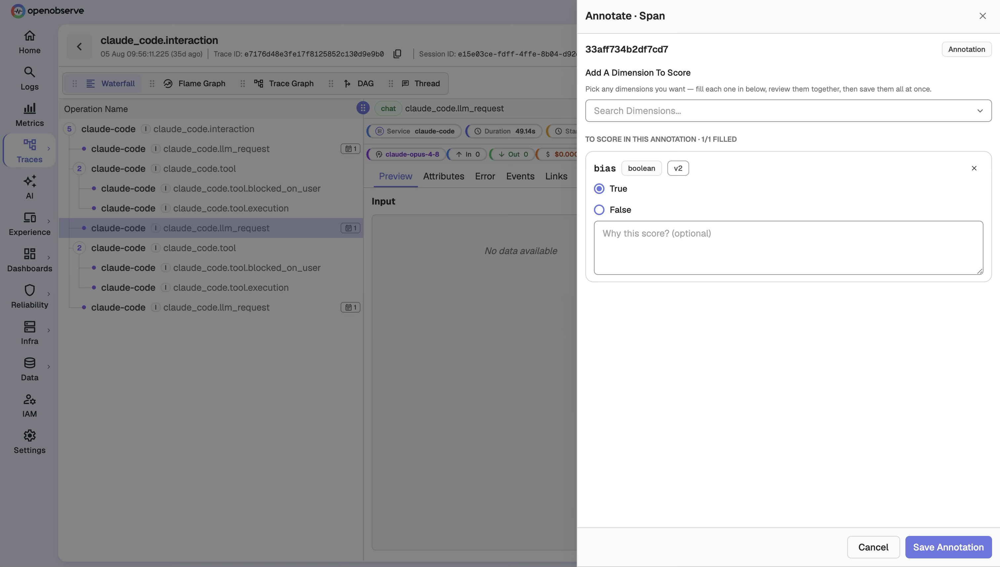

# LLM Annotations and Datasets

Annotations and Datasets extend Online Evaluations with a human-in-the-loop workflow: you discover underperforming spans, traces, and sessions, enqueue them for review against a rubric, and promote the human-verified results into golden datasets you can reuse for offline evaluation.

## Overview

Online Evaluations score your LLM traffic automatically with LLM Judge or Remote scorers. Annotations and Datasets add the human layer on top of those machine scores, with three resources:

| Resource | What it does |
|---|---|
| **Annotation Queue** | A review workflow. A queue pins one or more **Score Configs** as a rubric, holds a list of span/trace/session references to review, and tracks per-item review progress. Reviewers submit human scores that are written back to the `_llm_scores` stream. |
| **Dataset** | A golden dataset for offline evaluation. Each dataset holds items with an `input` and a human-approved `expectedOutput`, sourced manually, from telemetry, or from queue adjudication. Items are fully versioned. |
| **Discovery** | A view over `_llm_scores` that surfaces the traffic most worth reviewing, ranked by the number of unhealthy score dimensions, so you can enqueue or annotate issues directly. |

All three resources build on the **Score Config** from Online Evaluations: a score config defines the shape and healthy/unhealthy threshold of a score, and it is the "dimension" you review against in a queue.

## Enable Annotations and Datasets

Annotations and Datasets are an enterprise feature, gated by the same flag as Online Evaluations:

```env
ZO_ONLINE_EVALS_ENABLED=true
```

When enabled, the **Queues**, **Datasets**, and **Discovery** pages appear alongside the Online Evaluations pages. When disabled, the pages and settings are hidden; backend API endpoints remain reachable.

See [Review reconciliation](#review-reconciliation) below for the `O2_LLM_REVIEW_RECONCILE_INTERVAL_SECS` flag that controls how queue review status stays in sync.

## Annotation Queues

An Annotation Queue is a named review workflow. When you create a queue, you pin one or more **Score Configs** to it; those score configs become the rubric reviewers score against. The queue can optionally target a **Dataset** so reviewed items can be pushed straight into a golden set.

### Create a queue

Navigate to **Evaluations > Queues** and click **Add Queue**.



| Field | Description |
|---|---|
| **Name** | Display name for the queue. |
| **Description** | Optional description. |
| **Target Dataset** | (Optional) A dataset this queue adjudicates into. Reviewed items can be pushed to it in one step. |
| **Score Configs** | One or more score configs that define the review rubric. The queue pins the exact version of each selected score config. |

A queue accepts span, trace, and session references.



The queues list shows each queue's **reviewed** versus **total** item count so you can see review progress at a glance.

### Update a queue

If another editor changed the queue's rubric while you were editing, your update is rejected with a conflict rather than silently overwriting their change.

### Enqueue items

Add a discovered span, trace, or session to a queue from **Discovery** (see below), or enqueue one programmatically — see [API Reference](#annotation-queues).

Enqueuing the same reference into the same queue returns a conflict. A reference can live in multiple queues independently, and each queue tracks its own item status.

### Review items in the workbench

Open a queue and select an item to review. The **workbench** hydrates the item's business **input**, **output**, and **trace** context from the source stream, and lists the item's **machine scores** (the LLM Judge / Remote scores already recorded for that target) next to the review rubric.

Submit your review by scoring each pinned score config, with optional reasoning and a comment. The queue item flips from **pending** to **reviewed** once you submit.

### Push reviewed items to a dataset

When a queue targets a dataset, you can promote a reviewed item into it with `POST /api/{org_id}/annotation_queues/{queue_id}/items/{queue_item_id}/push_to_dataset`. You select the destination dataset and the review submission that represents your final adjudication, and provide an explicit human-finalized `expectedOutput`.

### Manage queue items

- **Archive** removes items from the active review set in bulk while preserving them for audit.
- **Clear** removes all items from a queue.

## Datasets

A Dataset is a golden set of `input`/`expectedOutput` pairs you can use to benchmark and regress your LLM application offline. Datasets carry `name`, `description`, `tags`, and a `globalVersion` that increments as items change.

### Create a dataset

Navigate to **Evaluations > Datasets** and click **Add Dataset**.



Provide a **Name**, an optional **Description**, and optional **Tags**. Tags help you filter and organize datasets for offline evaluation.

### Add items

You can add dataset items three ways:

| Entry path | How you add the item |
|---|---|
| **Manual** | From the dataset detail page, enter an `input` and `expectedOutput` directly. |
| **Telemetry** | From a trace or span's detail, add the object as an item by reference (`refType` of `trace` or `span`, not `session`). OpenObserve retrieves the input from the referenced trace or span. |
| **Queue adjudication** | Push a reviewed queue item into the dataset (see [Push reviewed items to a dataset](#push-reviewed-items-to-a-dataset)). |

<!--  -->

### Import from CSV

Add many items at once with a multipart CSV import at `POST /api/{org_id}/datasets/{dataset_id}/items/import`. Malformed rows are skipped and summarized in the response (`importedCount` and `skippedCount`).

### Version history

Every dataset item is versioned: updating an item creates a new version rather than overwriting the old one. The item detail page shows the full version history, and you can retrieve it via `GET /api/{org_id}/datasets/{dataset_id}/items/{item_id}`.


Deleting an item marks it deleted rather than erasing its history; pass the `includeDeleted` query parameter to include deleted items when listing. Each item also records where it came from — a trace/span reference, an annotation review, a manual entry, or a CSV import — for traceability.

## Discovery

Discovery is the entry point for finding traffic worth reviewing. It projects `_llm_scores` into a scoped list of spans, traces, and sessions, each tagged with a **quality** classification.



| Filter | Description |
|---|---|
| **Scope** | The target granularity: `span`, `trace`, or `session`. |
| **Queue status** | Membership filter: `not_enqueued` (default), `enqueued`, `pending`, `reviewed`, or `all`. |
| **Time range** | Filter to a specific window. |

Each discovery item reports:

- **Quality** — `issue` when one score dimension is unhealthy, or `multiple` when two or more are unhealthy.
- **Issue count** — the number of unhealthy dimensions.
- **Context** — display fields from the target trace, such as input, service name, and operation name.
- **Queues** — the annotation queues this target already belongs to, with each membership's workflow status.

The response also returns **scope totals** (span / trace / session counts) so you can see the shape of issues across granularities. From Discovery you can **Add to Queue** to enqueue an item for review, or **Annotate** to score it immediately.

## On-demand annotation

In addition to queue-based review, you can annotate a single span, trace, or session directly from a trace's detail view or from Discovery. The annotation writes human scores straight to `_llm_scores`, the same as a queue review — no queue needed.



Programmatic annotation is also available — see [API Reference](#annotations).

Both queue reviews and on-demand annotations write to the same `_llm_scores` stream as machine scores from LLM Judge and Remote scorers, distinguished by `sourceType`.

## RBAC

Annotations and Datasets introduce two OFGA resources, in addition to the Online Evaluations resources:

| Resource | OFGA Type | Permissions |
|---|---|---|
| Annotation Queues | `annotation_queue` | GET, LIST, POST, PUT, DELETE |
| Datasets | `dataset` | GET, LIST, POST, PUT, DELETE |

Additional access rules:

- **Discovery** requires the organization-level trace-read grant, the same as other derived trace views.
- **Annotations** require `LIST` on `score_configs` — annotating is a *use* of visible score configs, not a mutation of them.
- **Queues** are only visible to a user who can also see every score config pinned to them.

Assign roles in **Identity & Access Management > Roles** to control access to these resources.

## Super Cluster

In multi-node deployments, annotation queues and datasets are synchronized across the super cluster via dedicated queue topics: `eval_annotation_queue` and `eval_dataset` (joining the existing `eval_provider`, `eval_score_config`, `eval_scorer`, and `eval_job` topics). Changes made on any node propagate automatically.

## Review reconciliation

Queue item review status is derived from `_llm_scores`. If a score arrives but a queue item's status doesn't update right away, a background job corrects it shortly after. Tune or pause it with `O2_LLM_REVIEW_RECONCILE_INTERVAL_SECS` (default `600`).

## API Reference

All endpoints are prefixed with `/api/{org_id}`.

### Annotation Queues

| Method | Path | Description |
|---|---|---|
| `GET` | `/annotation_queues` | List queues |
| `POST` | `/annotation_queues` | Create a queue |
| `GET` | `/annotation_queues/{queue_id}` | Get a queue |
| `PUT` | `/annotation_queues/{queue_id}` | Update a queue (with `expectedScoreConfigRowIds`) |
| `DELETE` | `/annotation_queues/{queue_id}` | Delete a queue |
| `GET` | `/annotation_queues/items` | List queue items (optionally by `queueId`, `queueStatus`, `scope`) |
| `POST` | `/annotation_queues/{queue_id}/items` | Enqueue a span/trace/session |
| `DELETE` | `/annotation_queues/{queue_id}/items` | Clear all items from a queue |
| `GET` | `/annotation_queues/{queue_id}/items/{queue_item_id}` | Get a hydrated item with content and machine scores |
| `GET` | `/annotation_queues/{queue_id}/items/{queue_item_id}/reviews` | List review submissions |
| `POST` | `/annotation_queues/{queue_id}/items/{queue_item_id}/reviews` | Submit a review |
| `POST` | `/annotation_queues/{queue_id}/items/archive` | Archive items in bulk |
| `POST` | `/annotation_queues/{queue_id}/items/{queue_item_id}/push_to_dataset` | Push a reviewed item to a dataset |

### Datasets

| Method | Path | Description |
|---|---|---|
| `GET` | `/datasets` | List datasets |
| `POST` | `/datasets` | Create a dataset |
| `GET` | `/datasets/{dataset_id}` | Get a dataset |
| `PUT` | `/datasets/{dataset_id}` | Update a dataset |
| `DELETE` | `/datasets/{dataset_id}` | Delete a dataset |
| `GET` | `/datasets/{dataset_id}/items` | List items (`includeDeleted`, `from`, `size`) |
| `POST` | `/datasets/{dataset_id}/items` | Push an item (`entryPoint`: `manual` or `telemetry`) |
| `POST` | `/datasets/{dataset_id}/items/import` | CSV import |
| `GET` | `/datasets/{dataset_id}/items/{item_id}` | Get an item's version history |
| `PUT` | `/datasets/{dataset_id}/items/{item_id}` | Update an item (writes a new version) |
| `DELETE` | `/datasets/{dataset_id}/items/{item_id}` | Delete an item (records a tombstone) |

### Annotations

| Method | Path | Description |
|---|---|---|
| `POST` | `/annotations` | Annotate a span/trace/session on demand |

### Discovery

| Method | Path | Description |
|---|---|---|
| `GET` | `/discovery?scope=trace&queueStatus=not_enqueued&startTime=&endTime=` | List discovery items with quality and queue membership |
