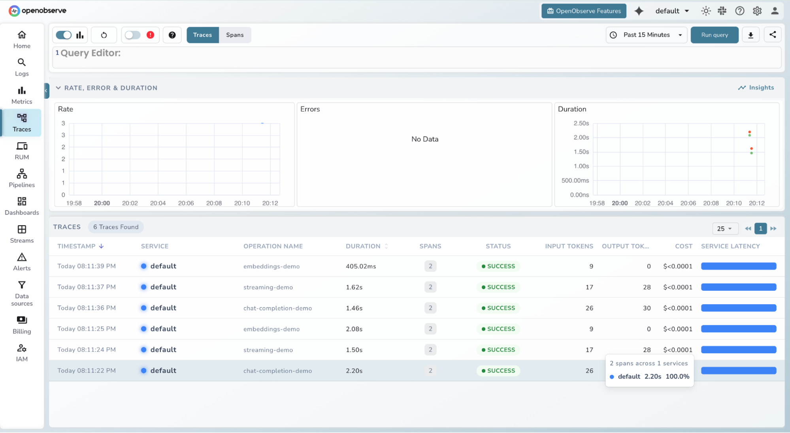
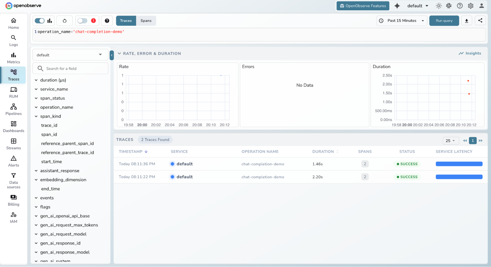
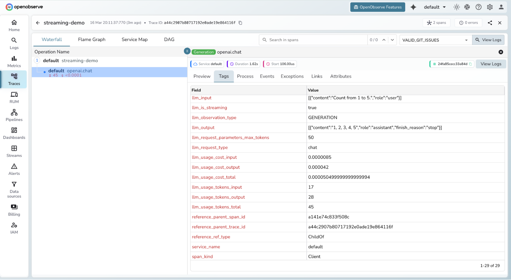
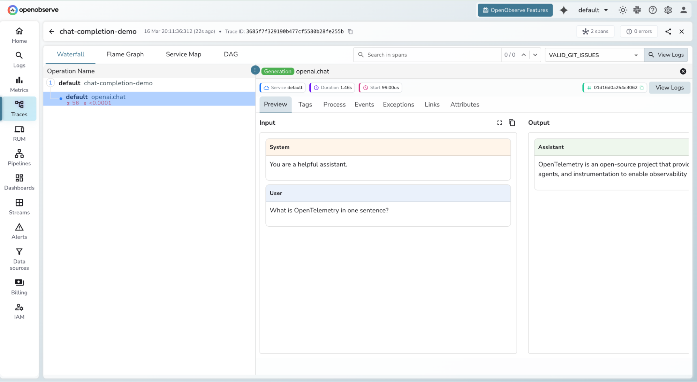

# **LLM Observability with OpenObserve**

Monitor, trace, and debug your LLM-powered applications in production using OpenObserve and OpenTelemetry.

## **What is LLM Observability?**

LLM Observability gives you visibility into the behaviour of large language model calls inside your application , similar to traditional APM, but purpose-built for AI workloads.

With it you can track:

* **Token usage**: prompt, completion, and total tokens per request  
* **Latency** : end-to-end duration of every LLM call  
* **Model metadata** : model name, temperature, max tokens, and other parameters  
* **Errors** : rate limit events, API failures, and timeouts with full context

**Under the hood:** LLM Observability is OpenTelemetry. There is nothing special about LLM traces compared to regular distributed traces, the work happens on the server side. Any OpenTelemetry-compatible SDK or exporter can ship traces to OpenObserve.

## **Prerequisites**

* Python 3.8+  
* [`uv`](https://github.com/astral-sh/uv) package manager (or `pip`)  
* An [OpenObserve](https://openobserve.ai/) account (cloud or self-hosted)  
* Your OpenObserve **organisation ID** and **Base64-encoded auth token**

## **Configuration**

Create a `.env` file in your project root:

```
# OpenObserve instance URL
# Default for self-hosted: http://localhost:5080
OPENOBSERVE_URL=https://api.openobserve.ai/

# Your OpenObserve organisation slug or ID
OPENOBSERVE_ORG=your_org_id

# Basic auth token — Base64-encoded "email:password"
OPENOBSERVE_AUTH_TOKEN="Basic <your_base64_token>"

# Enable or disable tracing (default: true)
OPENOBSERVE_ENABLED=true

# API keys for services you're using (optional, based on instrumentation)
OPENAI_API_KEY="your-openai-key"
ANTHROPIC_API_KEY="your-anthropic-key"
```

| Variable | Description | Required |
| ----- | ----- | ----- |
| `OPENOBSERVE_URL` | Base URL of your OpenObserve instance | Yes |
| `OPENOBSERVE_ORG` | Organisation slug or ID | Yes |
| `OPENOBSERVE_AUTH_TOKEN` | `Basic <base64(email:password)>` | Yes |
| `OPENOBSERVE_ENABLED` | Toggle tracing on/off | No (default: `true`) |
| `OPENAI_API_KEY` | Only needed by the bundled OpenAI example | No |

## **Option A : Quickstart with the bundled example**

Clone the SDK repository and run the included OpenAI example to see traces flowing into OpenObserve with minimal setup.

**1\. Clone the repository**

```shell
git clone https://github.com/openobserve/openobserve-python-sdk/
cd openobserve-python-sdk
```

**2\. Install dependencies**

```shell
uv pip install openobserve-telemetry-sdk openai opentelemetry-instrumentation-openai python-dotenv
uv pip install -r requirements.txt
```

**3\. Add your `.env` file** to the project root (see Configuration above), including `OPENAI_API_KEY`.

**4\. Run the example**

```shell
uv run examples/openai_example.py
```

Open your **OpenObserve dashboard → Traces** to see the spans appear.




## **Option B: Integrate into your own project using the OpenObserve SDK**

Use this if you want the simplest possible integration without cloning the repository.

**1\. Install dependencies**

```shell
uv pip install openobserve-telemetry-sdk opentelemetry-instrumentation-openai dotenv
```

**2\. Initialise the SDK at your application entry point and  Use your LLM client as normal**

Sample OpenAI Instrumentation:

```python
from opentelemetry.instrumentation.openai import OpenAIInstrumentor
from openobserve import openobserve_init

# Initialize OpenObserve and instrument OpenAI
OpenAIInstrumentor().instrument()
openobserve_init()

from openai import OpenAI

# Use OpenAI as normal - traces are automatically captured
client = OpenAI()
response = client.chat.completions.create(
    model="gpt-3.5-turbo",
    messages=[{"role": "user", "content": "Hello!"}]
)
print(response.choices[0].message.content)

```

Sample Anthropic Instrumentation:
```python
from opentelemetry.instrumentation.anthropic import AnthropicInstrumentor
from openobserve import openobserve_init

# Initialize OpenObserve and instrument Anthropic
AnthropicInstrumentor().instrument()
openobserve_init()

from anthropic import Anthropic

# Use Claude as normal - traces are automatically captured
client = Anthropic()
response = client.messages.create(
    model="claude-3-5-sonnet-20241022",
    max_tokens=1024,
    messages=[{"role": "user", "content": "Hello!"}]
)
print(response.content[0].text)

```
Every call is now captured as a trace span and exported to OpenObserve.

Note: The **openobserve-telemetry-sdk** is an optional thin wrapper around the standard OpenTelemetry Python SDK that simplifies setup and exporter configuration. If you already use OpenTelemetry, you can send telemetry directly to the OpenObserve OTLP endpoint without it.

## **What gets captured**

The `opentelemetry-instrumentation-openai` library attaches the following attributes to each span automatically:

| Attribute | Description |
| ----- | ----- |
| `llm.request.model` | Model name (e.g. `gpt-4o`) |
| `llm.usage.prompt_tokens` | Tokens in the prompt |
| `llm.usage.completion_tokens` | Tokens in the response |
| `llm.usage.total_tokens` | Total tokens consumed |
| `llm.request.temperature` | Temperature parameter |
| `llm.request.max_tokens` | Max tokens parameter |
| `duration` | End-to-end request latency |
| `error` | Exception details if the request failed |

In addition, OpenObserve computes and stores the following token and cost fields on each LLM span:

| Field | Type | Description |
| ----- | ----- | ----- |
| `llm_usage_tokens_input` | Int64 | Input (prompt) tokens |
| `llm_usage_tokens_output` | Int64 | Output (completion) tokens |
| `llm_usage_tokens_total` | Int64 | Total tokens consumed |
| `llm_usage_cost_input` | Float64 | Cost of input tokens |
| `llm_usage_cost_output` | Float64 | Cost of output tokens |
| `llm_usage_cost_total` | Float64 | Total cost of the LLM call |

The cost fields (`llm_usage_cost_input`, `llm_usage_cost_output`, `llm_usage_cost_total`) are populated only when the Model Pricing feature is enabled (`ZO_MODEL_PRICING_ENABLED`).

## **Viewing traces in OpenObserve**

1. Log in to your OpenObserve instance  
2. Navigate to **Traces** in the left sidebar  
3. Filter by service name, model, or time range


4. Click any span to inspect token counts, latency, and full request metadata






## **LLM Evaluations**

> **Enterprise feature.**

OpenObserve can automatically evaluate your LLM traces using an LLM-evaluation pipeline. This lets you score model responses against criteria such as correctness, relevance, or safety without leaving OpenObserve.

**How it works**

1. Set up an LLM-evaluation pipeline on a traces stream.
2. As LLM traces arrive, the pipeline runs the configured evaluation and writes the results to a separate output stream named `<stream>_evaluations` (for example, a `default` stream produces `default_evaluations`).
3. Per-trace evaluation results appear in an **Evaluations** tab in the trace detail view. This tab is shown only for LLM traces that have associated evaluation data.

**Eval Templates**

Evaluation logic is defined by Eval Templates, managed from the enterprise **Eval Templates** tab. Each template specifies:

* **response_type**: the expected shape of the evaluation response
* **dimensions**: the criteria the trace is evaluated against
* **content**: the prompt/instructions used to perform the evaluation
* **versioning**: templates are versioned so you can iterate without losing earlier definitions

## **Troubleshooting**

**Traces are not appearing in OpenObserve**

* Confirm `OPENOBSERVE_ENABLED=true` in your `.env`  
* Check that `OPENOBSERVE_URL` ends with a trailing `/`  
* Verify `OPENOBSERVE_AUTH_TOKEN` is correctly Base64-encoded (`Basic <token>`)  
* Ensure the SDK or tracer provider is initialised before any LLM calls

**`ModuleNotFoundError: No module named 'dotenv'`**

* Install the correct package: `uv pip install python-dotenv` (not `dotenv`)

**`ModuleNotFoundError: No module named 'openobserve_telemetry'`**

* Run: `uv pip install openobserve-telemetry-sdk`

## Read More
- [OpenObserve Python SDK](https://openobserve.ai/docs/user-guide/data-processing/opentelemetry/openobserve-python-sdk/)
