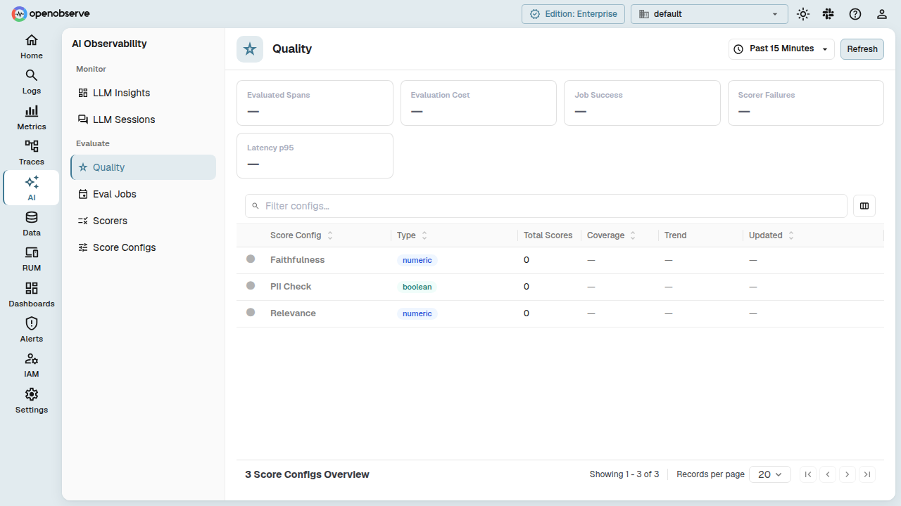
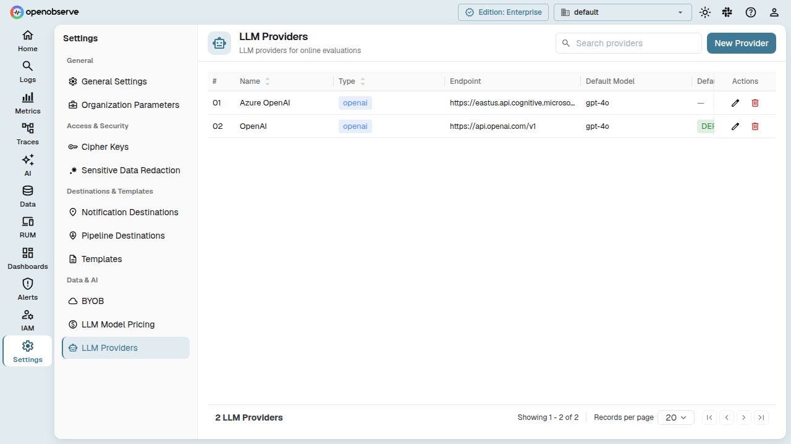
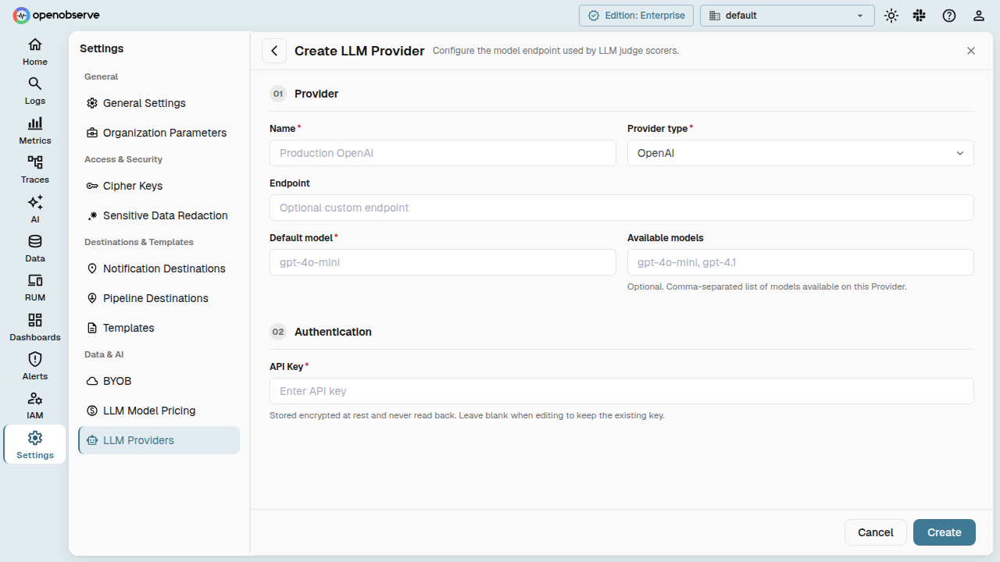
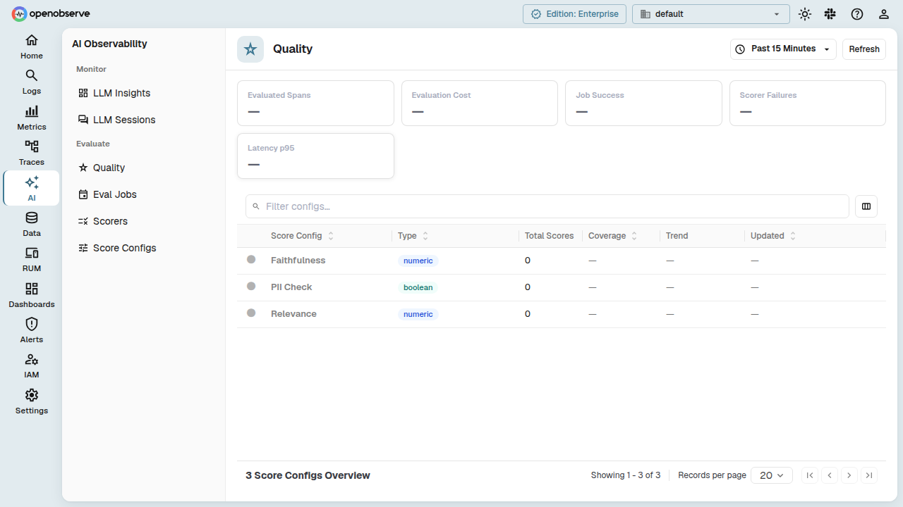
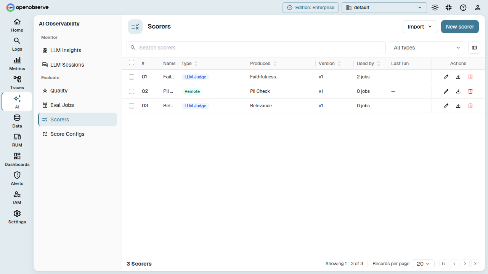
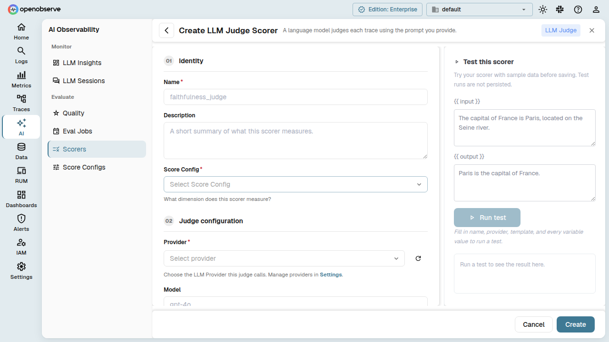
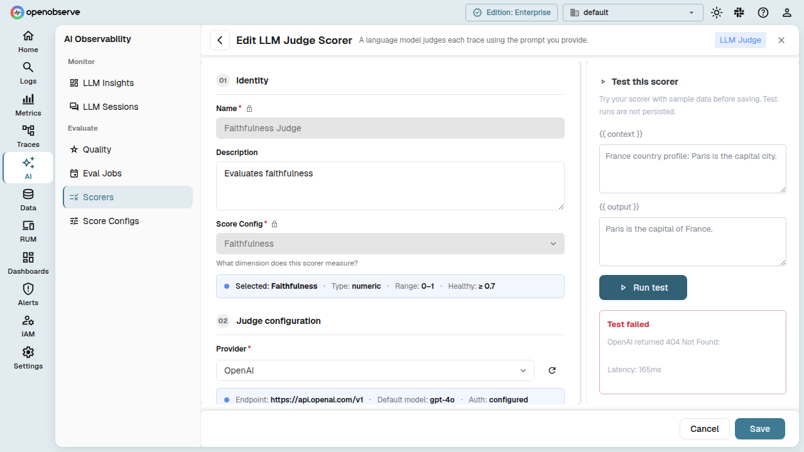
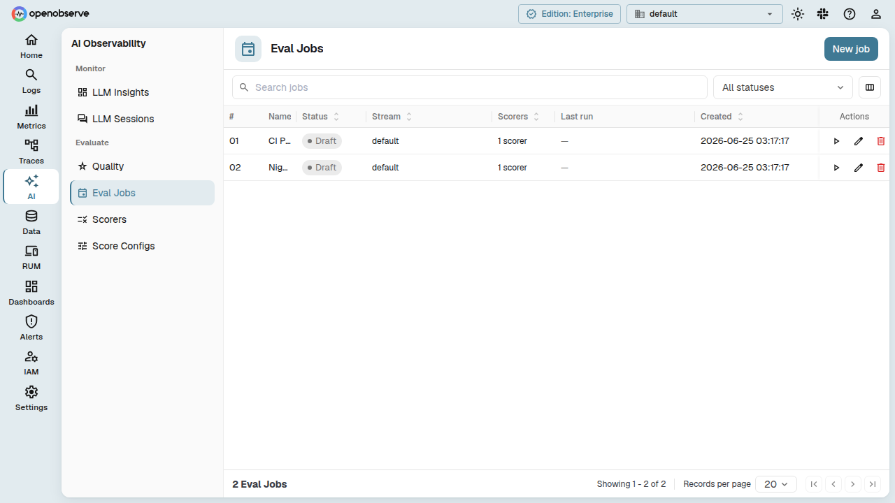
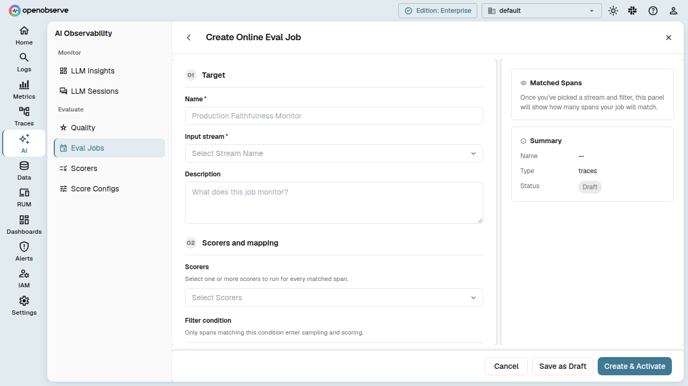
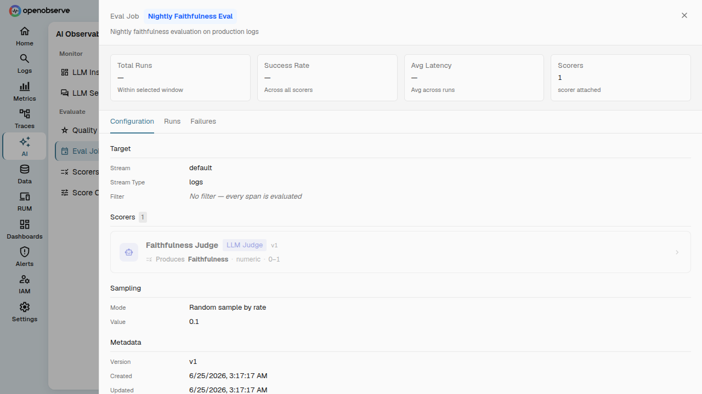

# LLM Evaluations

Online Evaluations let you continuously score your LLM application's traces and spans using configurable evaluators - either LLM-as-a-judge powered by your own AI providers, or external remote scoring endpoints.

## Overview

The Online Evaluations system has four core resources, each building on the previous:

| Resource | What it does |
|---|---|
| **Provider** | An LLM API configuration (OpenAI, Anthropic, etc.) with credentials and available models. Used by LLM Judge scorers to call an LLM. |
| **Score Config** | Defines the shape of a score - its data type (numeric, categorical, boolean), valid range or categories, and a healthy/unhealthy threshold. |
| **Scorer** | The evaluation logic: a template with `{{variables}}`, parameters for execution, and a link to a score config that describes the output it produces. Two types exist: **LLM Judge** (calls an LLM via a provider) and **Remote** (calls an external HTTP endpoint). |
| **Eval Job** | A running evaluation pipeline: binds one or more scorers to a specific stream, defines which traces/spans to evaluate (filter), how many to sample, and manages the lifecycle (draft, active, paused, archived). |

When you activate an eval job, the system creates a system-managed evaluation pipeline that runs your scorers against incoming data. Scores flow into the `_llm_scores` stream; evaluator telemetry flows into the `_evaluator` traces stream.



## Enable Online Evaluations

Online Evaluations is an enterprise feature. Set the configuration flag to enable it:

```env
ZO_ONLINE_EVALS_ENABLED=true
```

When enabled, the **Evaluations** top-level navigation appears in the UI. When disabled, all evaluation pages and settings are hidden; backend API endpoints remain reachable.

## Providers

A Provider stores the connection details for an LLM API. You configure one provider per AI service you want your LLM Judge scorers to use.

### Create a provider

Navigate to **Evaluations > Providers** and click **Add Provider**.



| Field | Description |
|---|---|
| **Name** | Display name for the provider. |
| **Provider Type** | The provider kind (`openai`, `anthropic`, `azure`, `gemini`, etc.). Determines the API protocol. |
| **Endpoint** | Override the default API base URL. Leave empty to use the provider's standard endpoint. |
| **Default Model** | The model used when no model is specified on the scorer. |
| **Available Models** | List of model IDs this provider supports. Used for model selection in scorers. |
| **Auth Config** | Credentials in JSON format (e.g., `{"api_key": "sk-..."}`). Masked in API responses. |
| **Is Default** | When set, this provider is preselected when creating new LLM Judge scorers. |



### Test a provider

From the provider detail page, use the **Test** button to verify connectivity. The system sends a test request using the configured endpoint and credentials.

### Manage providers

- **Update**: Edit any field. The provider is updated in-place.
- **Delete**: Removes the provider. Scorers referencing a deleted provider will fail until reassigned.

## Score Configs

A Score Config describes what a score looks like and when it is considered healthy.

### Create a score config

Navigate to **Evaluations > Score Configs** and click **Add Score Config**.

| Field | Description |
|---|---|
| **Name** | A label for this config (e.g., "Faithfulness", "Accuracy"). |
| **Data Type** | `numeric`, `categorical`, or `boolean` - the type of score value. |
| **Description** | Optional description of what the score measures. |
| **Numeric Range** | For numeric scores: `{"min": 0.0, "max": 1.0}`. |
| **Categories** | For categorical scores: a list of valid category labels. |
| **Healthy Threshold** | Defines the boundary for healthy scores (e.g., `{"direction": "gte", "value": 0.7}` means scores ≥ 0.7 are healthy). |



### Versioning

Score configs are versioned. Each config has a stable **entity ID** that stays the same across versions, and a unique **ID** per version. Updating a score config creates a new version and bumps the version number. Scorers that reference a score config can pin to a specific version or always use the latest.

## Scorers

A Scorer is the executable evaluation unit. It contains a prompt **template** with `{{variable}}` placeholders, execution **parameters**, and an optional link to a **score config** that describes its output.

### Scorer types

- **LLM Judge**: Sends the rendered template to an LLM via a configured provider. Supports temperature, max tokens, timeout, output parsing, and optional reasoning.
- **Remote**: Sends the rendered template as an HTTP request to an external evaluation service. Supports bearer token auth, API keys, basic auth, custom headers, timeouts, and retries.

### Create a scorer

Navigate to **Evaluations > Scorers** and click **Add Scorer**.



| Field | Description |
|---|---|
| **Name** | Display name. |
| **Description** | Optional description. |
| **Scorer Type** | Choose **LLM Judge** or **Remote**. |
| **Produces Score Config** | (Optional) Link to a score config that describes this scorer's output. |
| **Template** | The evaluation prompt with `{{variable}}` placeholders that will be populated at runtime. |
| **Output Schema** | (LLM Judge only) JSON Schema for structured output parsing. |

For **LLM Judge**, you also configure:

| Field | Description |
|---|---|
| **Provider** | The provider to use for the LLM call. |
| **Model** | Override the provider's default model. |
| **Temperature** | LLM temperature (0-2). |
| **Max Tokens** | Maximum completion tokens. |
| **Timeout** | Request timeout in milliseconds. |
| **Include Reasoning** | When enabled, the LLM is prompted to include reasoning alongside the score. |
| **Extra Metadata Fields** | Additional fields the LLM should return beyond the score (e.g., failure mode classification). |



For **Remote**, you configure:

| Field | Description |
|---|---|
| **Endpoint** | The URL of the remote scoring service. |
| **HTTP Method** | `POST` or `PUT`. |
| **Auth** | `none`, `bearer` (token), `basic` (username/password), or `api_key` (token + header name). |
| **Custom Headers** | Additional HTTP headers to send. |
| **Content Type** | Request content type (defaults to `application/json`). |
| **Timeout** | Request timeout in milliseconds. |
| **Max Retries** | Number of retry attempts on failure. |

### Test a scorer

From the scorer detail page, use the **Test** button. Provide values for the template variables, and the system executes a one-off evaluation. The response shows the score, reasoning, model used, latency, and token usage.



### Preview output schema

For LLM Judge scorers, the **Preview Schema** endpoint shows the derived output schema based on the score config and extra metadata fields, helping you understand what structure the LLM will return.

### Versioning

Like score configs, scorers are versioned. Each scorer has a stable **entity ID** and a version number. Updating a scorer creates a new version. Eval jobs can reference a scorer by entity ID (always latest) or pin to a specific version.

## Eval Jobs

An Eval Job is the execution unit that runs scorers against incoming traces. It manages the lifecycle of a system-managed evaluation pipeline.

### Create a job

Navigate to **Evaluations > Eval Jobs** and click **Add Job**.



| Field | Description |
|---|---|
| **Name** | Display name for the job. |
| **Description** | Optional description. |
| **Stream** | The stream whose traces or spans to evaluate. |
| **Stream Type** | `logs`, `traces`, or `metrics`. |
| **Filter Condition** | A JSON filter expression. Only spans matching this filter are evaluated. |
| **Scorers** | One or more scorer references (by entity ID). The system evaluates each matching span against every listed scorer. |
| **Input Mapping** | Per-scorer mapping of template variables to span attribute paths (e.g., `"input": "{{gen_ai_input_messages}}", "output": "{{gen_ai_output_messages}}"`). |
| **Sampling Mode** | `all` (evaluate everything), `rate` (evaluate a percentage, e.g., `0.1` for 10%), or `fixed` (evaluate N per time window). |
| **Sampling Value** | The sampling parameter value corresponding to the selected mode. |



### Job lifecycle

Jobs follow a defined state machine:

```
draft → active ⇄ paused
          ↓
       degraded → active
          ↓
       archived
```

| Action | Description |
|---|---|
| **Activate** | Creates the underlying evaluation pipeline and starts scoring. Allowed from `draft`, `paused`, or `degraded`. |
| **Pause** | Temporarily stops evaluation. The pipeline is preserved. Allowed from `active` or `degraded`. |
| **Resume** | Restarts evaluation from `paused` or `degraded` state. |
| **Archive** | Permanently stops evaluation. The job is retained for audit but no longer processes data. |

Use the action buttons on the job detail page to manage lifecycle transitions.



### Update a job

Edit any field on a draft or active job. Updating bumps the job's version. If the job is active, the underlying pipeline is automatically reconciled with the new configuration.

### Scoring pipeline

When a job is activated, the system creates a `PipelineKind::Evaluation` pipeline behind the scenes. This pipeline is:

- **Hidden** from the main Pipeline UI - it is managed exclusively by the eval jobs subsystem.
- **Coexisting** with user pipelines on the same stream (no "one pipeline per stream" conflict).
- **Automatically reconciled** when the job is updated.

Evaluated scores are written to the `_llm_scores` system stream as `LlmScoreRecord` entries, and evaluator telemetry (latency, tokens, status) is recorded as OTLP spans in the `_evaluator` traces stream.

## RBAC

Online Evaluations resources have their own OFGA permissions:

| Resource | OFGA Type | Permissions |
|---|---|---|
| Providers | `provider` | GET, LIST, POST, PUT, DELETE |
| Score Configs | `score_config` | GET, LIST, POST, PUT, DELETE |
| Scorers | `scorer` | GET, LIST, POST, PUT, DELETE |
| Eval Jobs | `eval_job` | GET, LIST, POST, PUT, DELETE |

Assign the appropriate roles in **Identity & Access Management > Roles** to control access to evaluation resources.

## API Reference

All endpoints are prefixed with `/api/{org_id}`.

### Providers

| Method | Path | Description |
|---|---|---|
| `GET` | `/providers` | List all providers |
| `POST` | `/providers` | Create a provider |
| `GET` | `/providers/{id}` | Get a provider |
| `PUT` | `/providers/{id}` | Update a provider |
| `DELETE` | `/providers/{id}` | Delete a provider |
| `POST` | `/providers/{id}/test` | Test provider connectivity |

### Score Configs

| Method | Path | Description |
|---|---|---|
| `GET` | `/score_configs` | List score configs |
| `POST` | `/score_configs` | Create a score config |
| `GET` | `/score_configs/{id}` | Get a score config |
| `PUT` | `/score_configs/{id}` | Update a score config (version bump) |
| `DELETE` | `/score_configs/{id}` | Delete a score config |
| `GET` | `/score_configs/{id}/versions` | List all versions |

### Scorers

| Method | Path | Description |
|---|---|---|
| `GET` | `/scorers?scorer_type=llm_judge` | List scorers (optionally filtered by type) |
| `POST` | `/scorers` | Create a scorer |
| `GET` | `/scorers/{id}` | Get a scorer |
| `PUT` | `/scorers/{id}` | Update a scorer (version bump) |
| `DELETE` | `/scorers/{id}` | Delete a scorer |
| `POST` | `/scorers/{id}/test` | Test a scorer with input variables |
| `GET` | `/scorers/{id}/versions` | List all versions |

### Eval Jobs

| Method | Path | Description |
|---|---|---|
| `GET` | `/eval_jobs?status=active` | List jobs (optionally filtered by status) |
| `POST` | `/eval_jobs` | Create a job (draft) |
| `GET` | `/eval_jobs/{id}` | Get a job |
| `PUT` | `/eval_jobs/{id}` | Update a job |
| `DELETE` | `/eval_jobs/{id}` | Delete a job and its pipeline |
| `POST` | `/eval_jobs/{id}/activate` | Activate the job |
| `POST` | `/eval_jobs/{id}/pause` | Pause the job |
| `POST` | `/eval_jobs/{id}/resume` | Resume the job |
| `POST` | `/eval_jobs/{id}/archive` | Archive the job |

## Super Cluster

In multi-node deployments, evaluation resources are synchronized across the super cluster via dedicated queue topics (`eval_provider`, `eval_score_config`, `eval_scorer`, `eval_job`). Changes made on any node propagate automatically.
