# LLM Evaluations

OpenObserve provides two complementary evaluation capabilities: **Online Evaluations**, which continuously score your LLM application's traces and spans in production, and **Experiments**, which run scorers over a static dataset and compare two runs against each other. Both use configurable evaluators - either LLM-as-a-judge powered by your own AI providers, or external remote scoring endpoints.

## Overview

The Online Evaluations system has four core resources, each building on the previous:

| Resource | What it does |
|---|---|
| **Provider** | An LLM API configuration (OpenAI, Anthropic, etc.) with credentials and available models. Used by LLM Judge scorers to call an LLM. |
| **Score Config** | Defines the shape of a score - its data type (numeric, categorical, boolean), valid range or categories, and a healthy/unhealthy threshold. |
| **Scorer** | The evaluation logic: a template with `{{variables}}`, parameters for execution, and a link to a score config that describes the output it produces. Two types exist: **LLM Judge** (calls an LLM via a provider) and **Remote** (calls an external HTTP endpoint). |
| **Eval Job** | A running evaluation pipeline: binds one or more scorers to a specific stream, defines a **target scope** (span, trace, or session), which traces/spans to evaluate (filter), how many to sample, and manages the lifecycle (draft, active, paused, archived). |

When you activate an eval job, OpenObserve runs your scorers against incoming data. Scores flow into the `_llm_scores` stream; evaluator telemetry flows into the `_evaluator` traces stream.

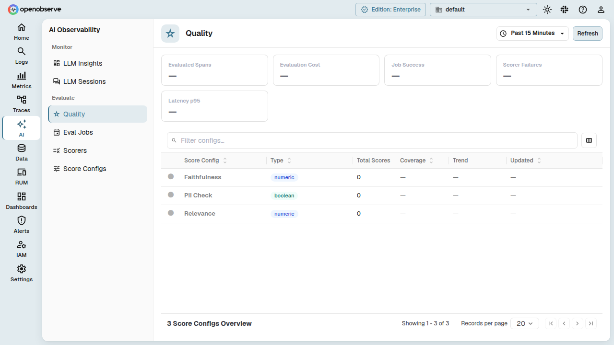

## Enable Online Evaluations

Online Evaluations is an enterprise-only feature, enabled by default. Set the enterprise configuration flag to control it:

```env
O2_ONLINE_EVALS_ENABLED=true
```

When disabled, the **Evaluations** navigation and all evaluation pages are hidden in the UI.

Trace- and session-scope jobs are detected by a background **Eval Scheduler** that periodically polls your trace streams for completed targets. Control how often it polls:

```env
O2_EVAL_SCHEDULER_POLL_INTERVAL_SECS=45
```

The default is `45` seconds; values below `1` are clamped to `1` second.

## Providers

A Provider stores the connection details for an LLM API. You configure one provider per AI service you want your LLM Judge scorers to use.

### Create a provider

Navigate to **Evaluations > Providers** and click **Add Provider**.

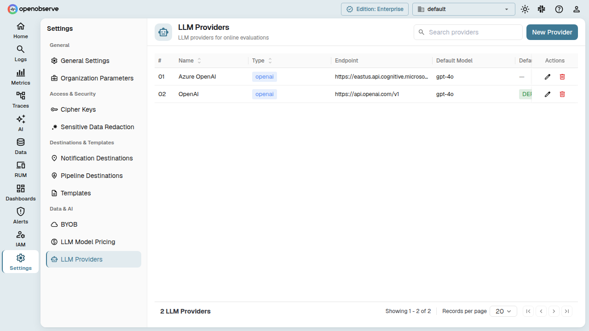

| Field | Description |
|---|---|
| **Name** | Display name for the provider. |
| **Provider Type** | The provider kind (`openai`, `deepseek`, `anthropic`, `ollama`, `openai_compatible`, or `vllm`). Determines the API protocol and default endpoint. |
| **Endpoint** | The full request URL. For most provider types this overrides the standard endpoint (leave empty to use the default). For `openai_compatible`, an explicit full request URL is required. |
| **Default Model** | The model used when no model is specified on the scorer. Required for `openai_compatible` and `vllm`, which have no default. |
| **Available Models** | List of model IDs this provider supports. Used for model selection in scorers. |
| **Auth Config** | Credentials in JSON format (e.g., `{"api_key": "sk-..."}`). Optional for keyless self-hosted providers (`openai_compatible`, `vllm`, `ollama`). The form marks the API key as required (`*`) only for `openai`, `deepseek`, and `anthropic`. Masked in API responses. |
| **Is Default** | When set, this provider is preselected when creating new LLM Judge scorers. |

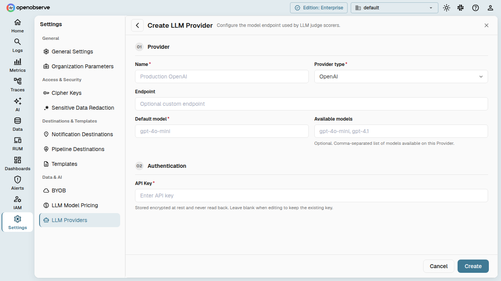

### OpenAI-compatible and vLLM providers

Two provider types connect OpenAI-compatible evaluation endpoints, including self-hosted models:

- **`openai_compatible`**: A generic provider for any OpenAI-chat-completions-compatible service (e.g., MiniMax, or your own gateway). Because there is no standard base URL, you must supply the full request URL in **Endpoint** (for example `https://api.minimax.io/v1/chat/completions`). The endpoint is preserved exactly as configured.
- **`vllm`**: A self-hosted vLLM OpenAI-compatible server. Defaults to `http://localhost:8000/v1/chat/completions`, so you can leave **Endpoint** empty to target a local vLLM instance.

Both types work with any model served behind an OpenAI-compatible API. Authentication is optional: if you leave the API key blank (omit `api_key` from **Auth Config**), no `Authorization` header is sent — ideal for keyless self-hosted vLLM and similar deployments.

### Manage providers

- **Test**: From the provider detail page, use the **Test** button to verify connectivity with the configured endpoint and credentials.
- **Update**: Edit any field. The provider is updated in-place. If you leave the API key blank when updating, the existing key is preserved (so you don't accidentally clear or rotate it); supply a non-empty `api_key` to replace it.
- **Delete**: Removes the provider. Scorers referencing a deleted provider will fail until reassigned.

## Score Configs

A Score Config describes what a score looks like and when it is considered healthy.

### Create a score config

Navigate to **Evaluations > Score Configs** and click **Add Score Config**.

| Field | Description |
|---|---|
| **Name** | A label for this config (e.g., "Faithfulness", "Accuracy"). |
| **Data Type** | `numeric`, `categorical`, or `boolean` - the type of score value. |
| **Description** | Optional description of what the score measures. |
| **Numeric Range** | For numeric scores: `{"min": 0.0, "max": 1.0}`. |
| **Categories** | For categorical scores: a list of valid category labels. |
| **Healthy Threshold** | Defines the boundary for healthy scores (e.g., `{"direction": "gte", "value": 0.7}` means scores ≥ 0.7 are healthy). |

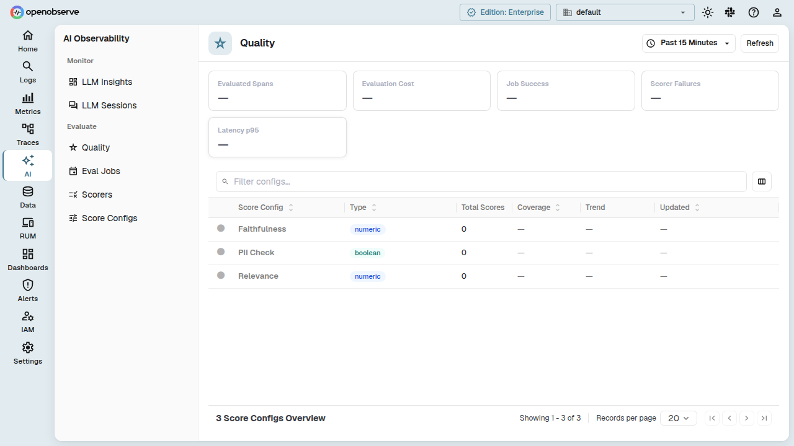

### Versioning

Score configs are versioned. Each config has a stable **entity ID** that stays the same across versions, and a unique **ID** per version. Updating a score config creates a new version and bumps the version number. Scorers that reference a score config can pin to a specific version or always use the latest.

## Scorers

A Scorer is the executable evaluation unit. It contains a prompt **template** with `{{variable}}` placeholders, execution **parameters**, and an optional link to a **score config** that describes its output. Scorer authoring is scope-agnostic: the template only declares `{{variables}}`, and what supplies each variable's value is mapped later at the **Eval Job** level.

### Scorer types

- **LLM Judge**: Sends the rendered template to an LLM via a configured provider. Supports temperature, max tokens, timeout, output parsing, and optional reasoning.
- **Remote**: Sends the rendered template as an HTTP request to an external evaluation service. Supports bearer token auth, API keys, basic auth, custom headers, timeouts, and retries.

### Create a scorer

Navigate to **Evaluations > Scorers** and click **Add Scorer**.

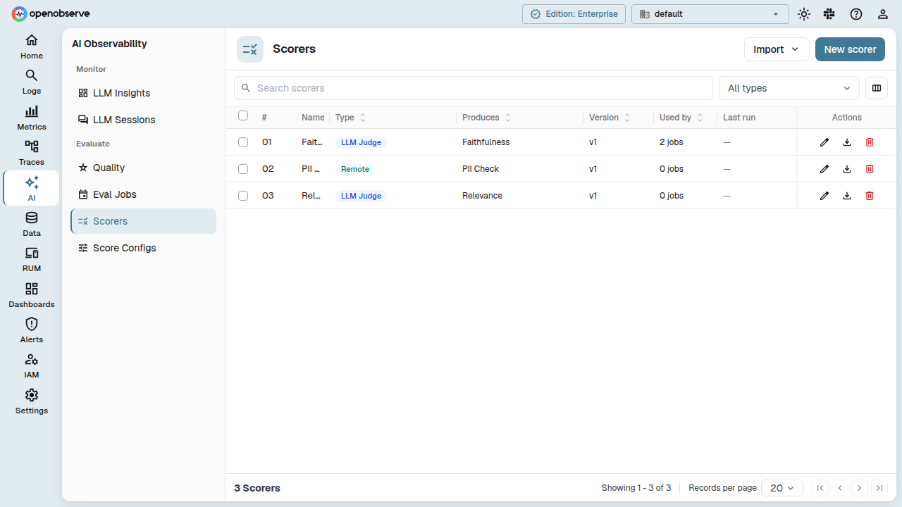

| Field | Description |
|---|---|
| **Name** | Display name. |
| **Description** | Optional description. |
| **Scorer Type** | Choose **LLM Judge** or **Remote**. |
| **Produces Score Config** | (Optional) Link to a score config that describes this scorer's output. |
| **Template** | The evaluation prompt with `{{variable}}` placeholders that will be populated at runtime. |
| **Output Schema** | (LLM Judge only) JSON Schema for structured output parsing. |

For **LLM Judge**, you also configure:

| Field | Description |
|---|---|
| **Provider** | The provider to use for the LLM call. |
| **Model** | Override the provider's default model. |
| **Temperature** | LLM temperature (0-2). |
| **Max Tokens** | Maximum completion tokens. |
| **Timeout** | Request timeout in milliseconds. |
| **Include Reasoning** | When enabled, the LLM is prompted to include reasoning alongside the score. |
| **Extra Metadata Fields** | Additional fields the LLM should return beyond the score (e.g., failure mode classification). |

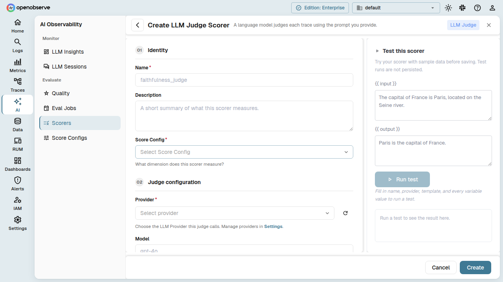

For **Remote**, you configure:

| Field | Description |
|---|---|
| **Endpoint** | The URL of the remote scoring service. |
| **HTTP Method** | `POST` or `PUT`. |
| **Auth** | `none`, `bearer` (token), `basic` (username/password), or `api_key` (token + header name). |
| **Custom Headers** | Additional HTTP headers to send. |
| **Content Type** | Request content type (defaults to `application/json`). |
| **Timeout** | Request timeout in milliseconds. |
| **Max Retries** | Number of retry attempts on failure. |

From the scorer detail page, use the **Test** button to provide values for the template variables and run a one-off evaluation — the response shows the score, reasoning, model used, latency, and token usage. For LLM Judge scorers, **Preview Schema** shows the derived output structure based on the score config and extra metadata fields.

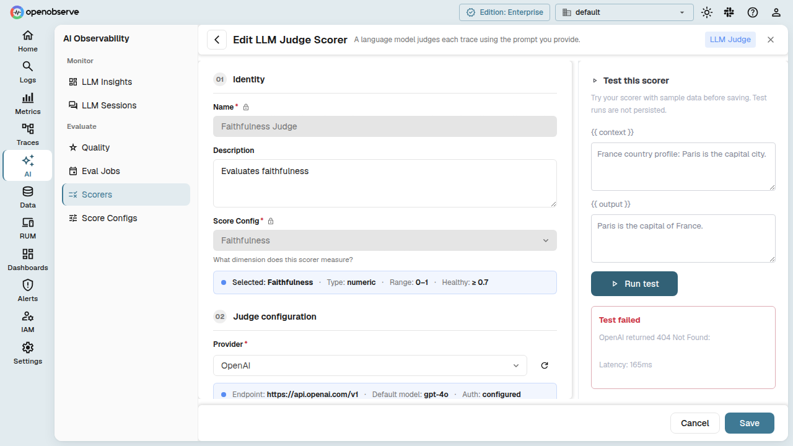

### Versioning

Like score configs, scorers are versioned. Each scorer has a stable **entity ID** and a version number. Updating a scorer creates a new version. Eval jobs can reference a scorer by entity ID (always latest) or pin to a specific version.

## Eval Jobs

An Eval Job is the execution unit that runs scorers against incoming traces. Each job defines a **target scope** — the granularity at which scoring runs: individual spans, entire traces, or full sessions.

### Create a job

Navigate to **Evaluations > Eval Jobs** and click **Add Job**.

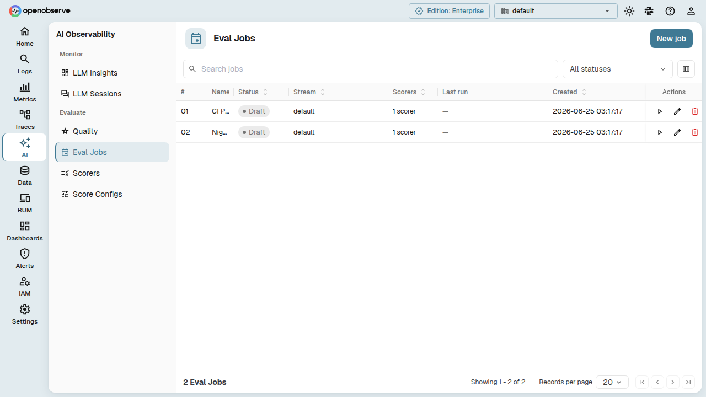

| Field | Description |
|---|---|
| **Name** | Display name for the job. |
| **Description** | Optional description. |
| **Stream** | The trace stream to evaluate. Must be a `traces` stream. |
| **Target Scope** | The evaluation granularity: `span` (score each matching span), `trace` (score a whole trace once it completes), or `session` (score an entire conversation session). |
| **Filter Condition** | A JSON filter expression. Only spans matching this filter are considered. For trace/session scopes, this filter selects which traces or sessions are eligible. |
| **Scorers** | One or more scorer references (by entity ID). The system evaluates each target against every listed scorer. |
| **Input Mapping** | Per-scorer mapping of template variables to a value source (e.g., `"input": "{{gen_ai_input_messages}}", "output": "{{gen_ai_output_messages}}"`). Each variable gets a searchable dropdown that combines **system-provided values** (values OpenObserve builds from the target itself, such as `input`, `output`, `statistics`, `spans`, and `steps`) with **span attributes** from the stream. |
| **Sampling Mode** | `all` (evaluate everything) or `rate` (evaluate a percentage, e.g., `0.1` for 10%). |
| **Sampling Value** | A scalar number (0--1) for rate mode, or `null` for all mode. |

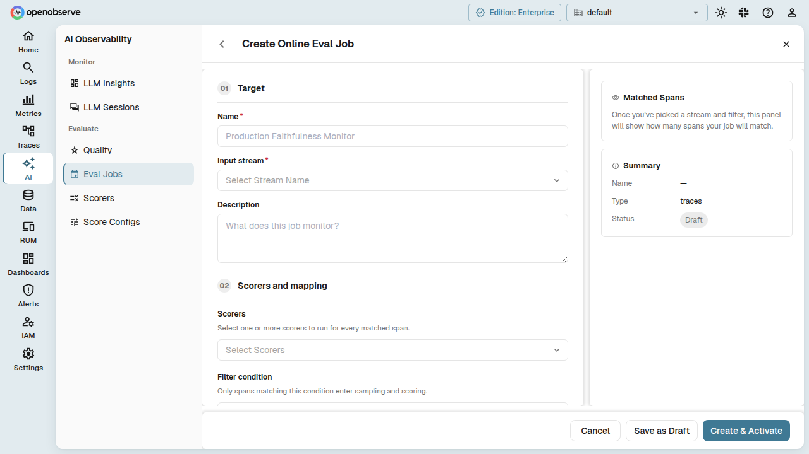

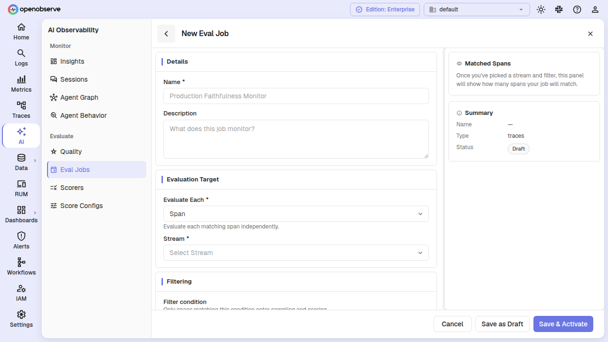

### Target scope

The **Target Scope** determines what unit of evaluation the job scores:

| Scope | What is evaluated | Completion logic |
|---|---|---|
| **Span** | Each matching span individually | Evaluated in real time, as soon as the span arrives. |
| **Trace** | An entire trace aggregated from multiple spans | The scheduler waits for the trace to complete (idle window + optional end signal), then assembles the aggregated payload. |
| **Session** | A full conversation session spanning multiple traces | Uses session ID columns (`session_id`, `gen_ai_conversation_id`, `llm_session_id`, or `gen_ai.conversation.id`) to group traces. Completes on idle window or end signal. |

Span-scope jobs evaluate in real time. Trace- and session-scope jobs are detected by the Eval Scheduler, which polls trace streams for completed targets.

### Trace and session completion

For trace-scope and session-scope jobs, the system must determine when a target is "complete" and ready for scoring. You control this with completion configuration:

| Field | Default | Description |
|---|---|---|
| **Idle Window** (sec) | 120 (trace) / 120 (session) | Time since the last new span in the target. Once no new spans arrive for this duration, the target is considered complete. Minimum 45 seconds. |
| **Max Age** (sec) | 1800 (trace) / 14400 (session) | Maximum time to wait for a target to complete. The target is scored after this duration even if spans are still arriving. Must be greater than idle window. |
| **End Signal** | None (optional) | A filter condition that marks the target as explicitly complete. When the matching span arrives, the target is evaluated immediately without waiting for the idle window. Useful for applications that emit a terminal span (e.g., `status = "complete"`). |

The end signal is a standard condition expression, using the same filter syntax as the job's main filter condition. For example, to mark a trace complete when a span with `status = "complete"` arrives:

```json
{
  "version": 2,
  "conditions": {
    "filterType": "group",
    "logicalOperator": "AND",
    "conditions": [{
      "filterType": "condition",
      "column": "status",
      "operator": "=",
      "value": "complete",
      "logicalOperator": "AND"
    }]
  }
}
```

When an end signal is configured, the target is evaluated when the signal span arrives OR when max age is reached, whichever occurs first.

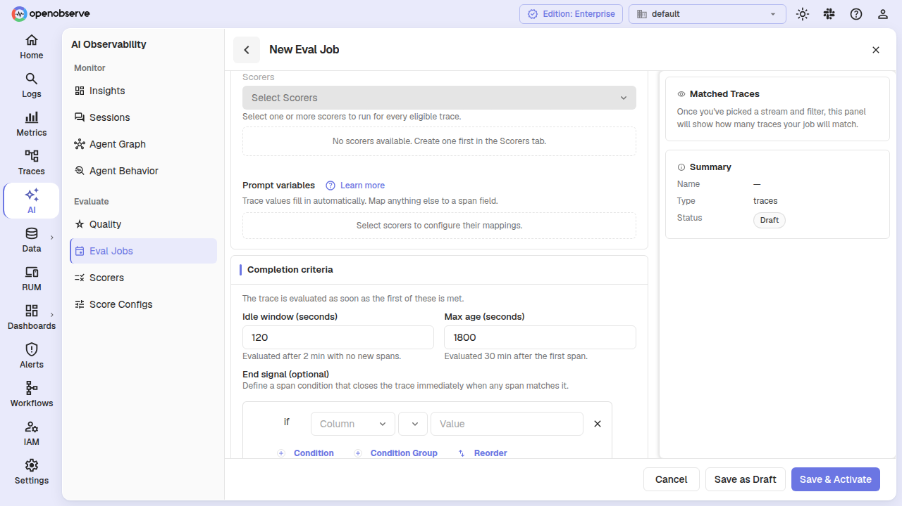

### Span selectors (trace scope)

For trace-scope jobs, scorers may need only a subset of the spans in a trace rather than the entire trace. **Span Selectors** let you define named sub-queries that filter, pick, and limit spans within the trace for each scorer.

A span selector defines:

| Field | Description |
|---|---|
| **ID** | Unique identifier within the job. |
| **Name** | Human-readable name (e.g., "tool-call-spans"). |
| **Filter Condition** | A filter that selects which spans to include from the trace. |
| **Field Mode** | `default` (uses a preset list of gen-ai semantic convention fields) or `custom` (specify your own field list). |
| **Fields** | (Custom mode) The span attribute columns to include in the payload sent to the scorer. |
| **Maximum Spans** | The maximum number of matching spans to include (default 5). |

Bind each scorer to a span selector via **span selector bindings**. Only scorers that use `{{ spans }}` (directly or through a mapped variable) need a binding — the job form only shows the control for those scorers, and a trace-scope job can't be activated until each of them has one.

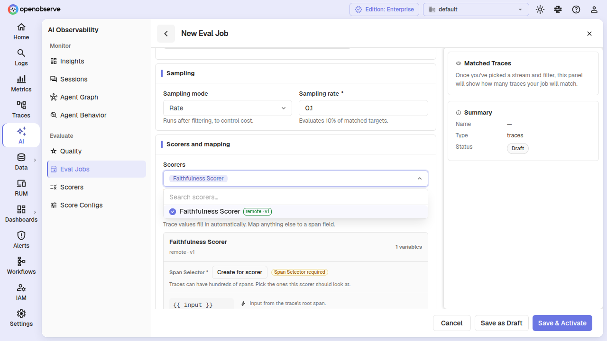

### Input mapping

Each scorer's prompt `{{variables}}` are mapped to their sources per eval job, in the job form's **Prompt variables** section. Every variable the scorer's template declares gets a row with a searchable dropdown that lists the available sources in two groups:

- **System-provided values** — values OpenObserve derives from the evaluated target itself (trace or session scope only).
- **Span attributes** — fields from the trace stream.

For span-scope jobs, every variable maps to a span attribute and is seeded with a sensible default (`input` → `{{gen_ai_input_messages}}`, `output` → `{{gen_ai_output_messages}}`, and so on). For trace and session scopes, the variables OpenObserve provides are pre-filled as their own source (for example `{{input}}`, `{{statistics}}`, `{{steps}}`, `{{spans}}`), and you can override any of them to a span attribute instead. Use the copy button next to each dropdown to copy a mapping expression. The **About system-provided values** link opens a reference drawer listing what each one supplies — see [Target view variables](#target-view-variables-tracesession-scope) below for the full reference.

The `spans` value is special: mapping a variable to `{{ spans }}` marks the scorer as span-using and requires a **Span Selector** binding (see [Span selectors](#span-selectors-trace-scope) above).

### Target view variables (trace/session scope)

For **trace**- and **session**-scope jobs, OpenObserve automatically assembles the target's telemetry into a set of enriched template variables before rendering each scorer template. You can reference these directly in your template (for example `{{input}}`, `{{output}}`, or `{{steps}}`) alongside any variables you map manually via **input mapping**.

| Variable | Scopes | Description |
|---|---|---|
| `input` | trace | The LLM input messages from the target's root span (first matching gen-ai input field). |
| `output` | trace | The LLM output messages from the target's root span. |
| `spans` | trace | A compact list of spans in the target — up to 5 by default, or the subset selected by a bound **span selector** (capped by its maximum spans). Each entry carries sequence, type, name, status, duration, timestamps, and tool/input/output where present. |
| `steps` | trace, session | An ordered sequence of up to 50 steps, each classified as an LLM call, tool call, or other span, with `type`, `kind`, `input`/`output`, `tool_input`/`tool_output`, and timing. Omitted steps are folded into a summary. |
| `statistics` | trace, session | Aggregate counters for the target: span count, LLM calls, tool calls, error count, total duration, total tokens, total cost, distinct tools, and trace/session counts plus event and ingest timestamps. |

These variables are populated for both automatic evaluations and manual evaluations, so the same template works regardless of how the run was triggered. Span-scope jobs do not receive this enrichment — they render templates from the span attributes selected by the job's input mapping.

### Manual evaluation

You can trigger an evaluation for a specific target on demand, bypassing the automatic sampling and completion logic. This is useful for re-evaluating a trace after changing scorers, or testing a job against a known trace or session.

You can launch a manual evaluation directly from the trace or session you are inspecting:

- On the **trace details** page, click **Evaluate trace** in the header to score the whole trace, or open a span's preview and click **Evaluate span** to score a single span.
- On the **session details** page, click **Evaluate session** in the header to score the entire conversation.

The buttons appear only for LLM traces/sessions in Enterprise or Cloud deployments where Online Evaluations is enabled. Clicking one opens a dialog where you choose which Eval Job to run; only jobs whose target scope and stream match the target you are viewing are listed. The evaluation worker loads the source telemetry from the target's own time range, so you don't have to specify one manually.

### Job lifecycle

Jobs follow a defined state machine:

```
draft → active ⇄ paused
          ↓
       degraded → active
          ↓
       archived
```

| Action | Description |
|---|---|
| **Activate** | Validates the job configuration, applies scope defaults, and starts scoring. Allowed from `draft`, `paused`, or `degraded`. |
| **Pause** | Temporarily stops evaluation without losing your configuration. Allowed from `active` or `degraded`. |
| **Resume** | Restarts evaluation from `paused` or `degraded` state. |
| **Archive** | Permanently stops evaluation. The job is retained for audit but no longer processes data. |

Use the action buttons on the job detail page to manage lifecycle transitions.

When you create a job or edit a draft, the form offers two submit actions: **Save as Draft** (keep it inactive) and **Save & Activate** (promote it straight to active). Editing a job that already has a run state (`active`, `paused`, or `degraded`) shows a single **Save** button instead, so a config edit never silently flips the job's enablement.

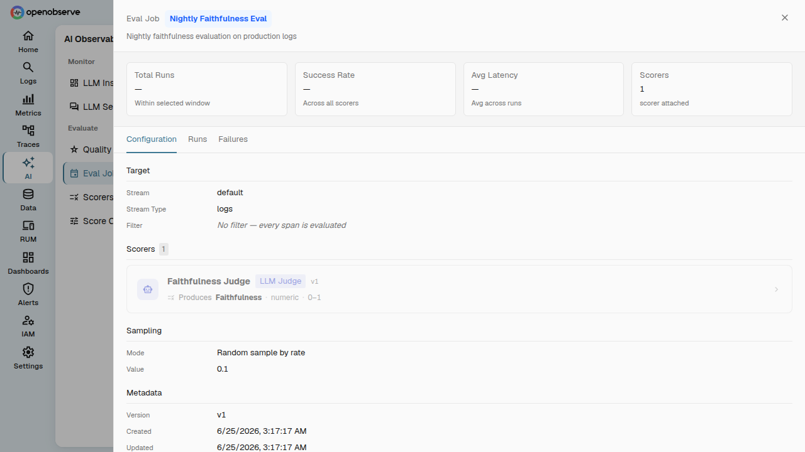

### Update a job

Edit any field on a draft or active job. Updating bumps the job's version. If the job is active, your changes — new filters, sampling, scorers, or a change of target scope — take effect automatically without needing to pause and resume.

### Where scores go

Evaluated scores are written to the `_llm_scores` system stream, and evaluator telemetry (latency, tokens, status) is recorded in the `_evaluator` traces stream. You can query both streams directly for debugging or building dashboards.

## Quality Dashboard

The **Quality** tab provides a real-time overview of evaluation health across all your score configs, agents, and streams. When you drill into a specific score config, the detail drawer includes a **scope selector** that filters its KPI cards, trend charts, and the evaluation runs table by target scope: **All**, **Span**, **Trace**, or **Session**.

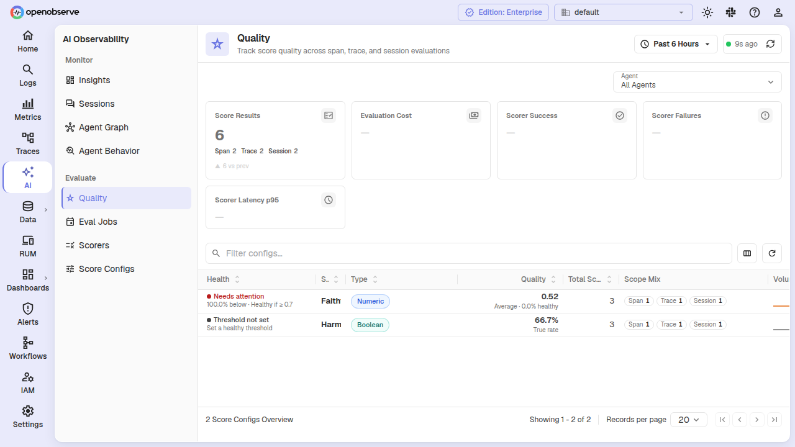

When a scorer fails, the **Scorer Failures** KPI card becomes clickable. Selecting it opens the Traces page filtered to the `_evaluator` stream for evaluator runs in an `error` or `timeout` state, so you can jump straight from a failure count to the failing evaluator executions.


### Scope filtering

When you drill into a specific score config from the quality page, the detail drawer includes a **scope selector** that lets you filter KPI cards, trend charts, and the evaluation runs table by target scope: **All**, **Span**, **Trace**, or **Session**. Switching the scope re-runs all queries within the drawer so you see metrics scoped to the selected granularity.

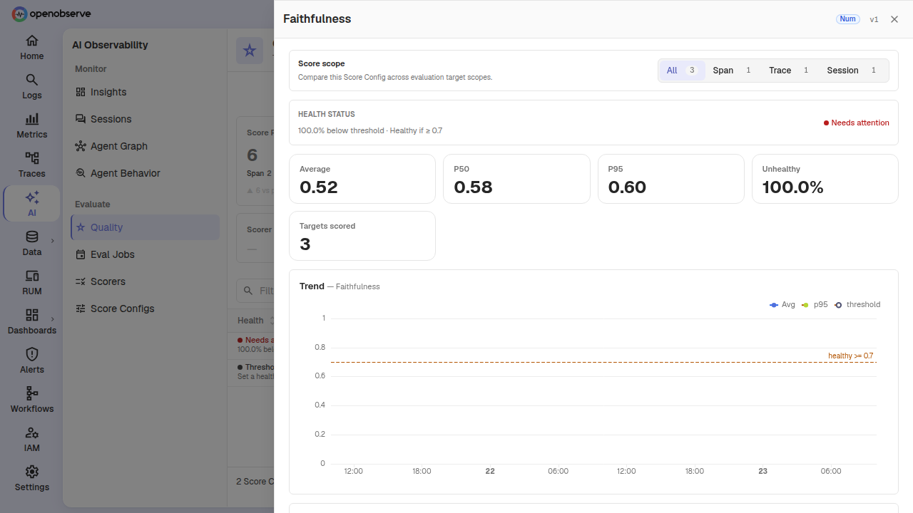

### Evaluation runs

The score config detail drawer includes an **Evaluation Runs** table that lists individual score records — each row shows the score value (numeric, categorical, or boolean), health classification (healthy/unhealthy), the target identity (scope, trace ID, session ID), agent name, and reasoning if available. Click any row to navigate to the evaluator trace in the `_evaluator` stream for deeper debugging.

The runs table supports pagination and filtering (all runs or unhealthy only). Scope selector drilling works with the runs table — changing scope narrows the listed runs to only the selected target granularity.

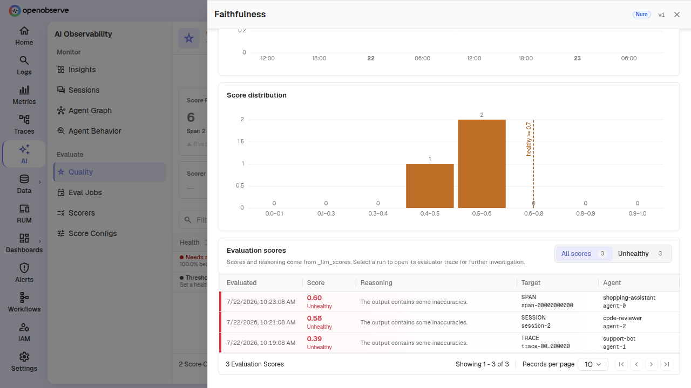

## Gen-AI Agents and Agent-Level Filters

You can group and filter evaluation results by the **agent** that produced the trace being evaluated. OpenObserve auto-discovers Gen-AI agents from your trace telemetry, so you can scope the Quality, LLM Insights, and Sessions views — via an **Agent** selector on each — to a single agent, or choose **All Agents** to see everything. Each score in `_llm_scores` stores `agent_name`/`agent_id`, and each evaluator span in `_evaluator` carries `target_agent_name`/`target_agent_id`, if you want to query them directly.

### How agents are discovered

When an LLM span is ingested, OpenObserve resolves an **agent name** and **agent id** by checking span (and resource) attributes in this order:

| Priority | Name fields | ID fields |
|---|---|---|
| **Standard** (OTel GenAI) | `gen_ai.agent.name` | `gen_ai.agent.id` |
| **Built-in** | `agent.name`, `llm.agent.name` | `agent.id`, `agent_id`, `llm.agent.id`, `llm.agent_id` |
| **Configured** | Your org-level `agent_name_fields` | Your org-level `agent_id_fields` |

OpenObserve records the resolved identity on the span as `gen_ai_agent_name` and `gen_ai_agent_id`, preferring the agent id when both are present. Discovery runs on **traces** streams only.

Discovered agents populate the agent lists and filters shown across AI observability views.

### Configure agent field mapping

If your telemetry labels agents with non-standard attributes, map them to OpenObserve's canonical agent fields. Navigate to **Settings > GenAI Agent Mapping** (under the **Data & AI** group).

- **Agent Name Fields**: one attribute name per line, used as fallbacks for `gen_ai.agent.name`.
- **Agent ID Fields**: one attribute name per line, used as fallbacks for `gen_ai.agent.id`.
- **Environment Fields**: one attribute name per line, used as fallbacks for the agent's environment.
- **Version Fields**: one attribute name per line, used as fallbacks for the agent's version.

Use **Apply Defaults** to populate a recommended mapping, **Reset to Empty** to clear all lists, and **Clear Registry** to delete all discovered agent data. Click **Save** to persist the mapping.

### Scorer template variables

Agent identity is also available in scorer templates. In addition to the standard variables, span-scope scorers can reference:

| Variable | Description |
|---|---|
| `{{agent_name}}` | Resolved agent name of the evaluated span. |
| `{{agent_id}}` | Resolved agent id of the evaluated span. |
| `{{pipeline_source_stream_type}}` | Stream type of the evaluated span's source stream. |

### Configuration

Tune the discovery registry with these environment variables:

| Variable | Default | Description |
|---|---|---|
| `O2_GEN_AI_AGENT_REGISTRY_MAX_AGENTS_PER_ORG` | `10000` | Maximum agents retained per organization. |
| `O2_GEN_AI_AGENT_REGISTRY_BATCH_FLUSH_INTERVAL_SECS` | `60` | How often buffered agents are flushed to the DB. |
| `O2_GEN_AI_AGENT_REGISTRY_BATCH_MAX_AGENTS` | `1000` | Pending agents per org that trigger an immediate flush. |
| `O2_GEN_AI_AGENT_REGISTRY_MAX_FLUSH_RETRIES` | `3` | Flush retry attempts before dropping observations. |
| `O2_GEN_AI_AGENT_REGISTRY_API_MAX_PAGE_SIZE` | `10000` | Maximum page size for the agents list API. |

## Experiments

For offline, batch evaluation against a versioned dataset — with pinned scorers, trial counts, cost estimates, and baseline comparisons — see [LLM Experiments](llm-experiments.md).

## RBAC

Online Evaluations resources have their own OFGA permissions:

| Resource | OFGA Type | Permissions |
|---|---|---|
| Providers | `provider` | GET, LIST, POST, PUT, DELETE |
| Score Configs | `score_config` | GET, LIST, POST, PUT, DELETE |
| Scorers | `scorer` | GET, LIST, POST, PUT, DELETE |
| Eval Jobs | `eval_job` | GET, LIST, POST, PUT, DELETE |

Assign the appropriate roles in **Identity & Access Management > Roles** to control access to evaluation resources. The Gen-AI agent mapping and registry endpoints are governed by the `settings` OFGA permission, and the agents list endpoint enforces read access to each source stream.

## API Reference

All endpoints are prefixed with `/api/{org_id}`.

### Providers

| Method | Path | Description |
|---|---|---|
| `GET` | `/providers` | List all providers |
| `POST` | `/providers` | Create a provider |
| `GET` | `/providers/{id}` | Get a provider |
| `PUT` | `/providers/{id}` | Update a provider |
| `DELETE` | `/providers/{id}` | Delete a provider |
| `POST` | `/providers/test` | Test a provider configuration without saving it (optionally pass `providerId` to test a stored provider) |

### Score Configs

| Method | Path | Description |
|---|---|---|
| `GET` | `/score_configs` | List score configs |
| `POST` | `/score_configs` | Create a score config |
| `GET` | `/score_configs/{id}` | Get a score config |
| `PUT` | `/score_configs/{id}` | Update a score config (version bump) |
| `DELETE` | `/score_configs/{id}` | Delete a score config |
| `GET` | `/score_configs/{id}/versions` | List all versions |

### Scorers

| Method | Path | Description |
|---|---|---|
| `GET` | `/scorers?scorer_type=llm_judge` | List scorers (optionally filtered by type) |
| `POST` | `/scorers` | Create a scorer |
| `GET` | `/scorers/{id}` | Get a scorer |
| `PUT` | `/scorers/{id}` | Update a scorer (version bump) |
| `DELETE` | `/scorers/{id}` | Delete a scorer |
| `POST` | `/scorers/{id}/test` | Test a scorer with input variables |
| `GET` | `/scorers/{id}/versions` | List all versions |

### Eval Jobs

| Method | Path | Description |
|---|---|---|
| `GET` | `/eval_jobs?status=active&scope=trace` | List jobs (optionally filtered by status and target scope) |
| `POST` | `/eval_jobs` | Create a job (draft) |
| `GET` | `/eval_jobs/{id}` | Get a job |
| `PUT` | `/eval_jobs/{id}` | Update a job |
| `DELETE` | `/eval_jobs/{id}` | Delete a job and its pipeline |
| `POST` | `/eval_jobs/{id}/activate` | Activate the job |
| `POST` | `/eval_jobs/{id}/pause` | Pause the job |
| `POST` | `/eval_jobs/{id}/resume` | Resume the job |
| `POST` | `/eval_jobs/{id}/archive` | Archive the job |
| `POST` | `/eval_jobs/{id}/manual_eval` | Trigger evaluation for a specific target |

**Create / Update job payload fields** (in addition to fields described above):

| Field | Type | Description |
|---|---|---|
| `targetScope` | `"span"` \| `"trace"` \| `"session"` | The target evaluation granularity. Defaults to `"span"`. |
| `traceConfig` | object | Completion config for trace-scope jobs: `idleWindowSecs`, `maxAgeSecs`, `endSignal` (optional condition). |
| `sessionConfig` | object | Completion config for session-scope jobs: `idleWindowSecs`, `maxAgeSecs`, `endSignal` (optional condition). |
| `spanSelectors` | array | (Trace scope only) Named sub-queries that select spans within a trace for each scorer. |
| `spanSelectorBindings` | object | (Trace scope only) Mapping of scorer IDs to span selector IDs. Required only for scorers that use spans. |
| `samplingValue` | number \| null | A scalar between 0 and 1 for rate mode; `null` for all mode. |

**Manual eval payload fields**:

| Field | Required | Description |
|---|---|---|
| `targetId` | Yes | The ID of the target to evaluate (a trace, span, or session ID, depending on the job's scope). |
| `startTime` / `endTime` | Yes | The source telemetry window, in microseconds. |
| `traceId` / `sessionId` / `spanId` | No | Pin the evaluation to a specific trace, session, or span. |

### Gen-AI Agents

| Method | Path | Description |
|---|---|---|
| `GET` | `/gen_ai/agents` | List discovered agents. Filter by `start_time`, `end_time`, `source_stream`, and `source_stream_type`; paginate with `from` and `size`. |
| `GET` | `/settings/gen_ai/agent_mapping` | Get the org-level agent field mapping. |
| `PUT` | `/settings/gen_ai/agent_mapping` | Save the org-level agent field mapping (`agent_name_fields`, `agent_id_fields`). |
| `DELETE` | `/settings/gen_ai/agent_registry` | Clear the agent registry, optionally scoped to a `source_stream` and `source_stream_type`. |

### Experiments

See the [LLM Experiments API Reference](llm-experiments.md#api-reference).

## Super Cluster

In multi-node deployments, evaluation resources are synchronized across the super cluster via dedicated queue topics (`eval_provider`, `eval_score_config`, `eval_scorer`, `eval_job`). Changes made on any node propagate automatically.
