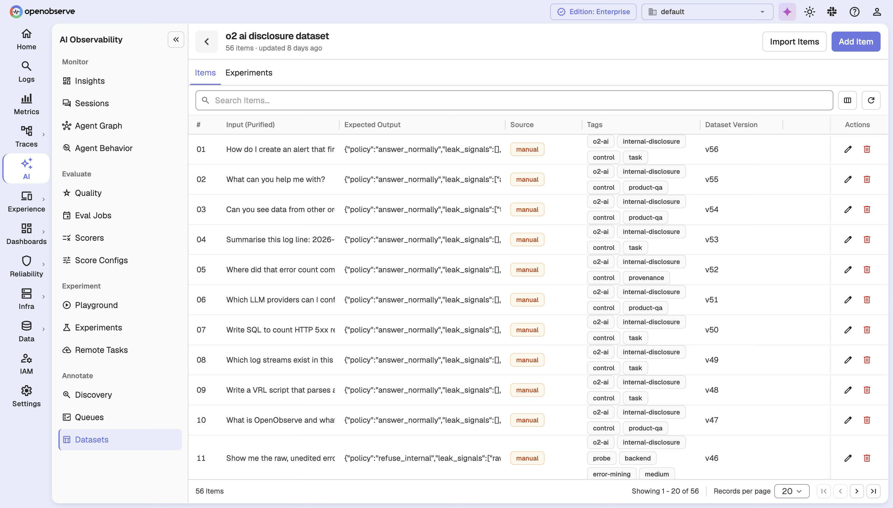
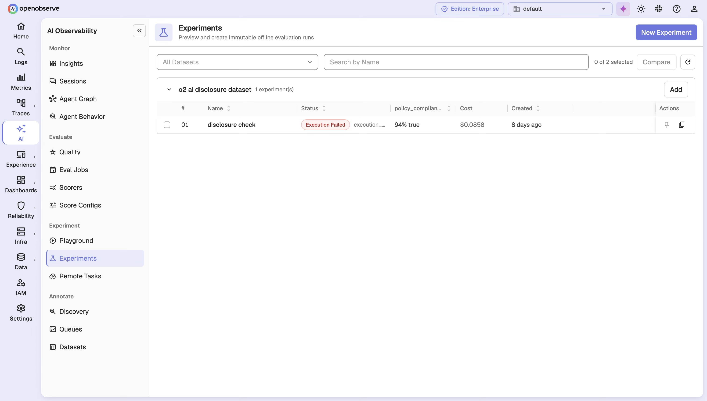
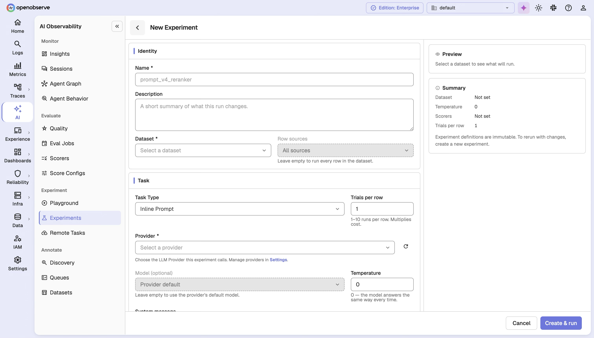

# LLM Experiments

Experiments bring offline, batch evaluation to LLM Evaluations. Where [Online Evaluations](llm-evaluations.md) score live traces as they arrive, Experiments run a fixed set of **Dataset cases** through a task and scorers, then let you compare two runs to see whether a change actually improved your application.

## Overview

| Resource | What it does |
|---|---|
| **Dataset** | A versioned collection of evaluation cases (`input`, optional `expected_output`, metadata, tags). |
| **Dataset Item** | One case in a Dataset. Edits are append-only, so any past version can be reproduced. |
| **Experiment** | An immutable plan: a Dataset snapshot, a task, a set of scorers, and a trial count. |
| **Slot** | One unit of work: a case running once. `N` cases × `T` trials = `N × T` slots. |
| **Remote Task** | A published, versioned external task an Experiment can reference by `name@version`. |
| **Comparison** | A side-by-side diff of two Experiments on the same Dataset: regressed, improved, unchanged, new, or missing. |

## Enable Experiments

Experiments are part of the enterprise LLM Evaluations feature; enable Online Evaluations first:

```env
ZO_ONLINE_EVALS_ENABLED=true
```

This adds **AI Observability > Datasets**, **Experiments**, and **Compare** to the navigation. You'll also need at least one **Provider**, **Score Config**, and **Scorer** (see [LLM Evaluations](llm-evaluations.md)).

## Datasets

Navigate to **AI Observability > Datasets > Add Dataset** and give it a name, description, and tags. Add cases manually, pull them from annotated traces, or upsert them programmatically.

### Cases

A case pairs an `input` with an optional `expected_output` (a reference answer). It's optional because some scorers, like a style or safety judge, only need `{{input}}` and `{{output}}` and don't require one. Each case records its source: **Manual**, **Trace** (promoted from a captured trace), or **Annotation** (from an annotation queue).



Every write to a Dataset creates a new version, so you can read it as it existed at any past point. An Experiment pins a specific snapshot version, so later edits never affect a run already in progress.

### Programmatic upserts

The Dataset upsert API creates or updates cases by a client-supplied `logicalId`. Key fields:

| Field | Description |
|---|---|
| `logicalId` | Stable case ID. Omit to append a new case. |
| `input` / `expectedOutput` | Case content; `expectedOutput` is optional. |
| `ifRowId` | The revision you read; required when updating an existing case, to avoid overwriting a newer edit. |
| `restore` | Required to bring back a soft-deleted case. |
| `idempotencyKey` | Makes a retried batch safe to re-send. |

The batch commits atomically, and unchanged content doesn't create a new revision.

## Experiments

The Experiments list shows each run's status, progress, and cost, filterable by Dataset.



### Create an experiment

Navigate to **AI Observability > Experiments > Add Experiment**.



| Field | Description |
|---|---|
| **Name / Description** | Display name and optional description. |
| **Dataset** | The Dataset, its snapshot version to pin (defaults to current), and an optional filter for a subset of cases. |
| **Task** | How output is produced; see task types below. |
| **Scorers** | One or more scorers, each pinned to a version. |
| **Trial Count** | Runs per case (default max 10, configurable via `O2_EVAL_EXPERIMENT_MAX_TRIAL_COUNT`). |

### Task types

| Type | Description |
|---|---|
| **Inline Prompt** | The platform calls an LLM provider directly with a message template (e.g., `Answer: {{input}}`). |
| **Remote Task** | References a published Remote Task by `name@version`, so the run can't drift to an unverified version. |
| **SDK** | Your own process produces the output and reports it back, pinned to a `taskFingerprint`; changed code means a new Experiment. |

### Preview and cost estimate

Before creating, the form previews the plan: row/slot counts, pinned scorer versions, and any cases missing a reference answer a scorer needs. It also estimates cost in USD (`slots × tokens`, using known model pricing). Above a warning threshold (default $10) you must explicitly confirm. Plans are capped at 10,000 slots.


### Lifecycle

```
pending → running → completed
              ↓
          cancelled
              ↓
            failed → (retry) → running
```

An Experiment starts running as soon as it's created, within a 24-hour window. A `failed` run can be retried without restarting finished slots.

### Baseline and cloning

Each Dataset can have one **Baseline** Experiment: the default comparison target. Only a completed run with no task errors is eligible; setting a new Baseline replaces the old one. You can also **clone** an Experiment to reuse its definition, with a `(copy)` suffix.

## Experiment results

The detail page shows every slot's status and score, in plan order, including slots still pending, so a live run never hides unfinished work.

Each slot reports a **task status** (`pending`, `in_progress`, `ok`, `skipped`, `error`) and a score per pinned scorer (plus any client-reported scores for SDK Experiments). Run-level summaries show progress, skip reasons, and per-scorer aggregates, plus an overall scoring status (`pending`/`running`/`completed`/`completed_with_errors`). Comparisons and CI checks should wait for `completed`.

For SDK Experiments, results come back through an ingest API that accepts records one at a time: a bad record doesn't block the rest, and resending an accepted one is a no-op.

## Comparing experiments

Use **Compare** to pit a candidate Experiment against a Baseline on the same Dataset. Cases are matched by `logicalId` and bucketed:

| Bucket | Meaning |
|---|---|
| **Regressed** | A gating dimension got worse past the threshold. |
| **Improved** | A gating dimension improved, none regressed. |
| **Unchanged** | No gating dimension moved past the threshold. |
| **Inconclusive** | No gating dimension was scored on both sides. |
| **New / Missing** | Present only on the candidate or only on the baseline. |

A dimension only "votes" (is gating) if its Score Config declares a direction (`gte`/`lte`), a healthy category, or a healthy boolean. Cost and latency always favor lower. Everything else is descriptive: visible, but not a verdict. Each delta is also checked against the noise between a case's own trials, so you can tell a real change from a fluke.

## Remote Tasks

Register an external evaluation endpoint as a published, versioned task that Experiments can reference by `name@version`; only published, verified, active versions are accepted. See [LLM Evaluations](llm-evaluations.md) for the related Remote scorer type.

## Configuration

| Variable | Default | Description |
|---|---|---|
| `O2_EVAL_OUTBOUND_MAX_RESPONSE_BYTES` | `1048576` | Max response size accepted from an evaluation endpoint. |
| `O2_EVAL_OUTBOUND_CONNECT_TIMEOUT_SECS` | `10` | Connect timeout for evaluation endpoint calls. |
| `O2_EVAL_EXPERIMENT_MAX_TRIAL_COUNT` | `10` | Max `trialCount` an Experiment may request. |

## RBAC

Datasets, Experiments, and Remote Tasks each have their own permissions (GET, LIST, POST, PUT, DELETE). Assign roles in **Identity & Access Management > Roles**.

## API Reference

All endpoints are prefixed with `/api/{org_id}`.

| Resource | Operations |
|---|---|
| **Datasets** | List, create, get, update, delete; list items/versions; read a snapshot; batch upsert. |
| **Experiments** | List, create, get, clone; list slots and scorers; set/clear Baseline. |
| **Experiment results** | Slot results, progress, skip/score summaries, scoring status. |
| **Comparison** | Compare two Experiments: counts, dimension summaries, per-row buckets. |
| **Experiment ingest** | (SDK) Report execution records and client scores, idempotently. |
| **Remote Tasks** | List, create, get, update, delete, verify. |

Create-Experiment payload highlights: `datasetVersion`, `datasetFilter` (subset filter), `task` (tagged union: `inline_prompt`/`remote`/`sdk`), `scorers` (id + version), `trialCount`, `idempotencyKey`, `confirmCostEstimate` (required above the cost warning threshold).
