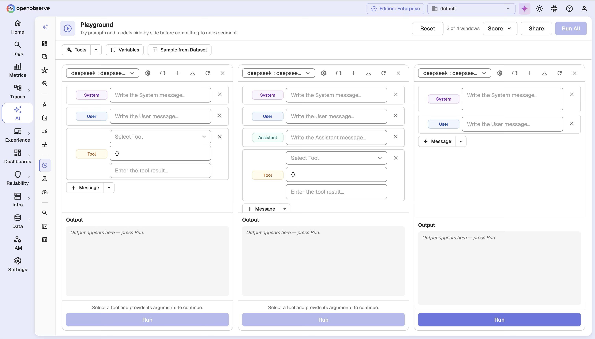
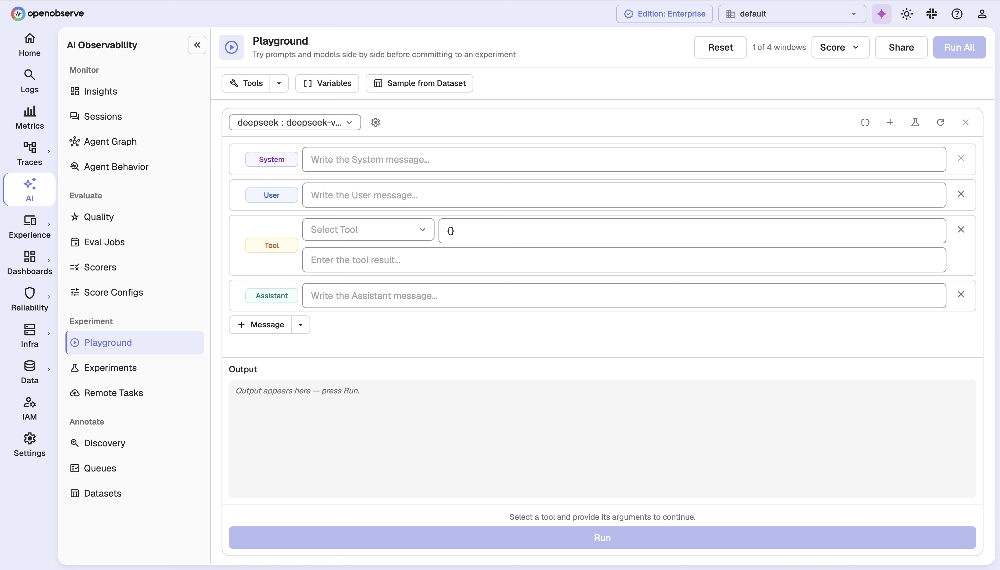
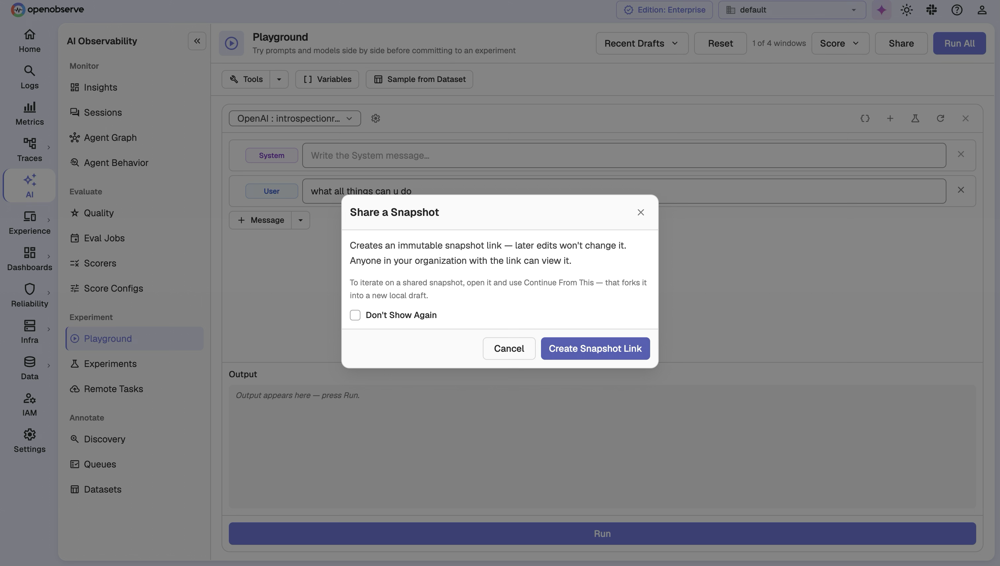

# LLM Playground

The Playground is an interactive workbench for iterating on prompts, models, and scorers before you commit them to a Dataset or an Experiment. Run a model to stream its answer, score the result to read your judge's reasoning, and share a snapshot to capture the whole board by value.

## Overview

The Playground is a two-dimensional board:

- **Columns are variants**: each column is one prompt configuration — a provider, an optional model, an ordered list of messages, sampling parameters, and optional tools or a response format.
- **Rows are cases**: each row is an input (plus optional expected output and metadata) that every variant runs against.

A **cell** is the intersection of a variant and a case. **Run** a cell to stream the model's answer back live; **score** a cell to run your scorers against it and read each judge's verdict and reasoning.

The Playground is volatile by design: opening it and running it persist nothing, so your drafts never affect the analytics the Playground exists to improve. Sharing is the only action that saves anything — it copies every column, row, result, and score into a snapshot, which keeps rendering even after the dataset, scorer, or provider it came from has changed or been deleted.



## Build a variant

Each column is a variant. Configure it with:

| Field | Description |
|---|---|
| **Provider** | The LLM provider to call. You can only use providers you are allowed to see. |
| **Model** | Optional model override. Leave empty to use the provider's default model. |
| **Messages** | The prompt as an ordered list of `role` + `content` messages. String content is templated with `{{variables}}`; structured content is passed through untouched. |
| **Parameters** | Sampling parameters. `temperature` and `max_tokens` map to the provider's own fields; any other key is passed through to the provider as-is. |
| **Tools** | Tool definitions passed to the provider. If the model chooses to call a tool, the call is rendered as the cell's output — nothing is executed. |
| **Response Format** | An optional structured-output schema for the provider. |



### Variables

Templates in message content bind variables from the row's input:

- A string input binds `{{input}}`.
- An object input binds each of its fields by name.

Only string content is templated. Structured content — multimodal parts and tool results — is passed through as JSON rather than rendered, so its structure is never corrupted.

## Add cases

Each row is a case. A case supplies the input every variant renders against, and optionally:

| Field | Description |
|---|---|
| **Input** | A string binds `{{input}}`; an object binds each of its fields by name. |
| **Expected Output** | An optional reference used by scorers that compare output against a gold answer. |
| **Metadata** | Optional extra context made available to scorers as `{{metadata}}`. |

## Run a cell

Running a cell streams the model's answer back as Server-Sent Events. The first event is the **rendered** prompt — exactly what was sent, including how the row's variables were bound — followed by incremental text deltas and a terminal `done` event carrying the model used, latency, and token usage and cost.

Configuration errors (an inaccessible provider, an unrenderable message, an invalid parameter) are caught before streaming starts and return a normal error response. Once streaming begins, an upstream failure — including rate limits and other gateway errors — arrives as an `error` event in the stream. Any API key in an upstream error is redacted before it reaches you.

## Score a cell

Scoring a cell runs your scorers against it synchronously and returns one verdict per scorer — nothing is saved, so throwaway scores never affect your experiment comparisons. Select the scorers you want to apply to a cell, then run them.

Each result reports one of three outcomes:

| Outcome | Meaning |
|---|---|
| **Scored** | The judge returned a value — `numeric`, `categorical`, or `boolean` — plus reasoning, metadata, the model used, prompt/completion tokens, and latency. |
| **Skipped** | The scorer could not judge this cell. `requires_trace` means the scorer reads spans or steps, which a Playground run never produces; `no_reference` means the scorer compares against an expected output the case does not supply. |
| **Failed** | The scorer ran and errored. One failed scorer does not cost you the other verdicts in the batch. |

Scorers are resolved at their **latest** version. Pinning to a specific version happens when you promote a column to an Experiment, not while you are drafting.

## Tool calls and structured output

When a variant defines **tools**, a model that chooses to call one returns the call — name and assembled arguments — as the cell's output rather than executing anything. This lets you iterate on tool definitions without wiring up an execution environment.

When a variant sets a **response format**, the provider is asked for structured output, and the returned structure is shown as the result.

## Share a snapshot

Share captures the entire board — every column, row, result, and score — into an immutable snapshot and returns a short link you can hand to a teammate. The snapshot keeps rendering even after the dataset, scorer, or provider it came from changes or is deleted.

Editing a shared board does not update the existing snapshot — it creates a new one.

A snapshot is visible only within your organization.



### Limits and retention

Shared snapshots are subject to workbench limits and a sliding retention window:

- A snapshot payload may hold up to **4 columns**, **10 rows**, and **1 MB** of data.
- Snapshots expire after a configurable number of days of **not being opened**; opening one renews its window.
- Each organization is capped at a configurable number of snapshots; over the cap, the least recently opened are purged first.

## Promote to a Dataset or Experiment

The Playground is a drafting surface for the rest of the LLM evaluations suite. When you are happy with a result, promote it:

- Promote a **result cell** into a Dataset, where it becomes a reference case recorded with source `playground`.
- Promote a **column** into an Experiment, which is the moment a scorer is pinned to a specific version.

## Configuration

The Playground is part of the enterprise AI Observability / Online Evaluations suite. Three environment variables tune Playground-specific behavior:

| Variable | Default | Description |
|---|---|---|
| `O2_LLM_PLAYGROUND_RUN_TIMEOUT_MS` | `120000` | Per-cell timeout in milliseconds for a Playground run. A Playground call is interactive, so it gives up long before an Experiment slot would. |
| `O2_LLM_PLAYGROUND_SNAPSHOT_TTL_DAYS` | `180` | Days a shared snapshot survives without being opened. Opening it renews the window; set to `0` to keep snapshots forever. |
| `O2_LLM_PLAYGROUND_SNAPSHOT_MAX_PER_ORG` | `1000` | Maximum shared snapshots retained per organization. Over the cap, the least recently opened are purged first. Set to `0` to remove the cap. |

## RBAC

The Playground has its own OFGA resource type, `playground`, with the standard `GET`, `LIST`, `POST`, `PUT`, and `DELETE` grants. Two details matter:

- **Run** and **Score** require the write grant (`POST`), even though they persist nothing — both call a provider or judge and spend real money, so a read-only user can't drive the organization's spend.
- You can only use providers and scorers you have access to.

Assign the appropriate roles in **Identity & Access Management > Roles** to control Playground access.

## API Reference

All endpoints are prefixed with `/api/{org_id}`.

| Method | Path | Description |
|---|---|---|
| `POST` | `/playground/run` | Run a cell: stream the model's answer back as Server-Sent Events. |
| `POST` | `/playground/score` | Score a cell synchronously against one or more scorers. |
| `POST` | `/playground/snapshots` | Share a workbench snapshot, stored by value. |
| `GET` | `/playground/snapshots/{snapshot_id}` | Read a snapshot (renewing its retention window). |

**Run payload** — a column plus an optional row:

```json
{
  "column": {
    "provider_id": "provider-id",
    "model": "gpt-4o",
    "messages": [
      { "role": "system", "content": "You are a helpful assistant." },
      { "role": "user", "content": "{{input}}" }
    ],
    "params": { "temperature": 0.2, "max_tokens": 256 },
    "tools": [],
    "response_format": null
  },
  "row": {
    "input": "What is the retention default?",
    "expected_output": "14 days",
    "metadata": {}
  }
}
```

**Score payload** — the scorers to run against a subject:

```json
{
  "scorer_ids": ["scorer-1", "scorer-2"],
  "input": "What is the retention default?",
  "output": "Fourteen days.",
  "expected_output": "14 days",
  "metadata": {}
}
```

**Share payload** — the whole workbench by value:

```json
{
  "payload": {
    "columns": [ { "provider_id": "provider-id", "messages": [], "model": "gpt-4o", "params": {} } ],
    "rows": [ { "input": "case 1" } ]
  },
  "parent_snapshot_id": null
}
```

## Super Cluster

In multi-node deployments, shared snapshots replicate across the super cluster via the `eval_playground_snapshot` queue topic, so a snapshot shared on one node is readable on every node.
