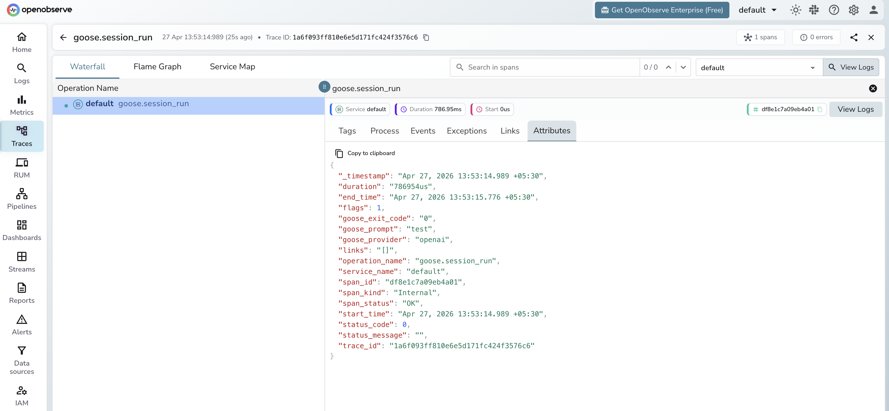

# **Codename Goose → OpenObserve**

Capture session run latency, exit codes, and output lengths for every Codename Goose invocation. Codename Goose is Block's open-source AI developer agent that uses tools to complete multi-step software engineering tasks. Instrumentation wraps subprocess calls to the `goose` CLI in manual OpenTelemetry spans.

## **Prerequisites**

* Python 3.8+
* An [OpenObserve](https://openobserve.ai/) account (cloud or self-hosted)
* Your OpenObserve **organisation ID** and **Base64-encoded auth token**
* Codename Goose CLI installed (see below)
* An OpenAI API key (or another supported provider)

## **Installation**

Install the Goose CLI:

```shell
curl -fsSL https://github.com/block/goose/releases/download/stable/download_cli.sh | bash
```

Install the Python dependencies:

```shell
pip install openobserve opentelemetry-api requests python-dotenv
```

## **Configuration**

Create a `.env` file in your project root:

```
OPENOBSERVE_URL=http://localhost:5080/
OPENOBSERVE_ORG=default
OPENOBSERVE_AUTH_TOKEN=Basic <your_base64_token>
OPENAI_API_KEY=your-openai-api-key
```

Set provider and model via environment variables at run time:

```
GOOSE_PROVIDER=openai
GOOSE_MODEL=gpt-4o-mini
```

## **Instrumentation**

Call `openobserve_init()` before running sessions. Wrap each `goose run` subprocess call in a manual span.

```python
from dotenv import load_dotenv
load_dotenv()

from openobserve import openobserve_init
openobserve_init()

from opentelemetry import trace
import os
import subprocess

tracer = trace.get_tracer(__name__)

goose_env = {
    **os.environ,
    "GOOSE_PROVIDER": "openai",
    "GOOSE_MODEL": "gpt-4o-mini",
}

def run_goose(prompt: str):
    with tracer.start_as_current_span("goose.session_run") as span:
        span.set_attribute("goose.prompt", prompt[:100])
        span.set_attribute("goose.provider", "openai")
        span.set_attribute("goose.model", "gpt-4o-mini")
        result = subprocess.run(
            ["goose", "run", "-t", prompt, "-q"],
            capture_output=True,
            text=True,
            timeout=60,
            env=goose_env,
        )
        span.set_attribute("goose.exit_code", result.returncode)
        span.set_attribute("goose.output_length", len(result.stdout))
        span.set_attribute("span_status", "OK" if result.returncode == 0 else "ERROR")
        return result.stdout.strip()

output = run_goose("Explain distributed tracing in one sentence.")
print(output)

trace.get_tracer_provider().force_flush()
```

## **What Gets Captured**

| Attribute | Description |
| ----- | ----- |
| `operation_name` | `goose.session_run` |
| `goose_prompt` | The prompt passed to the session (truncated to 100 chars) |
| `goose_provider` | The LLM provider used (e.g. `openai`) |
| `goose_model` | The model used (e.g. `gpt-4o-mini`) |
| `goose_exit_code` | Exit code of the `goose` process (`0` = success) |
| `goose_output_length` | Character count of the session output |
| `span_status` | `OK` on success, `ERROR` on failure |
| `error.message` | Error detail when the process fails or times out |
| `duration` | Total session run latency |

## **Viewing Traces**

1. Log in to OpenObserve and navigate to **Traces**
2. Filter by `operation_name` = `goose.session_run` to see all session runs
3. Filter by `goose_exit_code` != `0` to find failed sessions
4. Sort by duration to identify the slowest prompts



## **Next Steps**

With Codename Goose instrumented, every agent session is recorded in OpenObserve. From here you can monitor session latency, track exit code distributions, and correlate long-running sessions with specific prompt types.

## **Read More**

- [LLM Observability Overview](../llm-applications.md)
- [Traces Ingestion with Python](../../../ingestion/traces/python.md)
- [Exploring Traces in OpenObserve](../../../user-guide/data-exploration/traces/)
- [Building Dashboards](../../../user-guide/analytics/dashboards/)
