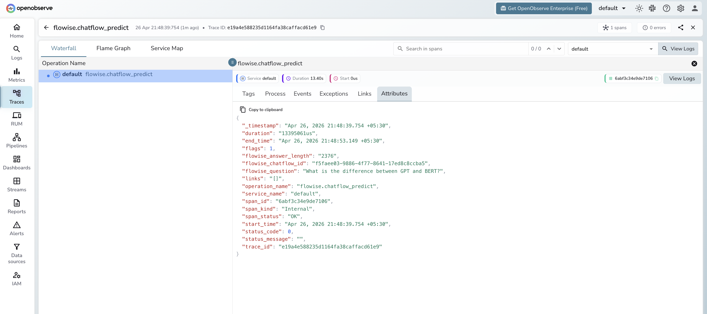

# **Flowise → OpenObserve**

Trace every prediction request made to a Flowise chatflow by wrapping the REST API calls in manual OpenTelemetry spans. Flowise is an open-source drag-and-drop LLM flow builder. This integration instruments a Python client that calls the Flowise prediction API and exports spans to OpenObserve.

## **Prerequisites**

* [Docker](https://www.docker.com/) installed
* An [OpenObserve](https://openobserve.ai/) account (cloud or self-hosted)
* Your OpenObserve **organisation ID** and **Base64-encoded auth token**
* OpenAI API key (or another provider supported by Flowise)

## **Installation**

```bash
pip install openobserve opentelemetry-sdk opentelemetry-exporter-otlp python-dotenv requests
```

## **Configuration**

Start Flowise via Docker, passing your OpenObserve endpoint as the OTLP export target:

```bash
docker run -d \
  --name flowise \
  -p 3000:3000 \
  -e OTEL_EXPORTER_OTLP_ENDPOINT=http://host.docker.internal:5080/api/default/v1/traces \
  "-e OTEL_EXPORTER_OTLP_HEADERS=Authorization=Basic <your_base64_token>" \
  -e OTEL_SERVICE_NAME=flowise \
  flowiseai/flowise
```

Replace `host.docker.internal` with your OpenObserve host if it is not running on the same machine.

Once Flowise is running, open `http://localhost:3000`, build a chatflow, and copy the chatflow ID from the canvas URL.

Set the following in your `.env` file:

```
OPENOBSERVE_URL=http://localhost:5080/
OPENOBSERVE_ORG=default
OPENOBSERVE_AUTH_TOKEN=Basic <your_base64_token>
FLOWISE_BASE_URL=http://localhost:3000
FLOWISE_CHATFLOW_ID=<your_chatflow_id>
```

## **Instrumentation**

Wrap each prediction call in a manual span using the OpenTelemetry tracer:

```python
from dotenv import load_dotenv
load_dotenv()

from openobserve import openobserve_init
openobserve_init()

from opentelemetry import trace
import os
import requests

tracer = trace.get_tracer(__name__)

base_url = os.environ["FLOWISE_BASE_URL"]
chatflow_id = os.environ["FLOWISE_CHATFLOW_ID"]

with tracer.start_as_current_span("flowise.chatflow_predict") as span:
    span.set_attribute("flowise_chatflow_id", chatflow_id)
    span.set_attribute("flowise_question", "Explain distributed tracing in one sentence.")
    resp = requests.post(
        f"{base_url}/api/v1/prediction/{chatflow_id}",
        headers={"Content-Type": "application/json"},
        json={"question": "Explain distributed tracing in one sentence."},
        timeout=30,
    )
    resp.raise_for_status()
    text = resp.json().get("text", "")
    span.set_attribute("flowise_answer_length", len(text))
    span.set_attribute("span_status", "OK")
    print(text)
```

## **What Gets Captured**

Each prediction call emits one `flowise.chatflow_predict` span:

| Attribute | Description |
| ----- | ----- |
| `flowise_chatflow_id` | The chatflow UUID that handled the request |
| `flowise_question` | The question text sent to the chatflow |
| `flowise_answer_length` | Character length of the response |
| `span_status` | `OK` on success, `ERROR` on failure |
| `error_message` | Error detail when the request fails |
| `duration` | Total round-trip latency in microseconds |

## **Viewing Traces**

1. Log in to OpenObserve and navigate to **Traces**
2. Filter by `operation_name` = `flowise.chatflow_predict` to isolate Flowise spans
3. Click a trace to inspect the chatflow ID, question, and response length
4. Filter by `span_status` = `ERROR` to find failed predictions



## **Next Steps**

With Flowise traces in OpenObserve, you can track chatflow latency over time, compare performance across different flow designs, and alert on prediction failures.

## **Read More**

- [LLM Observability Overview](../llm-applications.md)
- [LangChain](../frameworks/langchain.md)
- [Exploring Traces in OpenObserve](../../../user-guide/data-exploration/traces/)
- [Building Dashboards](../../../user-guide/analytics/dashboards/)
