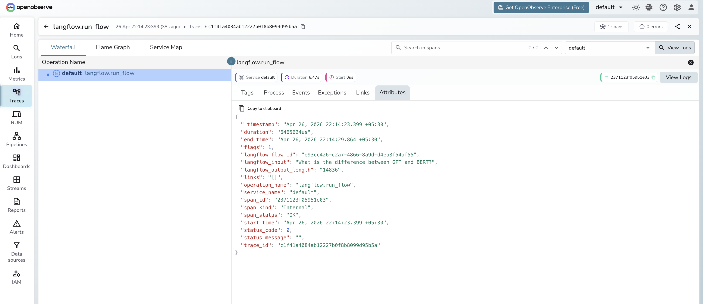

# **Langflow → OpenObserve**

Capture flow execution latency, inputs, and error rates from your Langflow applications by wrapping API calls in OpenTelemetry spans and sending them to OpenObserve.

## **Prerequisites**

* [Langflow](https://www.langflow.org/) running (self-hosted or Docker)
* An [OpenObserve](https://openobserve.ai/) account (cloud or self-hosted)
* Your OpenObserve **organisation ID** and **Base64-encoded auth token**
* Your Langflow **flow ID** (visible in the Langflow UI URL when a flow is open)

## **Installation**

```shell
pip install openobserve-telemetry-sdk opentelemetry-sdk python-dotenv requests
```

## **Configuration**

Create a `.env` file in your project root:

```
OPENOBSERVE_URL=http://localhost:5080/
OPENOBSERVE_ORG=default
OPENOBSERVE_AUTH_TOKEN=Basic <your_base64_token>

LANGFLOW_BASE_URL=http://localhost:7860
LANGFLOW_FLOW_ID=<your-flow-id>
LANGFLOW_API_KEY=<your-langflow-api-key>
```

To find your flow ID, open a flow in the Langflow UI and copy the UUID from the browser URL.

To create a Langflow API key, go to **Settings > API Keys** in the Langflow UI.

## **Instrumentation**

Wrap each Langflow API call in a manual span to capture flow execution data:

```python
from dotenv import load_dotenv
load_dotenv()

from openobserve import openobserve_init
openobserve_init()

from opentelemetry import trace
import os
import requests
import uuid

tracer = trace.get_tracer(__name__)

base_url = os.environ["LANGFLOW_BASE_URL"]
flow_id = os.environ["LANGFLOW_FLOW_ID"]
api_key = os.environ.get("LANGFLOW_API_KEY", "")

headers = {"Content-Type": "application/json"}
if api_key:
    headers["x-api-key"] = api_key

with tracer.start_as_current_span("langflow.run_flow") as span:
    span.set_attribute("langflow.flow_id", flow_id)
    span.set_attribute("langflow.input", "Explain distributed tracing in one sentence.")

    resp = requests.post(
        f"{base_url}/api/v1/run/{flow_id}",
        headers=headers,
        json={
            "input_value": "Explain distributed tracing in one sentence.",
            "output_type": "chat",
            "input_type": "chat",
            "session_id": str(uuid.uuid4()),
        },
        timeout=30,
    )
    resp.raise_for_status()
    output = str(resp.json().get("outputs", ""))
    span.set_attribute("langflow.output_length", len(output))
    span.set_attribute("span_status", "OK")
    print(output[:200])
```

## **What Gets Captured**

Each `langflow.run_flow` span records:

| Attribute | Description |
| ----- | ----- |
| `langflow_flow_id` | UUID of the flow being executed |
| `langflow_input` | Input text sent to the flow (first 100 characters) |
| `langflow_output_length` | Byte length of the full response payload |
| `span_status` | `OK` on success, `ERROR` on failure |
| `error_message` | Exception detail when `span_status` is `ERROR` |
| `duration` | End-to-end flow execution latency |

## **Viewing Traces**

1. Log in to OpenObserve and navigate to **Traces**
2. Filter by `operation_name` = `langflow.run_flow` to see all flow calls
3. Click a trace to inspect input, output length, and latency
4. Filter by `span_status` = `ERROR` to identify failed runs



## **Next Steps**

With Langflow flow executions in OpenObserve, you can track end-to-end latency per flow, alert on error spikes, and correlate Langflow runs with the rest of your application traces.

## **Read More**

- [LLM Observability Overview](../llm-applications.md)
- [Exploring Traces in OpenObserve](../../../user-guide/data-exploration/traces/)
- [Building Dashboards](../../../user-guide/analytics/dashboards/)
- [Alerts](../../../user-guide/analytics/alerts/)
