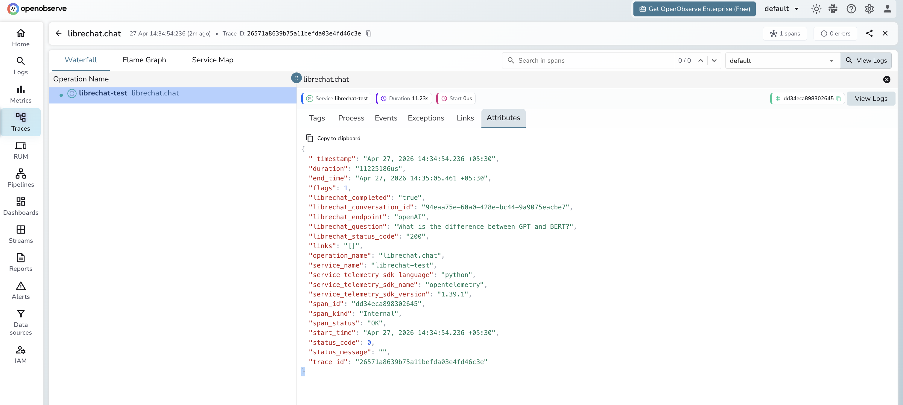

# **LibreChat → OpenObserve**

Capture per-conversation latency, endpoint, completion status, and error rates for every message sent through LibreChat's API. LibreChat is a self-hosted multi-provider chat UI supporting OpenAI, Anthropic, Ollama, and others. Instrumentation wraps LibreChat's HTTP API in manual OpenTelemetry spans.

## **Prerequisites**

* Python 3.8+
* An [OpenObserve](https://openobserve.ai/) account (cloud or self-hosted)
* Your OpenObserve **organisation ID** and **Base64-encoded auth token**
* A running [LibreChat](https://www.librechat.ai/) instance (self-hosted via Docker)
* LibreChat credentials (email and password) for programmatic login

## **Installation**

```shell
pip install openobserve-telemetry-sdk opentelemetry-api requests python-dotenv
```

## **Configuration**

Create a `.env` file in your project root:

```
OPENOBSERVE_URL=https://api.openobserve.ai/
OPENOBSERVE_ORG=your_org_id
OPENOBSERVE_AUTH_TOKEN=Basic <your_base64_token>
LIBRECHAT_BASE_URL=http://localhost:3080
LIBRECHAT_EMAIL=your@email.com
LIBRECHAT_PASSWORD=your-password
```

## **Instrumentation**

Call `openobserve_init()` before making API calls. Pass `resource_attributes` to set the service name. The script logs in to LibreChat to obtain a JWT, posts each message to the async chat endpoint, and polls for completion before closing the span.

```python
from dotenv import load_dotenv
load_dotenv()

from openobserve import openobserve_init, openobserve_shutdown
openobserve_init(resource_attributes={"service.name": "my-app"})

from opentelemetry import trace
import os
import time
import requests

tracer = trace.get_tracer(__name__)

base_url = os.environ.get("LIBRECHAT_BASE_URL", "http://localhost:3080")
email = os.environ["LIBRECHAT_EMAIL"]
password = os.environ["LIBRECHAT_PASSWORD"]
endpoint = os.environ.get("LIBRECHAT_ENDPOINT", "openAI")

BROWSER_UA = (
    "Mozilla/5.0 (Macintosh; Intel Mac OS X 10_15_7) "
    "AppleWebKit/537.36 (KHTML, like Gecko) "
    "Chrome/120.0.0.0 Safari/537.36"
)


def login():
    resp = requests.post(
        f"{base_url}/api/auth/login",
        headers={"Content-Type": "application/json"},
        json={"email": email, "password": password},
        timeout=15,
    )
    resp.raise_for_status()
    return resp.json()["token"]


def wait_for_completion(jwt_token, conversation_id, timeout=30):
    headers = {"Authorization": f"Bearer {jwt_token}", "User-Agent": BROWSER_UA}
    deadline = time.time() + timeout
    while time.time() < deadline:
        resp = requests.get(
            f"{base_url}/api/agents/chat/status/{conversation_id}",
            headers=headers,
            timeout=10,
        )
        if not resp.json().get("active", True):
            return True
        time.sleep(1)
    return False


jwt_token = login()

headers = {
    "Authorization": f"Bearer {jwt_token}",
    "Content-Type": "application/json",
    "User-Agent": BROWSER_UA,
}

with tracer.start_as_current_span("librechat.chat") as span:
    span.set_attribute("librechat.endpoint", endpoint)
    span.set_attribute("librechat.question", "What is distributed tracing?")
    resp = requests.post(
        f"{base_url}/api/agents/chat",
        headers=headers,
        json={"text": "What is distributed tracing?", "endpoint": endpoint, "model": "gpt-4o-mini"},
        timeout=30,
    )
    resp.raise_for_status()
    data = resp.json()
    conversation_id = data["conversationId"]
    span.set_attribute("librechat.conversation_id", conversation_id)
    span.set_attribute("librechat.status_code", resp.status_code)
    completed = wait_for_completion(jwt_token, conversation_id)
    span.set_attribute("librechat.completed", completed)
    span.set_attribute("span_status", "OK")

openobserve_shutdown()
```

LibreChat's chat API is asynchronous. `POST /api/agents/chat` returns a `conversationId` immediately and processes the response in the background. The `wait_for_completion` helper polls `GET /api/agents/chat/status/:conversationId` until the job finishes, so the span duration reflects the full end-to-end latency including the LLM response time.

LibreChat enforces a browser User-Agent header on the chat endpoint. Requests without a recognisable browser UA are rejected with `Illegal request`.

## **What Gets Captured**

| Attribute | Description |
| ----- | ----- |
| `librechat_conversation_id` | Unique ID for the conversation created by the chat request |
| `librechat_endpoint` | Provider endpoint name (e.g. `openAI`, `anthropic`) |
| `librechat_question` | User message text, truncated to 100 characters |
| `librechat_status_code` | HTTP status code from `POST /api/agents/chat` |
| `librechat_completed` | Whether the async job completed within the timeout |
| `span_status` | `OK` on success, `ERROR` on failed requests |
| `error_message` | Error detail when the request fails |
| `duration` | End-to-end latency including LLM response time |

## **Viewing Traces**

1. Log in to OpenObserve and navigate to **Traces**
2. Filter by `service_name = librechat-test` to isolate LibreChat spans
3. Click a `librechat.chat` span to inspect the conversation ID and endpoint
4. Filter by `span_status = ERROR` to identify authentication or connection failures
5. Sort by `duration` to find the slowest LLM responses



## **Next Steps**

With LibreChat instrumented, every API call is recorded in OpenObserve. From here you can monitor latency per provider endpoint, track completion rates for async jobs, and alert when requests fail or exceed acceptable latency thresholds.

## **Read More**

- [LLM Observability Overview](../llm-applications.md)
- [Traces Ingestion with Python](../../../ingestion/traces/python.md)
- [Exploring Traces in OpenObserve](../../../user-guide/data-exploration/traces/)
- [Building Dashboards](../../../user-guide/analytics/dashboards/)
