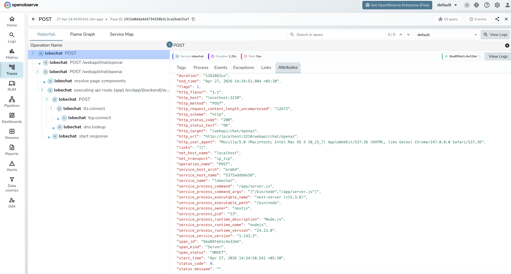

# **LobeChat → OpenObserve**

Capture per-request latency and status codes for every chat completion processed by LobeChat. LobeChat is a self-hosted ChatGPT-like application with built-in OpenTelemetry support. Pass OTLP environment variables at startup and traces flow directly into OpenObserve.

## **Prerequisites**

* Docker
* An [OpenObserve](https://openobserve.ai/) account (cloud or self-hosted)
* Your OpenObserve **organisation ID** and **Base64-encoded auth token**
* An API key for at least one LLM provider (e.g. OpenAI)

## **Installation**

Pull the LobeChat image:

```shell
docker pull lobehub/lobe-chat:latest
```

## **Configuration**

Start LobeChat with `ENABLE_TELEMETRY=1` and the standard OTLP environment variables. The exporter appends `/v1/traces` to `OTEL_EXPORTER_OTLP_ENDPOINT` automatically, so set the endpoint without the path suffix.

```shell
docker run -d --name lobechat \
  -p 3210:3210 \
  -e OPENAI_API_KEY=your_openai_api_key \
  -e OPENAI_MODEL_LIST=gpt-4o-mini \
  -e ENABLE_TELEMETRY=1 \
  -e OTEL_EXPORTER_OTLP_ENDPOINT=http://host.docker.internal:5080/api/default \
  -e "OTEL_EXPORTER_OTLP_HEADERS=Authorization=Basic <your_base64_token>" \
  -e OTEL_SERVICE_NAME=lobechat \
  lobehub/lobe-chat:latest
```

For OpenObserve Cloud replace the endpoint and token:

```
OTEL_EXPORTER_OTLP_ENDPOINT=https://api.openobserve.ai/api/your_org_id
OTEL_EXPORTER_OTLP_HEADERS=Authorization=Basic <your_base64_token>
```

`OPENAI_MODEL_LIST` restricts the available models. Without it LobeChat may default to a model your account cannot access, causing all requests to fail with no spans emitted.

## **Viewing Traces**

Open LobeChat at `http://localhost:3210`, select a model, and send a chat message. Each request appears in OpenObserve as a server span on the `/webapi/chat/openai` route.

1. Log in to OpenObserve and navigate to **Traces**
2. Filter by `service_name = lobechat`
3. Each span covers the full round-trip from the browser request to the LLM provider response
4. Use `http_status_code` to identify failed requests
5. Sort by `duration` to find slow completions



## **What Gets Captured**

LobeChat exports HTTP server spans — one span per chat request. These are infrastructure-level spans: they capture route, latency, and status but not LLM-specific fields like token counts or model name.

| Attribute | Description |
| ----- | ----- |
| `operation_name` | `POST` |
| `http_target` | `/webapi/chat/openai` |
| `http_method` | `POST` |
| `http_status_code` | HTTP response code (e.g. `200`) |
| `http_status_text` | `OK` on success |
| `http_url` | Full request URL |
| `http_host` | Host and port |
| `http_request_content_length_uncompressed` | Request body size in bytes |
| `http_user_agent` | Browser or client user agent |
| `net_transport` | `ip_tcp` |
| `span_kind` | `Server` |
| `span_status` | `UNSET` on success, `ERROR` on failure |
| `duration` | End-to-end request latency |
| `service_service_version` | LobeChat version (e.g. `1.143.3`) |
| `service_process_runtime_name` | `nodejs` |

## **Next Steps**

With LobeChat instrumented, every chat request is recorded in OpenObserve. From here you can monitor response latency, track error rates by route, and set up alerts when the chat API degrades.

## **Read More**

- [LLM Observability Overview](../llm-applications.md)
- [Traces Ingestion with Python](../../../ingestion/traces/python.md)
- [Exploring Traces in OpenObserve](../../../user-guide/data-exploration/traces/)
- [Building Dashboards](../../../user-guide/analytics/dashboards/)
