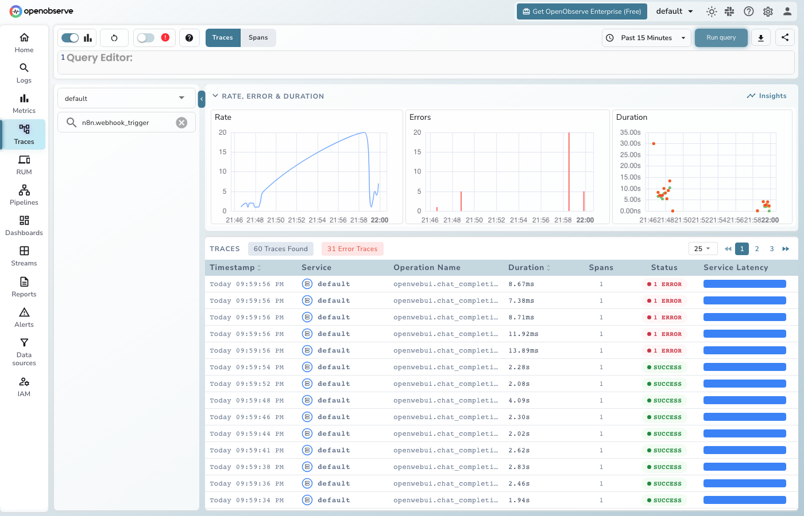

# **n8n → OpenObserve**

Capture webhook trigger latency, status codes, and payload metadata for every n8n workflow invocation. n8n is a self-hosted workflow automation platform. Instrumentation wraps n8n webhook calls in manual OpenTelemetry spans, and n8n can also export native workflow traces via OTLP environment variables.

## **Prerequisites**

* Python 3.8+
* An [OpenObserve](https://openobserve.ai/) account (cloud or self-hosted)
* Your OpenObserve **organisation ID** and **Base64-encoded auth token**
* A running [n8n](https://n8n.io/) instance with at least one active webhook workflow

## **Installation**

```shell
pip install openobserve-telemetry-sdk opentelemetry-api requests python-dotenv
```

## **Configuration**

Create a `.env` file in your project root:

```
OPENOBSERVE_URL=https://api.openobserve.ai/
OPENOBSERVE_ORG=your_org_id
OPENOBSERVE_AUTH_TOKEN=Basic <your_base64_token>
N8N_BASE_URL=http://localhost:5678
N8N_WEBHOOK_ID=your-webhook-path
```

To capture native n8n workflow execution traces alongside the manual spans, start n8n with these environment variables:

```shell
docker run -p 5678:5678 \
  -e N8N_METRICS=true \
  -e OTEL_EXPORTER_OTLP_ENDPOINT=http://host.docker.internal:5080/api/default/v1/traces \
  -e "OTEL_EXPORTER_OTLP_HEADERS=Authorization=Basic <your_base64_token>" \
  -e OTEL_SERVICE_NAME=n8n \
  n8nio/n8n
```

## **Instrumentation**

Call `openobserve_init()` **before** making API calls. Wrap each webhook trigger in a manual span.

```python
from dotenv import load_dotenv
load_dotenv()

from openobserve import openobserve_init
openobserve_init()

from opentelemetry import trace
import os
import requests

tracer = trace.get_tracer(__name__)

base_url = os.environ.get("N8N_BASE_URL", "http://localhost:5678")
webhook_id = os.environ["N8N_WEBHOOK_ID"]

def trigger_webhook(payload: dict):
    with tracer.start_as_current_span("n8n.webhook_trigger") as span:
        span.set_attribute("n8n.webhook_id", webhook_id)
        span.set_attribute("n8n.payload_keys", str(list(payload.keys())))
        resp = requests.post(
            f"{base_url}/webhook/{webhook_id}",
            headers={"Content-Type": "application/json"},
            json=payload,
            timeout=30,
        )
        span.set_attribute("n8n.status_code", resp.status_code)
        span.set_attribute("span_status", "OK" if resp.ok else "ERROR")
        return resp

result = trigger_webhook({"message": "Explain distributed tracing."})
print(result.status_code, result.text)
```

## **What Gets Captured**

| Attribute | Description |
| ----- | ----- |
| `n8n_webhook_id` | The webhook path being triggered |
| `n8n_payload_keys` | Keys present in the webhook payload |
| `n8n_status_code` | HTTP status code from n8n (`200` on success) |
| `span_status` | `OK` or error status |
| `error_message` | Error detail on connection failures |
| `duration` | Webhook trigger latency |

## **Viewing Traces**

1. Log in to OpenObserve and navigate to **Traces**
2. Filter by span name `n8n.webhook_trigger` to see all webhook calls
3. Filter by `n8n_status_code` to find non-200 responses
4. Filter by `span_status` `ERROR` to find failed triggers



## **Next Steps**

With n8n instrumented, every webhook trigger is recorded in OpenObserve. From here you can monitor trigger latency, track which webhooks are called most often, and set alerts on failed workflow invocations.

## **Read More**

- [LLM Observability Overview](../llm-applications.md)
- [Traces Ingestion with Python](../../../ingestion/traces/python.md)
- [Exploring Traces in OpenObserve](../../../user-guide/data-exploration/traces/)
- [Building Dashboards](../../../user-guide/analytics/dashboards/)
