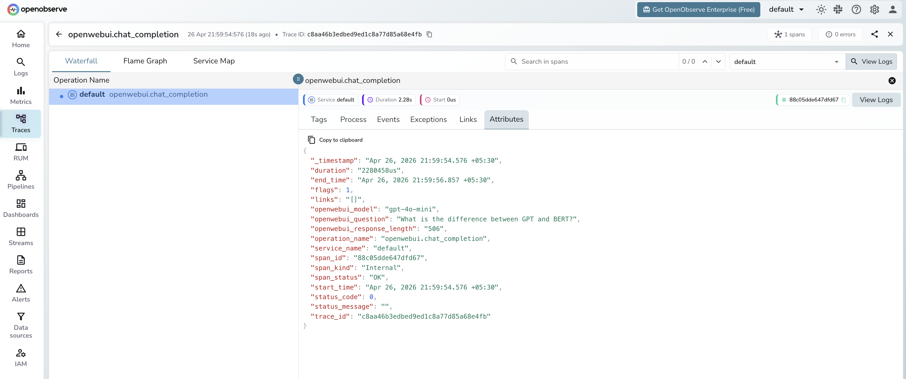

# **Open WebUI → OpenObserve**

Capture chat completion spans from your Open WebUI instance. Open WebUI is a self-hosted interface for local and cloud LLMs that exposes an OpenAI-compatible API. Wrap API calls in manual OTel spans to record model, question, and response metadata in OpenObserve.

## **Prerequisites**

* Python 3.8+
* [Open WebUI](https://openwebui.com/) running (Docker recommended)
* An [OpenObserve](https://openobserve.ai/) account (cloud or self-hosted)
* Your OpenObserve **organisation ID** and **Base64-encoded auth token**
* An Open WebUI API key (from your profile settings)

## **Installation**

```shell
pip install openobserve-telemetry-sdk python-dotenv requests
```

## **Configuration**

Start Open WebUI with Docker:

```shell
docker run -d --name openwebui \
  -p 3001:8080 \
  -e OPENAI_API_KEY=your-openai-key \
  -v openwebui-data:/app/backend/data \
  ghcr.io/open-webui/open-webui:main
```

Create a `.env` file in your project root:

```
OPENOBSERVE_URL=https://api.openobserve.ai/
OPENOBSERVE_ORG=your_org_id
OPENOBSERVE_AUTH_TOKEN=Basic <your_base64_token>
OPENWEBUI_BASE_URL=http://localhost:3001
OPENWEBUI_API_KEY=your-openwebui-api-key
OPENWEBUI_MODEL=gpt-4o-mini
```

To get your Open WebUI API key, go to your profile > **API Keys** and generate a new key.

## **Instrumentation**

Call `openobserve_init()` to set up the tracer provider, then wrap each API call in a manual span.

```python
from dotenv import load_dotenv
load_dotenv()

from openobserve import openobserve_init
openobserve_init()

from opentelemetry import trace
import os
import requests

tracer = trace.get_tracer(__name__)

base_url = os.environ.get("OPENWEBUI_BASE_URL", "http://localhost:3001")
api_key = os.environ["OPENWEBUI_API_KEY"]
model = os.environ.get("OPENWEBUI_MODEL", "gpt-4o-mini")

prompt = "Explain distributed tracing in one sentence."

with tracer.start_as_current_span("openwebui.chat_completion") as span:
    span.set_attribute("openwebui.model", model)
    span.set_attribute("openwebui.question", prompt)
    resp = requests.post(
        f"{base_url}/api/chat/completions",
        headers={"Authorization": f"Bearer {api_key}", "Content-Type": "application/json"},
        json={"model": model, "messages": [{"role": "user", "content": prompt}], "max_tokens": 100},
    )
    resp.raise_for_status()
    content = resp.json()["choices"][0]["message"]["content"]
    span.set_attribute("openwebui.response_length", len(content))

print(content)
```

## **What Gets Captured**

| Attribute | Description |
| ----- | ----- |
| `openwebui_model` | The model used for the completion (e.g. `gpt-4o-mini`) |
| `openwebui_question` | The prompt sent to the model |
| `openwebui_response_length` | Character length of the model response |
| `operation_name` | `openwebui.chat_completion` |
| `duration` | End-to-end request latency |
| `span_status` | `OK` on success, `ERROR` on failure |

## **Viewing Traces**

1. Log in to OpenObserve and navigate to **Traces**
2. Filter by `operation_name = openwebui.chat_completion`
3. Click any span to inspect the model, prompt, and response length
4. Filter by `openwebui_model` to compare latency across models



## **Next Steps**

With Open WebUI traces in OpenObserve, you can monitor chat response latency, track which models are used most, and set alerts on failed requests.

## **Read More**

- [LLM Observability Overview](../llm-applications.md)
- [Traces Ingestion with Python](../../../ingestion/traces/python.md)
- [Exploring Traces in OpenObserve](../../../user-guide/data-exploration/traces/)
- [Building Dashboards](../../../user-guide/analytics/dashboards/)
