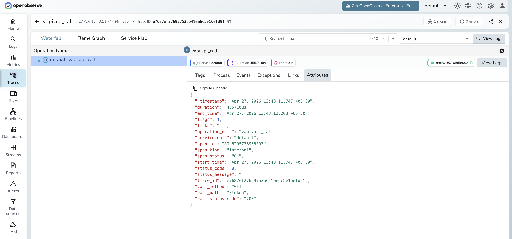

# **Vapi → OpenObserve**

Capture assistant metadata, request latency, and error status for every Vapi API call in your voice AI application. Vapi is a platform for building phone and web voice agents. Instrumentation uses manual OpenTelemetry spans wrapping Vapi REST API calls.

## **Prerequisites**

* Python 3.8+
* An [OpenObserve](https://openobserve.ai/) account (cloud or self-hosted)
* Your OpenObserve **organisation ID** and **Base64-encoded auth token**
* A [Vapi](https://vapi.ai/) account and private API key from [dashboard.vapi.ai](https://dashboard.vapi.ai)

## **Installation**

```shell
pip install openobserve-telemetry-sdk opentelemetry-api requests python-dotenv
```

## **Configuration**

Create a `.env` file in your project root:

```
OPENOBSERVE_URL=https://api.openobserve.ai/
OPENOBSERVE_ORG=your_org_id
OPENOBSERVE_AUTH_TOKEN=Basic <your_base64_token>
VAPI_API_KEY=your-vapi-private-api-key
```

## **Instrumentation**

Call `openobserve_init()` before making API calls. Pass `resource_attributes` to set the service name, then wrap each Vapi call in a manual span.

```python
from dotenv import load_dotenv
load_dotenv()

from openobserve import openobserve_init, openobserve_shutdown
openobserve_init(resource_attributes={"service.name": "my-app"})

from opentelemetry import trace
import os
import requests

tracer = trace.get_tracer(__name__)

VAPI_BASE = "https://api.vapi.ai"
headers = {
    "Authorization": f"Bearer {os.environ['VAPI_API_KEY']}",
    "Content-Type": "application/json",
}

def create_assistant(name: str, first_message: str):
    with tracer.start_as_current_span("vapi.create_assistant") as span:
        span.set_attribute("vapi.assistant_name", name)
        resp = requests.post(f"{VAPI_BASE}/assistant", headers=headers, json={
            "name": name,
            "firstMessage": first_message,
            "model": {"provider": "openai", "model": "gpt-4o-mini"},
            "voice": {"provider": "11labs", "voiceId": "paula"},
        })
        resp.raise_for_status()
        assistant_id = resp.json()["id"]
        span.set_attribute("vapi.assistant_id", assistant_id)
        return assistant_id

def list_resource(path: str):
    with tracer.start_as_current_span("vapi.api_call") as span:
        span.set_attribute("vapi.method", "GET")
        span.set_attribute("vapi.path", path)
        resp = requests.get(f"{VAPI_BASE}{path}", headers=headers)
        span.set_attribute("vapi.status_code", resp.status_code)
        return resp.json()

assistant_id = create_assistant("ObsBot", "Hello! How can I assist you?")
calls = list_resource("/call")

openobserve_shutdown()
```

The Vapi private API key is found under **API Keys** in your Vapi dashboard. Use the `Authorization: Bearer` header. Vapi does not use `x-api-key`.

## **What Gets Captured**

| Attribute | Description |
| ----- | ----- |
| `vapi_assistant_name` | Name given to the created assistant |
| `vapi_assistant_id` | Unique assistant resource ID returned by the API |
| `vapi_method` | HTTP method used (`GET`, `POST`, `DELETE`) |
| `vapi_path` | API path called (e.g. `/assistant`, `/call`, `/phone-number`) |
| `vapi_status_code` | HTTP response status code |
| `span_status` | `OK` or `ERROR` |
| `error_message` | Error detail on failed requests |
| `duration` | End-to-end API call latency |

## **Viewing Traces**

1. Log in to OpenObserve and navigate to **Traces**
2. Filter by service name to find your Vapi spans
3. Click a `vapi.create_assistant` span to inspect the assistant ID and creation latency
4. Filter by `span_status` = `ERROR` to identify failed API calls



## **Next Steps**

With Vapi instrumented, every API call in your voice AI application is recorded in OpenObserve. From here you can monitor assistant creation latency, track resource usage across calls and phone numbers, and alert on failed API requests.

## **Read More**

- [LLM Observability Overview](../llm-applications.md)
- [Traces Ingestion with Python](../../../ingestion/traces/python.md)
- [Exploring Traces in OpenObserve](../../../user-guide/data-exploration/traces/)
- [Building Dashboards](../../../user-guide/analytics/dashboards/)
