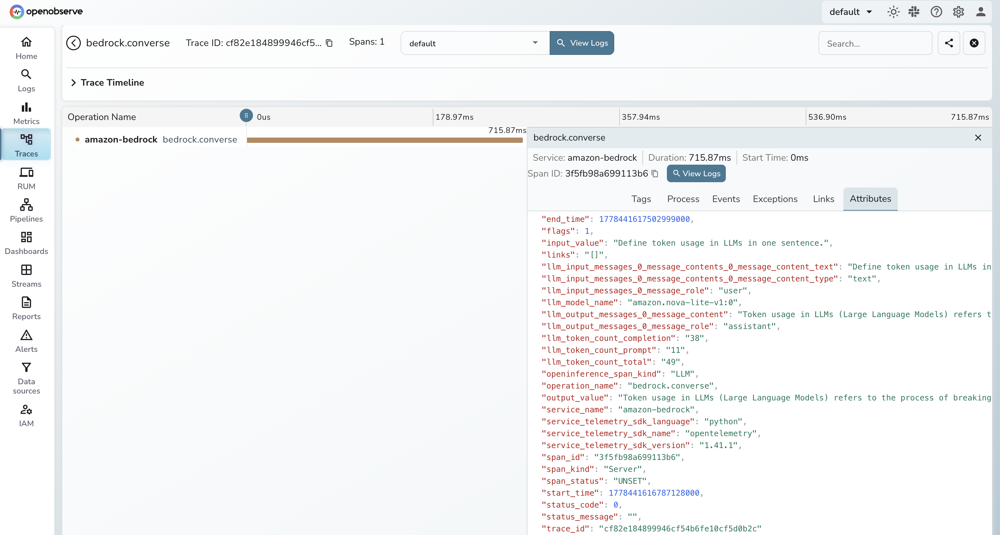

# **Amazon Bedrock → OpenObserve**

Automatically capture token usage, latency, and model metadata for every Amazon Bedrock `converse` call in your Python application.

## **Prerequisites**

* Python 3.8+
* An [OpenObserve](https://openobserve.ai/) account (cloud or self-hosted)
* Your OpenObserve **organisation ID** and **Base64-encoded auth token**
* AWS credentials with `AmazonBedrockFullAccess` permissions

## **Installation**

```shell
pip install openobserve-telemetry-sdk openinference-instrumentation-bedrock boto3 python-dotenv
```

## **Configuration**

Create a `.env` file in your project root:

```
OPENOBSERVE_URL=https://api.openobserve.ai/
OPENOBSERVE_ORG=your_org_id
OPENOBSERVE_AUTH_TOKEN=Basic <your_base64_token>

AWS_ACCESS_KEY_ID=your-access-key-id
AWS_SECRET_ACCESS_KEY=your-secret-access-key
AWS_DEFAULT_REGION=us-east-1
```

## **Instrumentation**

Call `BedrockInstrumentor().instrument()` before creating any boto3 client.

```python
from dotenv import load_dotenv
load_dotenv()

from openinference.instrumentation.bedrock import BedrockInstrumentor
from openobserve import openobserve_init

BedrockInstrumentor().instrument()
openobserve_init(resource_attributes={"service.name": "amazon-bedrock"})

import os
import boto3

bedrock = boto3.client(
    "bedrock-runtime",
    region_name=os.environ.get("AWS_DEFAULT_REGION", "us-east-1"),
)

response = bedrock.converse(
    modelId="amazon.nova-lite-v1:0",
    messages=[{"role": "user", "content": [{"text": "Explain observability in one sentence."}]}],
)
print(response["output"]["message"]["content"][0]["text"])
```

## **What Gets Captured**

| Attribute | Description |
|---|---|
| `operation_name` | Always `bedrock.converse` |
| `llm_model_name` | Model ID used (e.g. `amazon.nova-lite-v1:0`) |
| `llm_token_count_prompt` | Input tokens consumed |
| `llm_token_count_completion` | Output tokens generated |
| `llm_token_count_total` | Total tokens for the request |
| `llm_input_messages_0_message_role` | Role of the input message (`user`) |
| `llm_input_messages_0_message_contents_0_message_content_text` | Input message text |
| `llm_output_messages_0_message_role` | Role of the output message (`assistant`) |
| `llm_output_messages_0_message_content` | Full response text |
| `input_value` | Raw prompt text |
| `output_value` | Raw response text |
| `openinference_span_kind` | Always `LLM` |
| `duration` | End-to-end request latency |

## **Viewing Traces**

1. Log in to OpenObserve and navigate to **Traces** in the left sidebar
2. Filter by `service_name = amazon-bedrock`
3. Click any `bedrock.converse` span to inspect token counts, latency, and full request/response content



## **Next Steps**

With Amazon Bedrock instrumented, every model call is automatically recorded in OpenObserve. From here you can build dashboards to track token usage over time, set up alerts on latency spikes, and correlate Bedrock spans with the rest of your application traces.

## **Read More**

- [LLM Observability Overview](../llm-applications.md)
- [Explore Traces](../../../user-guide/data-exploration/traces/index.md)
- [Dashboards](../../../user-guide/analytics/dashboards/index.md)
- [Alerts](../../../user-guide/analytics/alerts/index.md)
