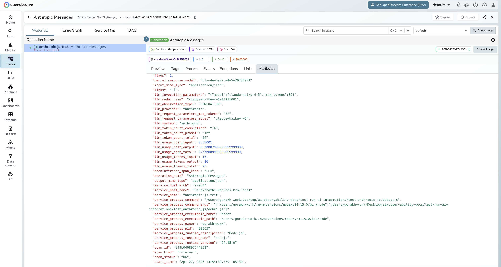

# **Anthropic JS/TS → OpenObserve**

Capture LLM call latency, token usage, model name, input and output messages for every Anthropic API call made from a Node.js application. Instrumentation uses `@arizeai/openinference-instrumentation-anthropic` to automatically patch the Anthropic SDK and export spans to OpenObserve via OTLP.

## **Prerequisites**

* Node.js 18+
* An [OpenObserve](https://openobserve.ai/) account (cloud or self-hosted)
* Your OpenObserve **organisation ID** and **Base64-encoded auth token**
* An Anthropic API key

## **Installation**

```shell
npm install @anthropic-ai/sdk @arizeai/openinference-instrumentation-anthropic \
  @opentelemetry/sdk-node @opentelemetry/exporter-trace-otlp-http \
  @opentelemetry/sdk-trace-node @opentelemetry/resources
```

## **Configuration**

Set the following environment variables before running your script:

```
ANTHROPIC_API_KEY=your-anthropic-api-key
OTEL_EXPORTER_OTLP_ENDPOINT=https://api.openobserve.ai/api/your_org_id/v1/traces
OTEL_EXPORTER_OTLP_HEADERS=Authorization=Basic <your_base64_token>
```

## **Instrumentation**

Use `require()` to load the Anthropic SDK **after** `sdk.start()`. The instrumentation patches the CommonJS module cache at startup, so the SDK must be loaded after the SDK is running for the patch to apply.

```javascript
const { NodeSDK } = require("@opentelemetry/sdk-node");
const { OTLPTraceExporter } = require("@opentelemetry/exporter-trace-otlp-http");
const { SimpleSpanProcessor } = require("@opentelemetry/sdk-trace-node");
const { resourceFromAttributes } = require("@opentelemetry/resources");
const { AnthropicInstrumentation } = require("@arizeai/openinference-instrumentation-anthropic");

const authHeader = process.env.OTEL_EXPORTER_OTLP_HEADERS.replace("Authorization=", "");

const sdk = new NodeSDK({
  resource: resourceFromAttributes({ "service.name": "anthropic-js" }),
  spanProcessors: [
    new SimpleSpanProcessor(
      new OTLPTraceExporter({
        url: process.env.OTEL_EXPORTER_OTLP_ENDPOINT,
        headers: { Authorization: authHeader },
      })
    ),
  ],
  instrumentations: [new AnthropicInstrumentation()],
});

sdk.start();

// require() AFTER sdk.start() so the instrumentation patch applies
const Anthropic = require("@anthropic-ai/sdk").default;
const client = new Anthropic({ apiKey: process.env.ANTHROPIC_API_KEY });

async function main() {
  const response = await client.messages.create({
    model: "claude-haiku-4-5",
    max_tokens: 256,
    messages: [{ role: "user", content: "What is distributed tracing?" }],
  });
  console.log(response.content[0].text);
  await sdk.shutdown();
}

main().catch(console.error);
```

Run with:

```shell
node index.js
```

## **What Gets Captured**

| Attribute | Description |
| ----- | ----- |
| `llm_model_name` | Resolved model name (e.g. `claude-haiku-4-5-20251001`) |
| `llm_provider` | Always `anthropic` |
| `llm_system` | Always `anthropic` |
| `llm_token_count_prompt` | Prompt tokens consumed |
| `llm_token_count_completion` | Completion tokens generated |
| `llm_token_count_total` | Total tokens for the call |
| `llm_usage_tokens_input` | Input tokens (numeric) |
| `llm_usage_tokens_output` | Output tokens (numeric) |
| `llm_usage_cost_input` | Estimated cost for input tokens |
| `llm_usage_cost_output` | Estimated cost for output tokens |
| `llm_invocation_parameters` | JSON-encoded request parameters |
| `openinference_span_kind` | Always `LLM` |
| `span_status` | `OK` on success, `ERROR` on failed calls |
| `duration` | End-to-end call latency |

## **Viewing Traces**

1. Log in to OpenObserve and navigate to **Traces**
2. Filter by `service_name = anthropic-js-test` to isolate Anthropic spans
3. Click any `Anthropic Messages` span to inspect token counts and model name
4. Filter by `span_status = ERROR` to find authentication or rate-limit failures
5. Sort by `duration` to find the slowest calls



## **Next Steps**

With the Anthropic JS SDK instrumented, every API call is recorded in OpenObserve. From here you can build dashboards tracking token consumption over time, compare latency across models, and set alerts on error rates or cost thresholds.

## **Read More**

- [LLM Observability Overview](../llm-applications.md)
- [Anthropic (Python)](./anthropic.md)
- [Exploring Traces in OpenObserve](../../../user-guide/data-exploration/traces/)
- [Building Dashboards](../../../user-guide/analytics/dashboards/)
