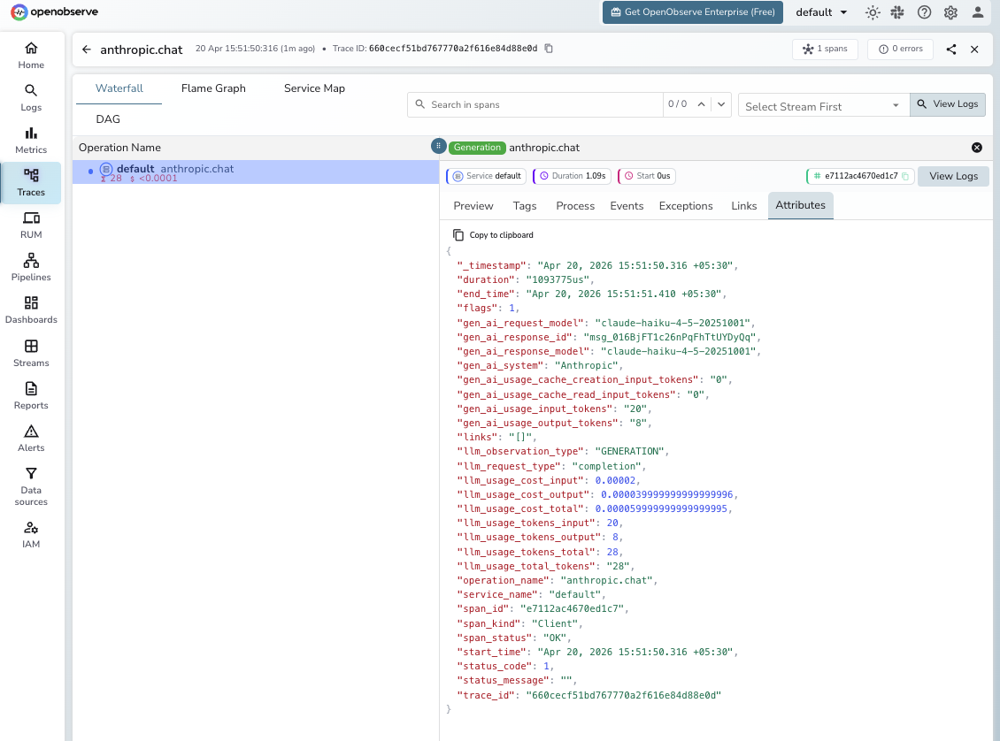

# **Anthropic (Python) → OpenObserve**

Automatically capture token usage, latency, and model metadata for every Claude API call in your Python application.

## **Prerequisites**

* Python 3.8+
* An [OpenObserve](https://openobserve.ai/) account (cloud or self-hosted)
* Your OpenObserve **organisation ID** and **Base64-encoded auth token**
* An Anthropic API key

## **Installation**

```shell
pip install openobserve-telemetry-sdk opentelemetry-instrumentation-anthropic python-dotenv
```

## **Configuration**

Create a `.env` file in your project root:

```
# OpenObserve instance URL
# Default for self-hosted: http://localhost:5080
OPENOBSERVE_URL=https://api.openobserve.ai/

# Your OpenObserve organisation slug or ID
OPENOBSERVE_ORG=your_org_id

# Basic auth token — Base64-encoded "email:password"
OPENOBSERVE_AUTH_TOKEN="Basic <your_base64_token>"

# Anthropic API key
ANTHROPIC_API_KEY=your-anthropic-key
```

## **Instrumentation**

Call `AnthropicInstrumentor().instrument()` **before** any Anthropic client is created.

```python
from opentelemetry.instrumentation.anthropic import AnthropicInstrumentor
from openobserve import openobserve_init

# Instrument before importing the Anthropic client
AnthropicInstrumentor().instrument()
openobserve_init()

from anthropic import Anthropic

client = Anthropic()

# Messages API
response = client.messages.create(
    model="claude-sonnet-4-6",
    max_tokens=1024,
    messages=[{"role": "user", "content": "What is distributed tracing?"}],
)
print(response.content[0].text)
```

### System prompt

```python
response = client.messages.create(
    model="claude-sonnet-4-6",
    max_tokens=512,
    system="You are a concise technical assistant.",
    messages=[{"role": "user", "content": "Explain a trace span in one sentence."}],
)
print(response.content[0].text)
```

### Streaming

```python
with client.messages.stream(
    model="claude-sonnet-4-6",
    max_tokens=256,
    messages=[{"role": "user", "content": "Write a haiku about observability."}],
) as stream:
    for text in stream.text_stream:
        print(text, end="", flush=True)
```

### Async client

```python
from anthropic import AsyncAnthropic
import asyncio

async_client = AsyncAnthropic()

async def main():
    response = await async_client.messages.create(
        model="claude-sonnet-4-6",
        max_tokens=256,
        messages=[{"role": "user", "content": "Hello async!"}],
    )
    print(response.content[0].text)

asyncio.run(main())
```

## **What Gets Captured**

| Attribute | Description |
| ----- | ----- |
| `gen_ai_request_model` | Requested model (e.g. `claude-haiku-4-5-20251001`) |
| `gen_ai_response_model` | Actual model version used |
| `gen_ai_response_id` | Unique response ID from Anthropic |
| `gen_ai_system` | Provider identifier (`Anthropic`) |
| `gen_ai_usage_input_tokens` | Input tokens consumed |
| `gen_ai_usage_output_tokens` | Output tokens generated |
| `gen_ai_usage_cache_creation_input_tokens` | Tokens written to the prompt cache |
| `gen_ai_usage_cache_read_input_tokens` | Tokens read from the prompt cache |
| `llm_usage_tokens_total` | Total tokens consumed |
| `llm_usage_cost_input` | Estimated input cost in USD |
| `llm_usage_cost_output` | Estimated output cost in USD |
| `llm_usage_cost_total` | Estimated total cost in USD |
| `duration` | End-to-end request latency |
| `error` | Exception details if the request failed |

## **Viewing Traces**

1. Log in to OpenObserve and navigate to **Traces** in the left sidebar
2. Click any span to inspect token counts, latency, and full request metadata



## **Next Steps**

With Anthropic instrumented, every Claude API call in your application is automatically recorded in OpenObserve. From here you can track token usage and cost per conversation turn, monitor cache hit rates to optimise prompt caching savings, and correlate Claude spans with the rest of your application traces.

## **Read More**

- [LLM Observability Overview](../llm-applications.md)
- [OpenObserve Python SDK](https://openobserve.ai/docs/opentelemetry/openobserve-python-sdk/)
