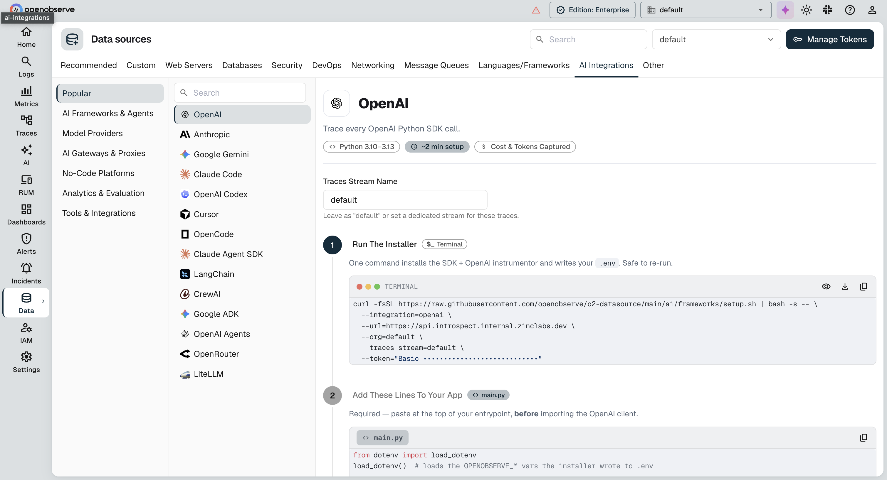
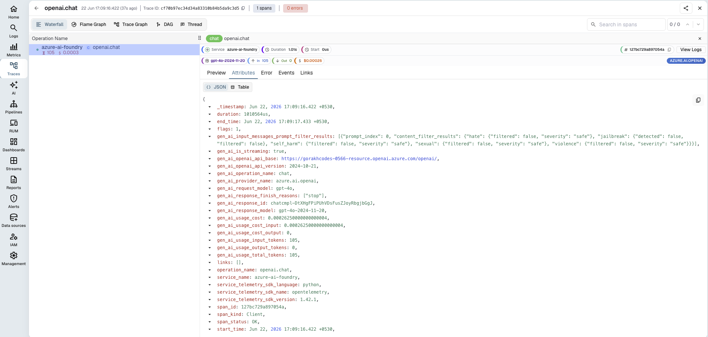

# **Azure AI Foundry → OpenObserve**

Capture token usage, latency, cost, and model metadata for every call to a model deployed through [Azure AI Foundry](https://ai.azure.com/). Foundry deployments expose an OpenAI-compatible API, so instrumentation uses the standard OpenAI instrumentor pointed at your Foundry endpoint.

> **Why the OpenAI SDK?** Foundry supports an OpenAI-compatible API, and [supports the OpenAI SDK](https://learn.microsoft.com/en-us/azure/foundry/how-to/model-inference-to-openai-migration) for both Azure OpenAI and other Foundry catalog models. It also has a mature OpenTelemetry instrumentor.

## **Prerequisites**

* Python 3.8+
* An [OpenObserve Cloud account](https://openobserve.ai/) or self-hosted instance, with your **organization ID** and **Base64 auth token**
* An Azure AI Foundry deployment, with its **endpoint**, **API key**, and **deployment name** (from the *Endpoint* tab in [ai.azure.com](https://ai.azure.com/))

## **Installation**

```shell
pip install openobserve-telemetry-sdk opentelemetry-instrumentation-openai openai python-dotenv
```

## **Configuration**

Create a `.env` file:

```
OPENOBSERVE_URL=https://api.openobserve.ai/   # self-hosted default: http://localhost:5080
OPENOBSERVE_ORG=your_org_id
OPENOBSERVE_AUTH_TOKEN="Basic <your_base64_token>"

AZURE_OPENAI_ENDPOINT=https://your-resource.openai.azure.com/
AZURE_OPENAI_API_KEY=your-azure-api-key
AZURE_OPENAI_API_VERSION=your-api-version
AZURE_OPENAI_DEPLOYMENT=your-deployment-name
```

`AZURE_OPENAI_DEPLOYMENT` is the **deployment name** you chose, not the base model name.

Find your `OPENOBSERVE_ORG` and `OPENOBSERVE_AUTH_TOKEN` on the OpenObserve **Ingestion** page, under *Data Sources*:



## **Instrumentation**

Add these two calls **before** the `AzureOpenAI` client is created. `OpenAIInstrumentor().instrument()` patches the `openai` SDK so every call is recorded as an OpenTelemetry span, and `openobserve_init()` configures the exporter that ships those spans to OpenObserve.

```python
from dotenv import load_dotenv
load_dotenv()

from opentelemetry.instrumentation.openai import OpenAIInstrumentor
from openobserve import openobserve_init

# Run before creating the AzureOpenAI client
OpenAIInstrumentor().instrument()
openobserve_init()
```

That's the entire tracing setup. Create and use the `AzureOpenAI` client as you normally would, and every call is traced and exported automatically. Streaming and async (`AsyncAzureOpenAI`) calls are captured the same way; for token counts on streamed calls, pass `stream_options={"include_usage": True}`.

## **How It Works**

Instrumentation produces two signals, both exported automatically:

- **Traces**: one span per call, carrying model, token usage, cost, latency, and errors (detailed below).
- **Metrics**: token-usage and request-duration histograms (`gen_ai_client_token_usage`, `gen_ai_client_operation_duration`).

## **What Gets Captured**

| Attribute | Description | Example |
| ----- | ----- | ----- |
| `gen_ai_request_model` / `gen_ai_response_model` | Deployment name sent, and the resolved model version | `gpt-4o` / `gpt-4o-2024-11-20` |
| `gen_ai_usage_input_tokens` / `output_tokens` / `total_tokens` | Prompt, completion, and total token counts | `10` / `14` / `24` |
| `gen_ai_usage_cost` | Estimated request cost in USD | `0.000165` |
| `gen_ai_is_streaming` | Whether the request was streamed | `false` |
| `duration` | End-to-end request latency (microseconds) | `1919252` |
| `span_status` | `UNSET` on success, `ERROR` on failure (exception recorded as a span event) | `UNSET` |

Prompt and completion text are also captured (`gen_ai_input_messages` / `gen_ai_output_messages`). Disable message-content capture in the instrumentor if you don't want it stored.

## **Viewing Traces**

In OpenObserve, open **Traces**, then click any span to inspect token counts, latency, and metadata. Filter by `gen_ai_request_model` to compare deployments.



## **Read More**

- [LLM Observability Overview](../llm-applications.md)
- [OpenObserve Python SDK](https://openobserve.ai/docs/opentelemetry/openobserve-python-sdk/)
- [Traces Ingestion with Python](../../../ingestion/traces/python.md)
- [Exploring Traces in OpenObserve](../../../user-guide/data-exploration/traces/)
- [Building Dashboards](../../../user-guide/analytics/dashboards/)

**Need some help?**

- Join our [Community Slack](https://short.openobserve.ai/community)
- Or [Contact support](https://openobserve.ai/contactus/)
