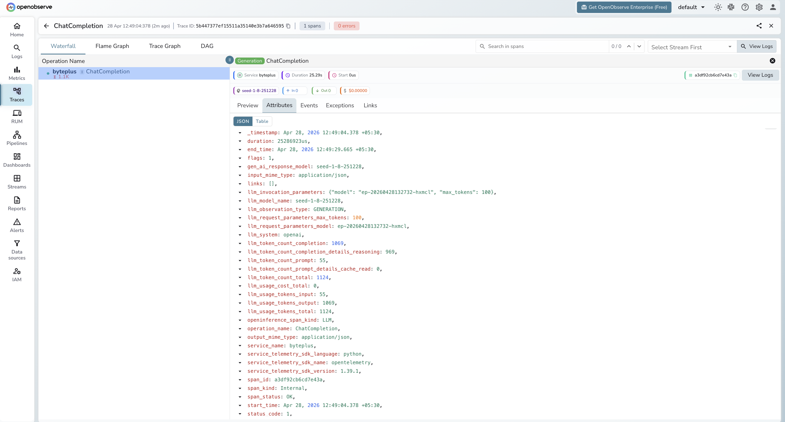

# **BytePlus ModelArk → OpenObserve**

Capture LLM call latency, token usage, model name, input messages, and output content for every BytePlus ModelArk inference call. BytePlus ModelArk exposes an OpenAI-compatible API. Instrumentation uses `openinference-instrumentation-openai` to automatically patch the OpenAI SDK pointed at the ModelArk endpoint and export spans to OpenObserve via OTLP.

## **Prerequisites**

* Python 3.9+
* An [OpenObserve](https://openobserve.ai/) account (cloud or self-hosted)
* Your OpenObserve **organisation ID** and **Base64-encoded auth token**
* A [BytePlus ModelArk](https://www.byteplus.com/en/product/modelark) account with an API key and an inference endpoint ID

## **Installation**

```shell
pip install openobserve-telemetry-sdk openinference-instrumentation-openai \
  openai python-dotenv
```

## **Configuration**

Create a `.env` file in your project root:

```
OPENOBSERVE_URL=https://api.openobserve.ai/
OPENOBSERVE_ORG=your_org_id
OPENOBSERVE_AUTH_TOKEN=Basic <your_base64_token>
BYTEPLUS_API_KEY=your-byteplus-api-key
BYTEPLUS_BASE_URL=https://ark.ap-southeast.bytepluses.com/api/v3
BYTEPLUS_ENDPOINT_ID=ep-xxxxxxxxxxxxxxxx-xxxxx
```

Create your API key under **ModelArk Console → API Key Management** and your endpoint ID under **ModelArk Console → Online Inference → Create Inference Endpoint**.

## **Instrumentation**

Call `OpenAIInstrumentor().instrument()` before `openobserve_init()`, then import and configure the OpenAI client with the BytePlus base URL. Every `chat.completions.create` call is automatically traced.

```python
from dotenv import load_dotenv
load_dotenv()

from openinference.instrumentation.openai import OpenAIInstrumentor
OpenAIInstrumentor().instrument()

from openobserve import openobserve_init, openobserve_shutdown
openobserve_init(resource_attributes={"service.name": "byteplus"})

import os
from openai import OpenAI

client = OpenAI(
    api_key=os.environ["BYTEPLUS_API_KEY"],
    base_url=os.environ["BYTEPLUS_BASE_URL"],
)

model = os.environ["BYTEPLUS_ENDPOINT_ID"]

response = client.chat.completions.create(
    model=model,
    messages=[{"role": "user", "content": "What is distributed tracing?"}],
    max_tokens=256,
)
print(response.choices[0].message.content)

openobserve_shutdown()
```

Run with:

```shell
python3 main.py
```

## **What Gets Captured**

| Attribute | Description |
| ----- | ----- |
| `llm_model_name` | Resolved model name served by the endpoint (e.g. `seed-1-8-251228`) |
| `gen_ai_response_model` | Same resolved model name returned in the response |
| `llm_request_parameters_model` | Endpoint ID passed in the request |
| `llm_system` | Always `openai` (instrumented via the OpenAI SDK) |
| `llm_token_count_prompt` | Prompt tokens consumed |
| `llm_token_count_completion` | Completion tokens generated (includes reasoning tokens) |
| `llm_token_count_completion_details_reasoning` | Reasoning tokens (present for thinking models) |
| `llm_token_count_prompt_details_cache_read` | Prompt tokens served from cache |
| `llm_token_count_total` | Total tokens for the call |
| `llm_usage_tokens_input` | Input tokens (numeric) |
| `llm_usage_tokens_output` | Output tokens (numeric) |
| `llm_usage_tokens_total` | Total tokens (numeric) |
| `llm_invocation_parameters` | JSON-encoded request parameters |
| `llm_input` | Input messages as JSON |
| `llm_output` | Full response JSON from the provider |
| `openinference_span_kind` | Always `LLM` |
| `operation_name` | Always `ChatCompletion` |
| `span_status` | `OK` on success, `ERROR` on failed calls |
| `duration` | End-to-end call latency |

## **Viewing Traces**

1. Log in to OpenObserve and navigate to **Traces**
2. Filter by `service_name = byteplus` to isolate BytePlus spans
3. Click any `ChatCompletion` span to inspect token counts and the resolved model name
4. Check `llm_token_count_completion_details_reasoning` to see how many tokens the model spent on reasoning
5. Filter by `span_status = ERROR` to find authentication or endpoint failures



## **Next Steps**

With BytePlus ModelArk instrumented, every inference call is recorded in OpenObserve. From here you can build dashboards tracking token consumption over time, compare reasoning token usage across models, and set alerts on error rates or latency thresholds.

## **Read More**

- [LLM Observability Overview](../llm-applications.md)
- [OpenAI (Python)](./openai.md)
- [Exploring Traces in OpenObserve](../../../user-guide/data-exploration/traces/)
- [Building Dashboards](../../../user-guide/analytics/dashboards/)
