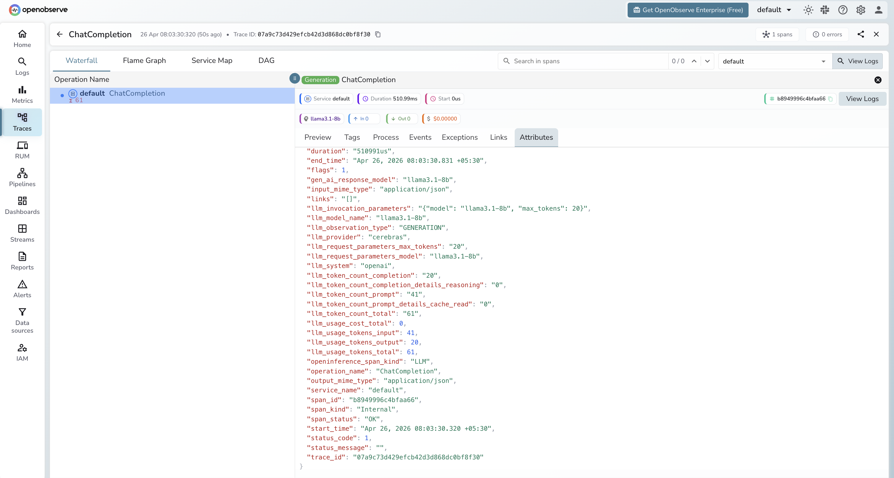

# **Cerebras → OpenObserve**

Automatically capture token usage, latency, and model metadata for every Cerebras inference call in your Python application. Cerebras exposes an OpenAI-compatible API, so instrumentation uses the standard OpenAI instrumentor pointed at the Cerebras endpoint.

## **Prerequisites**

* Python 3.8+
* An [OpenObserve](https://openobserve.ai/) account (cloud or self-hosted)
* Your OpenObserve **organisation ID** and **Base64-encoded auth token**
* A [Cerebras](https://cloud.cerebras.ai/) API key

## **Installation**

```shell
pip install openobserve-telemetry-sdk openinference-instrumentation-openai openai python-dotenv
```

## **Configuration**

Create a `.env` file in your project root:

```
OPENOBSERVE_URL=https://api.openobserve.ai/
OPENOBSERVE_ORG=your_org_id
OPENOBSERVE_AUTH_TOKEN=Basic <your_base64_token>
CEREBRAS_API_KEY=your-cerebras-api-key
```

## **Instrumentation**

Call `OpenAIInstrumentor().instrument()` **before** creating the OpenAI client. Point the client at the Cerebras base URL and pass your Cerebras API key.

```python
from dotenv import load_dotenv
load_dotenv()

from openinference.instrumentation.openai import OpenAIInstrumentor
from openobserve import openobserve_init

OpenAIInstrumentor().instrument()
openobserve_init()

import os
from openai import OpenAI

client = OpenAI(
    api_key=os.environ["CEREBRAS_API_KEY"],
    base_url="https://api.cerebras.ai/v1",
)

response = client.chat.completions.create(
    model="llama3.1-8b",
    messages=[{"role": "user", "content": "Explain distributed tracing in one sentence."}],
)
print(response.choices[0].message.content)
```

## **What Gets Captured**

| Attribute | Description |
| ----- | ----- |
| `llm_model_name` | Model name (e.g. `llama3.1-8b`) |
| `llm_provider` | `cerebras` |
| `llm_system` | `openai` (the client library used) |
| `llm_token_count_prompt` | Tokens in the prompt |
| `llm_token_count_completion` | Tokens in the response |
| `llm_token_count_total` | Total tokens consumed |
| `openinference_span_kind` | `LLM` |
| `operation_name` | `ChatCompletion` |
| `duration` | End-to-end request latency |
| `span_status` | `OK` or error status |

## **Viewing Traces**

1. Log in to OpenObserve and navigate to **Traces**
2. Click any span to inspect token counts and latency
3. Filter by `llm_model_name` to compare Cerebras model variants



## **Next Steps**

With Cerebras instrumented, every inference call is recorded in OpenObserve. From here you can monitor throughput, track token usage, and set alerts on error spans.

## **Read More**

- [LLM Observability Overview](../llm-applications.md)
- [Traces Ingestion with Python](../../../ingestion/traces/python.md)
- [Exploring Traces in OpenObserve](../../../user-guide/data-exploration/traces/)
- [Building Dashboards](../../../user-guide/analytics/dashboards/)
