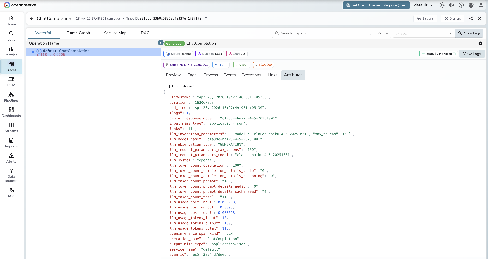

# **CometAPI → OpenObserve**

Automatically capture token usage, latency, and model metadata for every CometAPI inference call in your Python application. CometAPI is a unified API gateway providing access to 500+ models from OpenAI, Anthropic, and other providers through a single OpenAI-compatible endpoint. Instrumentation uses the standard OpenAI instrumentor pointed at the CometAPI base URL.

## **Prerequisites**

* Python 3.8+
* An [OpenObserve](https://openobserve.ai/) account (cloud or self-hosted)
* Your OpenObserve **organisation ID** and **Base64-encoded auth token**
* A [CometAPI](https://cometapi.com/) API key

## **Installation**

```shell
pip install openobserve-telemetry-sdk openinference-instrumentation-openai openai python-dotenv
```

## **Configuration**

Create a `.env` file in your project root:

```
OPENOBSERVE_URL=http://localhost:5080/
OPENOBSERVE_ORG=default
OPENOBSERVE_AUTH_TOKEN=Basic <your_base64_token>
COMETAPI_API_KEY=your-cometapi-api-key
```

## **Instrumentation**

Call `OpenAIInstrumentor().instrument()` **before** creating the OpenAI client. Point the client at the CometAPI base URL and pass your CometAPI key.

```python
from dotenv import load_dotenv
load_dotenv()

from openinference.instrumentation.openai import OpenAIInstrumentor
OpenAIInstrumentor().instrument()

from openobserve import openobserve_init
openobserve_init(service_name="cometapi")

import os
from openai import OpenAI

client = OpenAI(
    api_key=os.environ["COMETAPI_API_KEY"],
    base_url="https://api.cometapi.com/v1",
)

response = client.chat.completions.create(
    model="claude-haiku-4-5-20251001",
    messages=[{"role": "user", "content": "Explain distributed tracing in one sentence."}],
)
print(response.choices[0].message.content)
```

## **What Gets Captured**

| Attribute | Description |
| ----- | ----- |
| `operation_name` | `ChatCompletion` |
| `llm_system` | `openai` (OpenAI-compatible client) |
| `llm_model_name` | Resolved model returned by the API (e.g. `claude-haiku-4-5-20251001`) |
| `llm_request_parameters_model` | Model name sent in the request (e.g. `claude-haiku-4-5-20251001`) |
| `llm_observation_type` | `GENERATION` |
| `llm_token_count_prompt` | Prompt tokens consumed |
| `llm_token_count_completion` | Completion tokens returned |
| `llm_token_count_total` | Total tokens consumed |
| `llm_usage_tokens_input` | Input tokens |
| `llm_usage_tokens_output` | Output tokens |
| `llm_usage_cost_input` | Estimated cost for input tokens |
| `llm_usage_cost_output` | Estimated cost for output tokens |
| `openinference_span_kind` | `LLM` |
| `duration` | End-to-end request latency |
| `span_status` | `OK` on success, `ERROR` on failure |

## **Viewing Traces**

1. Log in to OpenObserve and navigate to **Traces**
2. Filter by `service_name = cometapi` to isolate CometAPI spans
3. Filter by `operation_name` = `ChatCompletion` to see all inference calls
4. Use `llm_model_name` to filter by specific model versions
5. Filter by `span_status` = `ERROR` to find failed requests



## **Next Steps**

With CometAPI instrumented, every inference call is recorded in OpenObserve regardless of which underlying model was used. From here you can compare latency and token usage across models, monitor cost per request, and set alerts on error spans.

## **Read More**

- [LLM Observability Overview](../llm-applications.md)
- [Traces Ingestion with Python](../../../ingestion/traces/python.md)
- [Exploring Traces in OpenObserve](../../../user-guide/data-exploration/traces/)
- [Building Dashboards](../../../user-guide/analytics/dashboards/)
