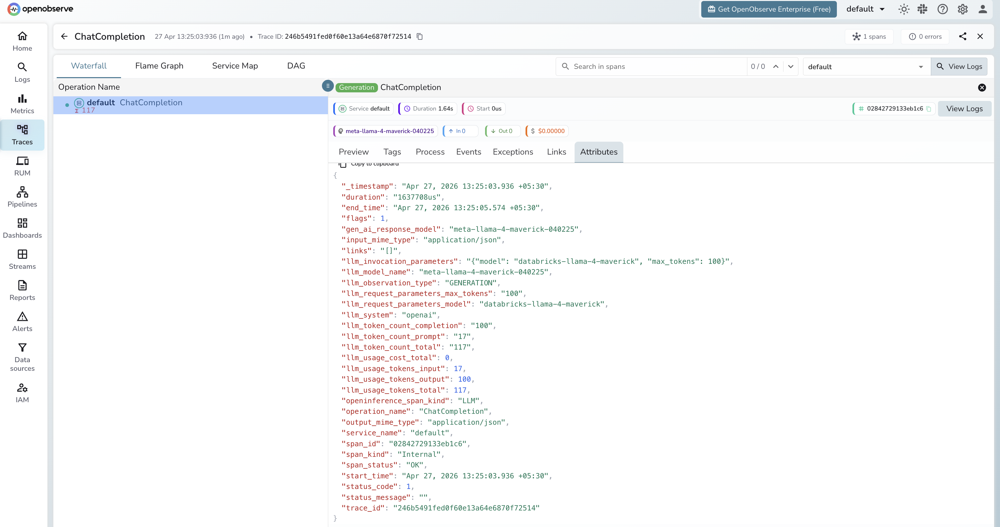

# **Databricks → OpenObserve**

Automatically capture token usage, latency, and model metadata for every call to Databricks Model Serving endpoints. Databricks Model Serving exposes an OpenAI-compatible API, so instrumentation uses the standard OpenAI instrumentor pointed at your workspace serving endpoint.

## **Prerequisites**

* Python 3.8+
* An [OpenObserve](https://openobserve.ai/) account (cloud or self-hosted)
* Your OpenObserve **organisation ID** and **Base64-encoded auth token**
* A Databricks workspace with Model Serving enabled
* A Databricks personal access token with model-serving permissions

## **Installation**

```shell
pip install openobserve-telemetry-sdk openinference-instrumentation-openai openai python-dotenv
```

## **Configuration**

Create a `.env` file in your project root:

```
OPENOBSERVE_URL=https://api.openobserve.ai/
OPENOBSERVE_ORG=your_org_id
OPENOBSERVE_AUTH_TOKEN=Basic <your_base64_token>
DATABRICKS_HOST=https://adb-1234567890123456.7.azuredatabricks.net
DATABRICKS_TOKEN=dapiXXXXXXXXXXXXXXXXXXXXXXXXXXXX
DATABRICKS_MODEL=databricks-llama-4-maverick
```

`DATABRICKS_HOST` is your workspace URL. `DATABRICKS_MODEL` is the serving endpoint name — either a Foundation Model API name (e.g. `databricks-llama-4-maverick`, `databricks-claude-sonnet-4-6`) or a custom endpoint name from your workspace.

## **Instrumentation**

Call `OpenAIInstrumentor().instrument()` **before** creating the OpenAI client. Authenticate with your Databricks personal access token and point the client at the workspace serving endpoint.

```python
from dotenv import load_dotenv
load_dotenv()

from openinference.instrumentation.openai import OpenAIInstrumentor
from openobserve import openobserve_init
from opentelemetry import trace

OpenAIInstrumentor().instrument()
openobserve_init()

import os
from openai import OpenAI

client = OpenAI(
    api_key=os.environ["DATABRICKS_TOKEN"],
    base_url=f"{os.environ['DATABRICKS_HOST'].rstrip('/')}/serving-endpoints",
)

response = client.chat.completions.create(
    model=os.environ.get("DATABRICKS_MODEL", "databricks-llama-4-maverick"),
    messages=[{"role": "user", "content": "Explain distributed tracing in one sentence."}],
    max_tokens=100,
)
print(response.choices[0].message.content)
trace.get_tracer_provider().force_flush()
```

## **What Gets Captured**

| Attribute | Description |
| ----- | ----- |
| `llm_system` | `openai` (OpenAI-compatible client) |
| `llm_model_name` | Resolved model name returned by the API (e.g. `meta-llama-4-maverick-040225`) |
| `llm_request_parameters_model` | Endpoint name sent in the request (e.g. `databricks-llama-4-maverick`) |
| `llm_request_parameters_max_tokens` | `max_tokens` value from the request |
| `gen_ai_response_model` | Same as `llm_model_name` |
| `llm_observation_type` | `GENERATION` |
| `llm_token_count_prompt` | Prompt tokens consumed |
| `llm_token_count_completion` | Completion tokens returned |
| `llm_token_count_total` | Total tokens consumed |
| `llm_usage_tokens_input` | Input tokens (mirrors `llm_token_count_prompt`) |
| `llm_usage_tokens_output` | Output tokens (mirrors `llm_token_count_completion`) |
| `llm_usage_tokens_total` | Total tokens |
| `openinference_span_kind` | `LLM` |
| `operation_name` | `ChatCompletion` |
| `input_mime_type` | `application/json` |
| `output_mime_type` | `application/json` |
| `duration` | End-to-end request latency |
| `span_status` | `OK` on success, `ERROR` on failure |

## **Viewing Traces**

1. Log in to OpenObserve and navigate to **Traces**
2. Spans appear with `operation_name: ChatCompletion` and `llm_system: openai`
3. Note that the endpoint alias (e.g. `databricks-llama-4-maverick`) appears in `llm_request_parameters_model`, while the resolved model version (e.g. `meta-llama-4-maverick-040225`) appears in `llm_model_name`
4. Filter by `llm_request_parameters_model` to compare latency across different serving endpoints



## **Next Steps**

With Databricks Model Serving instrumented, every inference call is recorded in OpenObserve. From here you can monitor latency per endpoint, track token usage across Foundation Model API endpoints, and set alerts on error spans.

## **Read More**

- [LLM Observability Overview](../llm-applications.md)
- [Traces Ingestion with Python](../../../ingestion/traces/python.md)
- [Exploring Traces in OpenObserve](../../../user-guide/data-exploration/traces/)
- [Building Dashboards](../../../user-guide/analytics/dashboards/)
