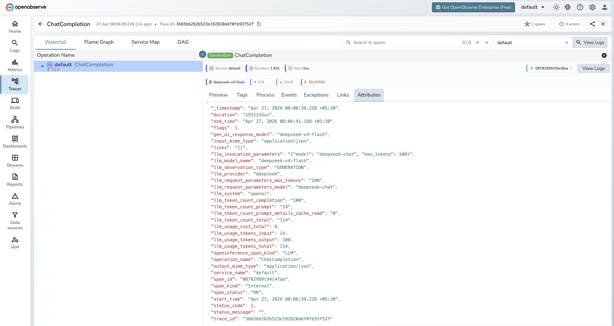

# **DeepSeek → OpenObserve**

Automatically capture token usage, latency, and model metadata for every DeepSeek inference call in your Python application. DeepSeek exposes an OpenAI-compatible API, so instrumentation uses the standard OpenAI instrumentor pointed at the DeepSeek endpoint.

## **Prerequisites**

* Python 3.8+
* An [OpenObserve](https://openobserve.ai/) account (cloud or self-hosted)
* Your OpenObserve **organisation ID** and **Base64-encoded auth token**
* A [DeepSeek](https://platform.deepseek.com/) API key

## **Installation**

```shell
pip install openobserve-telemetry-sdk openinference-instrumentation-openai openai python-dotenv
```

## **Configuration**

Create a `.env` file in your project root:

```
OPENOBSERVE_URL=https://api.openobserve.ai/
OPENOBSERVE_ORG=your_org_id
OPENOBSERVE_AUTH_TOKEN=Basic <your_base64_token>
DEEPSEEK_API_KEY=your-deepseek-api-key
```

## **Instrumentation**

Call `OpenAIInstrumentor().instrument()` **before** creating the OpenAI client. Point the client at the DeepSeek base URL and pass your DeepSeek API key.

```python
from dotenv import load_dotenv
load_dotenv()

from openinference.instrumentation.openai import OpenAIInstrumentor
from openobserve import openobserve_init

OpenAIInstrumentor().instrument()
openobserve_init()

import os
from openai import OpenAI

client = OpenAI(
    api_key=os.environ["DEEPSEEK_API_KEY"],
    base_url="https://api.deepseek.com/v1",
)

response = client.chat.completions.create(
    model="deepseek-chat",
    messages=[{"role": "user", "content": "Explain distributed tracing in one sentence."}],
)
print(response.choices[0].message.content)
```

## **What Gets Captured**

| Attribute | Description |
| ----- | ----- |
| `llm_provider` | `deepseek` |
| `llm_system` | `openai` (OpenAI-compatible client) |
| `llm_model_name` | Resolved model returned by the API (e.g. `deepseek-v4-flash`) |
| `llm_request_parameters_model` | Model name sent in the request (e.g. `deepseek-chat`) |
| `llm_request_parameters_max_tokens` | `max_tokens` value from the request |
| `gen_ai_response_model` | Same as `llm_model_name` |
| `llm_observation_type` | `GENERATION` |
| `llm_token_count_prompt` | Prompt tokens consumed |
| `llm_token_count_completion` | Completion tokens returned |
| `llm_token_count_total` | Total tokens consumed |
| `llm_token_count_prompt_details_cache_read` | Prompt cache read tokens |
| `llm_usage_tokens_input` | Input tokens (mirrors `llm_token_count_prompt`) |
| `llm_usage_tokens_output` | Output tokens (mirrors `llm_token_count_completion`) |
| `llm_usage_tokens_total` | Total tokens (mirrors `llm_token_count_total`) |
| `openinference_span_kind` | `LLM` |
| `operation_name` | `ChatCompletion` |
| `input_mime_type` | `application/json` |
| `output_mime_type` | `application/json` |
| `duration` | End-to-end request latency |
| `span_status` | `OK` on success, `ERROR` on failure |

## **Viewing Traces**

1. Log in to OpenObserve and navigate to **Traces**
2. Spans appear with `operation_name: ChatCompletion` and `llm_provider: deepseek`
3. Note that `deepseek-chat` resolves to the actual model in `llm_model_name` (e.g. `deepseek-v4-flash`)
4. Filter by `llm_provider` to isolate DeepSeek spans from other providers



## **Next Steps**

With DeepSeek instrumented, every inference call is recorded in OpenObserve. From here you can monitor token usage, compare latency across model aliases, and set alerts on error spans.

## **Read More**

- [LLM Observability Overview](../llm-applications.md)
- [Traces Ingestion with Python](../../../ingestion/traces/python.md)
- [Exploring Traces in OpenObserve](../../../user-guide/data-exploration/traces/)
- [Building Dashboards](../../../user-guide/analytics/dashboards/)
