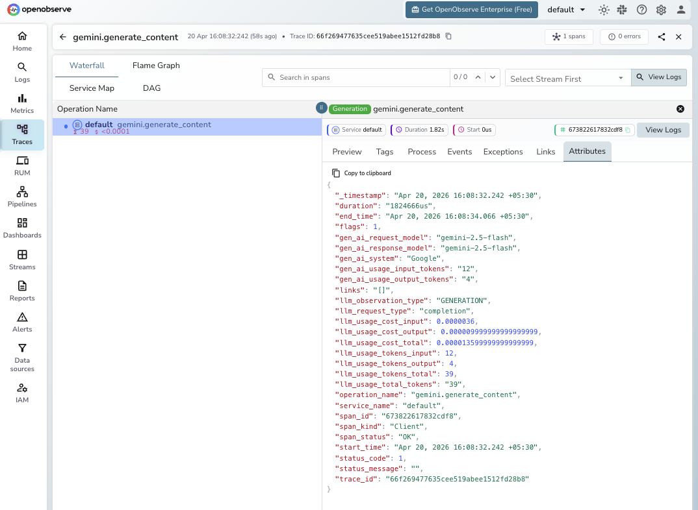

# **Google Gemini → OpenObserve**

Automatically capture token usage, latency, and model metadata for every Gemini API call in your Python application.

## **Prerequisites**

* Python 3.9+
* An [OpenObserve](https://openobserve.ai/) account (cloud or self-hosted)
* Your OpenObserve **organisation ID** and **Base64-encoded auth token**
* A Google AI API key (from [Google AI Studio](https://aistudio.google.com/))

## **Installation**

```shell
pip install openobserve-telemetry-sdk opentelemetry-instrumentation-google-generativeai google-genai python-dotenv
```

## **Configuration**

Create a `.env` file in your project root:

```
# OpenObserve instance URL
# Default for self-hosted: http://localhost:5080
OPENOBSERVE_URL=https://api.openobserve.ai/

# Your OpenObserve organisation slug or ID
OPENOBSERVE_ORG=your_org_id

# Basic auth token — Base64-encoded "email:password"
OPENOBSERVE_AUTH_TOKEN="Basic <your_base64_token>"

# Google AI API key
GOOGLE_API_KEY=your-google-ai-key
```

## **Instrumentation**

Call `GoogleGenerativeAiInstrumentor().instrument()` **before** any Gemini client is created.

```python
from opentelemetry.instrumentation.google_generativeai import GoogleGenerativeAiInstrumentor
from openobserve import openobserve_init

# Instrument before importing the Gemini SDK
GoogleGenerativeAiInstrumentor().instrument()
openobserve_init()

from google import genai
import os

client = genai.Client(api_key=os.environ["GOOGLE_API_KEY"])

# Single-turn generation
response = client.models.generate_content(
    model="gemini-2.5-flash",
    contents="Explain observability in one sentence.",
)
print(response.text)
```

### Multi-turn chat

```python
chat = client.chats.create(model="gemini-2.5-flash")

response = chat.send_message("What is a trace span?")
print(response.text)

response = chat.send_message("And what is a trace ID?")
print(response.text)
```

### Streaming

```python
for chunk in client.models.generate_content_stream(
    model="gemini-2.5-flash",
    contents="Count to five.",
):
    print(chunk.text, end="", flush=True)
```

## **What Gets Captured**

| Attribute | Description |
| ----- | ----- |
| `gen_ai_request_model` | Requested model (e.g. `gemini-2.5-flash`) |
| `gen_ai_response_model` | Actual model used |
| `gen_ai_system` | Provider identifier (`Google`) |
| `gen_ai_usage_input_tokens` | Input tokens consumed |
| `gen_ai_usage_output_tokens` | Output tokens generated |
| `llm_usage_tokens_total` | Total tokens (includes thinking tokens for Gemini 2.5 models) |
| `llm_usage_cost_input` | Estimated input cost in USD |
| `llm_usage_cost_output` | Estimated output cost in USD |
| `llm_usage_cost_total` | Estimated total cost in USD |
| `duration` | End-to-end request latency |
| `error` | Exception details if the request failed |

## **Viewing Traces**

1. Log in to OpenObserve and navigate to **Traces** in the left sidebar
2. Click any span to inspect token counts, latency, and full request metadata
3. For chat sessions, each `send_message` call appears as a separate span



## **Next Steps**

With Gemini instrumented, every model call in your application is automatically recorded in OpenObserve. From here you can track token usage including thinking tokens for Gemini 2.5 models, compare latency across model versions, and correlate Gemini spans with the rest of your application traces.

## **Read More**

- [LLM Observability Overview](../llm-applications.md)
- [OpenObserve Python SDK](https://openobserve.ai/docs/opentelemetry/openobserve-python-sdk/)
