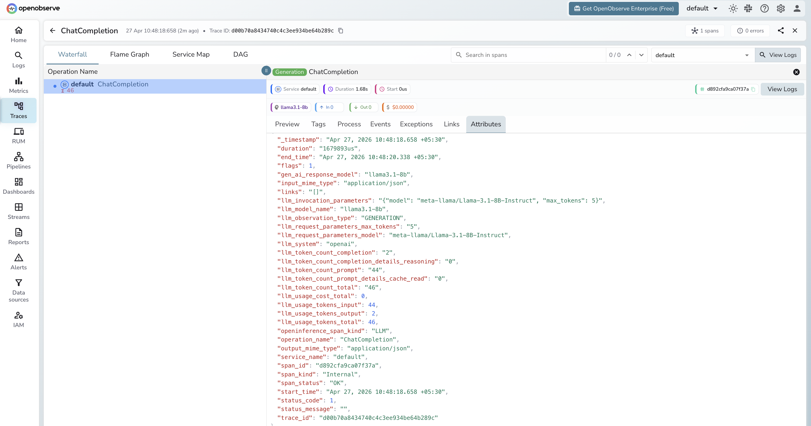

# **Hugging Face Inference API → OpenObserve**

Automatically capture token usage, latency, and model metadata for every Hugging Face serverless inference call in your Python application. The Hugging Face Inference Router exposes an OpenAI-compatible endpoint, so instrumentation uses the standard OpenAI instrumentor pointed at the Hugging Face router URL.

## **Prerequisites**

* Python 3.8+
* An [OpenObserve](https://openobserve.ai/) account (cloud or self-hosted)
* Your OpenObserve **organisation ID** and **Base64-encoded auth token**
* A [Hugging Face](https://huggingface.co/settings/tokens) access token (`read` scope is sufficient)

## **Installation**

```shell
pip install openobserve-telemetry-sdk openinference-instrumentation-openai openai python-dotenv
```

## **Configuration**

Create a `.env` file in your project root:

```
OPENOBSERVE_URL=https://api.openobserve.ai/
OPENOBSERVE_ORG=your_org_id
OPENOBSERVE_AUTH_TOKEN=Basic <your_base64_token>
HF_TOKEN=hf_your_token_here
```

## **Instrumentation**

Call `OpenAIInstrumentor().instrument()` **before** creating the OpenAI client. Point the client at the Hugging Face router and use the full Hub model ID as the model string.

```python
from dotenv import load_dotenv
load_dotenv()

from openinference.instrumentation.openai import OpenAIInstrumentor
from openobserve import openobserve_init

OpenAIInstrumentor().instrument()
openobserve_init()

import os
from openai import OpenAI

client = OpenAI(
    api_key=os.environ["HF_TOKEN"],
    base_url="https://router.huggingface.co/v1",
)

response = client.chat.completions.create(
    model="meta-llama/Llama-3.1-8B-Instruct",
    messages=[{"role": "user", "content": "Explain distributed tracing in one sentence."}],
    max_tokens=100,
)
print(response.choices[0].message.content)
```

The model string is the full Hugging Face Hub model ID (e.g. `meta-llama/Llama-3.1-8B-Instruct`, `mistralai/Mistral-7B-Instruct-v0.3`). Only models with an active serverless inference endpoint work with this API. Gated models (such as Llama variants) require accepting the model licence on the Hub before your token is authorised.

## **What Gets Captured**

| Attribute | Description |
| ----- | ----- |
| `llm_system` | `openai` (OpenAI-compatible client) |
| `llm_model_name` | Resolved model name returned by the API (e.g. `llama3.1-8b`) |
| `llm_request_parameters_model` | Full Hub model ID sent in the request (e.g. `meta-llama/Llama-3.1-8B-Instruct`) |
| `llm_request_parameters_max_tokens` | `max_tokens` value from the request |
| `gen_ai_response_model` | Same as `llm_model_name` |
| `llm_observation_type` | `GENERATION` |
| `llm_token_count_prompt` | Prompt tokens consumed |
| `llm_token_count_completion` | Completion tokens returned |
| `llm_token_count_total` | Total tokens consumed |
| `llm_token_count_prompt_details_cache_read` | Cached prompt tokens |
| `llm_token_count_completion_details_reasoning` | Reasoning tokens |
| `llm_usage_tokens_input` | Input tokens (mirrors `llm_token_count_prompt`) |
| `llm_usage_tokens_output` | Output tokens (mirrors `llm_token_count_completion`) |
| `llm_usage_tokens_total` | Total tokens |
| `openinference_span_kind` | `LLM` |
| `operation_name` | `ChatCompletion` |
| `input_mime_type` | `application/json` |
| `output_mime_type` | `application/json` |
| `duration` | End-to-end request latency |
| `span_status` | `OK` on success, `ERROR` on failure |

## **Viewing Traces**

1. Log in to OpenObserve and navigate to **Traces**
2. Spans appear with `operation_name: ChatCompletion` and `llm_system: openai`
3. Note that the Hub model ID (e.g. `meta-llama/Llama-3.1-8B-Instruct`) appears in `llm_request_parameters_model`, while the resolved short name (e.g. `llama3.1-8b`) appears in `llm_model_name`
4. Filter by `llm_request_parameters_model` to compare latency across different open-source models



## **Next Steps**

With the Hugging Face Inference API instrumented, every serverless inference call is recorded in OpenObserve. From here you can compare open-source model performance, track token consumption, and monitor error rates caused by rate limits or missing model access.

## **Read More**

- [LLM Observability Overview](../llm-applications.md)
- [Traces Ingestion with Python](../../../ingestion/traces/python.md)
- [Exploring Traces in OpenObserve](../../../user-guide/data-exploration/traces/)
- [Building Dashboards](../../../user-guide/analytics/dashboards/)
