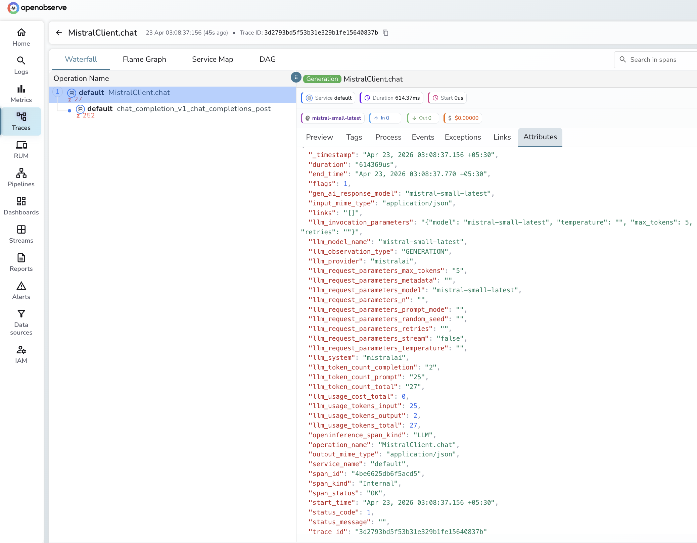

# **Mistral → OpenObserve**

Automatically capture token usage, latency, and model metadata for every Mistral AI inference call in your Python application.

## **Prerequisites**

* Python 3.9+
* A [Mistral](https://console.mistral.ai/) account with an API key
* An [OpenObserve](https://openobserve.ai/) account (cloud or self-hosted)
* Your OpenObserve **organisation ID** and **Base64-encoded auth token**

## **Installation**

```shell
pip install openobserve-telemetry-sdk "openinference-instrumentation-mistralai==1.4.0" mistralai python-dotenv
```

## **Configuration**

Create a `.env` file in your project root:

```
OPENOBSERVE_URL=https://api.openobserve.ai/
OPENOBSERVE_ORG=your_org_id
OPENOBSERVE_AUTH_TOKEN=Basic <your_base64_token>
MISTRAL_API_KEY=your-mistral-api-key
```

## **Instrumentation**

Call `MistralAIInstrumentor().instrument()` **before** importing the Mistral client.

```python
from dotenv import load_dotenv
load_dotenv()

from openinference.instrumentation.mistralai import MistralAIInstrumentor
from openobserve import openobserve_init

MistralAIInstrumentor().instrument()
openobserve_init()

import os
from mistralai import Mistral

client = Mistral(api_key=os.environ["MISTRAL_API_KEY"])

response = client.chat.complete(
    model="mistral-small-latest",
    messages=[{"role": "user", "content": "Explain observability in one sentence."}],
)
print(response.choices[0].message.content)
```

## **What Gets Captured**

| Attribute | Description |
| ----- | ----- |
| `llm_model_name` | Model used (e.g. `mistral-small-latest`) |
| `gen_ai_response_model` | Model that served the response |
| `llm_system` | `mistralai` |
| `llm_provider` | `mistralai` |
| `llm_usage_tokens_input` | Prompt token count |
| `llm_usage_tokens_output` | Completion token count |
| `llm_usage_tokens_total` | Total tokens consumed |
| `openinference_span_kind` | `LLM` |
| `operation_name` | `MistralClient.chat` |
| `span_status` | `OK` or `ERROR` |
| `status_message` | Error details if the request failed |
| `duration` | Request latency |

## **Viewing Traces**

1. Log in to OpenObserve and navigate to **Traces** in the left sidebar
2. Filter by `llm_model_name` to find Mistral spans
3. Click any span to inspect token counts, model name, and latency
4. Error spans show `span_status = ERROR` with the full error message in `status_message`



## **Next Steps**

With Mistral instrumented, every inference call is recorded in OpenObserve. From here you can compare latency across Mistral models, track token consumption over time, and set alerts on error rates.

## **Read More**

- [LLM Observability Overview](../llm-applications.md)
- [Traces Ingestion with Python](../../../ingestion/traces/python.md)
- [Exploring Traces in OpenObserve](../../../user-guide/data-exploration/traces/)
- [Building Dashboards](../../../user-guide/analytics/dashboards/)
