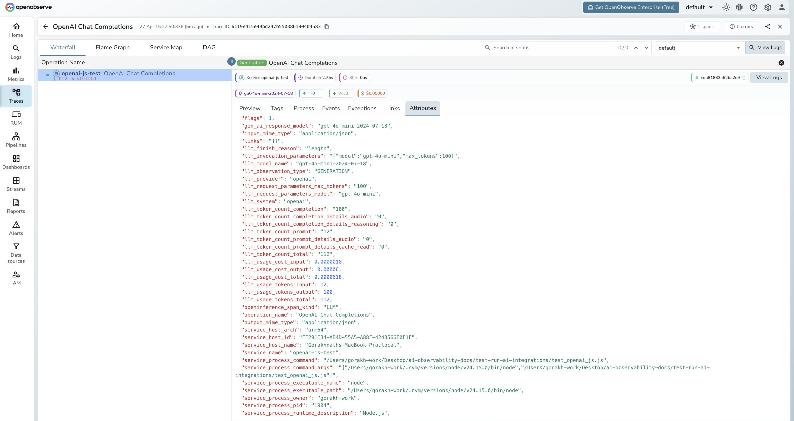

# **OpenAI JS/TS → OpenObserve**

Capture LLM call latency, token usage, model name, and finish reason for every OpenAI API call made from a Node.js application. Instrumentation uses `@arizeai/openinference-instrumentation-openai` to automatically patch the OpenAI SDK and export spans to OpenObserve via OTLP.

## **Prerequisites**

* Node.js 18+
* An [OpenObserve](https://openobserve.ai/) account (cloud or self-hosted)
* Your OpenObserve **organisation ID** and **Base64-encoded auth token**
* An OpenAI API key

## **Installation**

```shell
npm install openai @arizeai/openinference-instrumentation-openai \
  @opentelemetry/sdk-node @opentelemetry/exporter-trace-otlp-http \
  @opentelemetry/sdk-trace-base @opentelemetry/resources dotenv
```

## **Configuration**

Create a `.env` file in your project root:

```
OPENAI_API_KEY=your-openai-api-key
```

## **Instrumentation**

Initialise the OTel SDK with `OpenAIInstrumentation` before requiring the OpenAI SDK. The instrumentation patches the module at `require()` time, so OpenAI must be imported after `sdk.start()`.

```javascript
require('dotenv').config();

const { NodeSDK } = require('@opentelemetry/sdk-node');
const { OTLPTraceExporter } = require('@opentelemetry/exporter-trace-otlp-http');
const { SimpleSpanProcessor } = require('@opentelemetry/sdk-trace-base');
const { resourceFromAttributes } = require('@opentelemetry/resources');
const { OpenAIInstrumentation } = require('@arizeai/openinference-instrumentation-openai');

const sdk = new NodeSDK({
  resource: resourceFromAttributes({ 'service.name': 'my-openai-app' }),
  spanProcessors: [
    new SimpleSpanProcessor(
      new OTLPTraceExporter({
        url: 'https://api.openobserve.ai/api/your_org_id/v1/traces',
        headers: { Authorization: 'Basic <your_base64_token>' },
      })
    ),
  ],
  instrumentations: [new OpenAIInstrumentation()],
});
sdk.start();

const OpenAI = require('openai');

async function main() {
  const client = new OpenAI({ apiKey: process.env.OPENAI_API_KEY });

  const response = await client.chat.completions.create({
    model: 'gpt-4o-mini',
    messages: [{ role: 'user', content: 'What is distributed tracing?' }],
    max_tokens: 256,
  });

  console.log(response.choices[0].message.content);
  await sdk.shutdown();
}

main().catch(console.error);
```

For self-hosted OpenObserve, replace the URL with `http://localhost:5080/api/default/v1/traces`.

## **What Gets Captured**

| Attribute | Description |
| ----- | ----- |
| `operation_name` | `OpenAI Chat Completions` |
| `llm_model_name` | Resolved model version (e.g. `gpt-4o-mini-2024-07-18`) |
| `llm_request_parameters_model` | Model name sent in the request (e.g. `gpt-4o-mini`) |
| `gen_ai_response_model` | Same as `llm_model_name` |
| `llm_system` | `openai` |
| `llm_provider` | `openai` |
| `llm_observation_type` | `GENERATION` |
| `openinference_span_kind` | `LLM` |
| `llm_finish_reason` | Reason generation stopped (e.g. `stop`, `length`) |
| `llm_invocation_parameters` | JSON-serialised request parameters |
| `llm_request_parameters_max_tokens` | `max_tokens` from the request |
| `llm_token_count_prompt` | Prompt tokens consumed |
| `llm_token_count_completion` | Completion tokens generated |
| `llm_token_count_total` | Total tokens consumed |
| `llm_usage_tokens_input` | Input tokens (mirrors `llm_token_count_prompt`) |
| `llm_usage_tokens_output` | Output tokens (mirrors `llm_token_count_completion`) |
| `llm_usage_tokens_total` | Total tokens |
| `llm_usage_cost_input` | Estimated cost for input tokens |
| `llm_usage_cost_output` | Estimated cost for output tokens |
| `input_mime_type` | `application/json` |
| `output_mime_type` | `application/json` |
| `span_kind` | `Internal` |
| `span_status` | `OK` on success, `ERROR` on failure |
| `duration` | End-to-end request latency |

## **Viewing Traces**

1. Log in to OpenObserve and navigate to **Traces**
2. Filter by `service_name` to find your application's spans
3. Spans appear with `operation_name: OpenAI Chat Completions`
4. Note that `llm_request_parameters_model` shows the alias you requested while `llm_model_name` shows the resolved version (e.g. `gpt-4o-mini` vs `gpt-4o-mini-2024-07-18`)
5. Filter by `span_status = ERROR` to find failed calls
6. Use `llm_finish_reason = length` to identify responses truncated by `max_tokens`



## **Next Steps**

With the OpenAI JS/TS SDK instrumented, every API call is recorded in OpenObserve. From here you can build dashboards tracking token consumption, compare response times across models, and alert on high error rates.

## **Read More**

- [LLM Observability Overview](../llm-applications.md)
- [OpenAI (Python)](./openai.md)
- [Traces Ingestion with Python](../../../ingestion/traces/python.md)
- [Exploring Traces in OpenObserve](../../../user-guide/data-exploration/traces/)
- [Building Dashboards](../../../user-guide/analytics/dashboards/)
