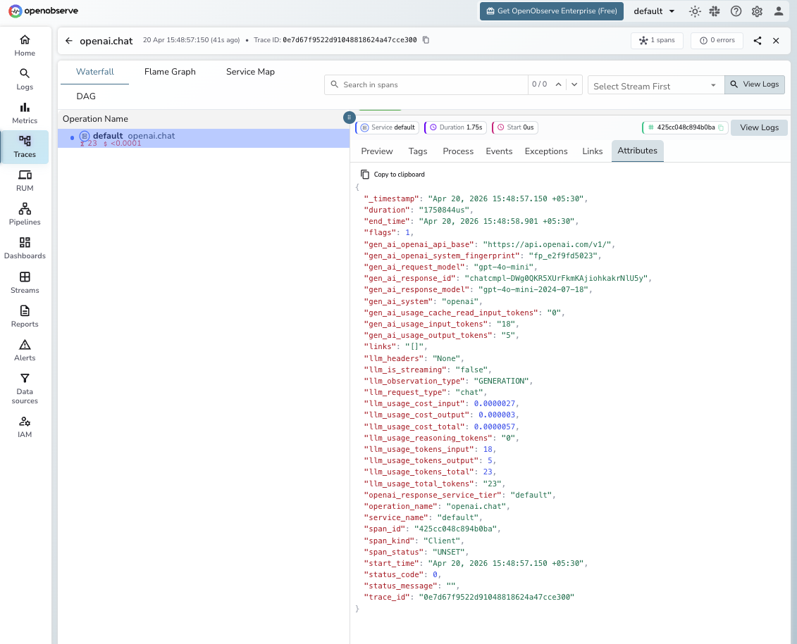

# **OpenAI (Python) → OpenObserve**

Automatically capture token usage, latency, and model metadata for every OpenAI API call in your Python application.

## **Prerequisites**

* Python 3.8+
* [`uv`](https://github.com/astral-sh/uv) package manager (or `pip`)
* An [OpenObserve](https://openobserve.ai/) account (cloud or self-hosted)
* Your OpenObserve **organisation ID** and **Base64-encoded auth token**
* An OpenAI API key

## **Installation**

```shell
pip install openobserve-telemetry-sdk opentelemetry-instrumentation-openai python-dotenv
```

## **Configuration**

Create a `.env` file in your project root:

```
# OpenObserve instance URL
# Default for self-hosted: http://localhost:5080
OPENOBSERVE_URL=https://api.openobserve.ai/

# Your OpenObserve organisation slug or ID
OPENOBSERVE_ORG=your_org_id

# Basic auth token — Base64-encoded "email:password"
OPENOBSERVE_AUTH_TOKEN="Basic <your_base64_token>"

# OpenAI API key
OPENAI_API_KEY=your-openai-key
```

## **Instrumentation**

Call `OpenAIInstrumentor().instrument()` **before** any OpenAI client is created.

```python
from opentelemetry.instrumentation.openai import OpenAIInstrumentor
from openobserve import openobserve_init

# Instrument before importing the OpenAI client
OpenAIInstrumentor().instrument()
openobserve_init()

from openai import OpenAI

client = OpenAI()

# Chat completions
response = client.chat.completions.create(
    model="gpt-4o",
    messages=[{"role": "user", "content": "Explain observability in one sentence."}],
)
print(response.choices[0].message.content)
```

### Streaming

Streaming completions are also captured. The span closes when the full stream is consumed.

```python
stream = client.chat.completions.create(
    model="gpt-4o",
    messages=[{"role": "user", "content": "Count to five."}],
    stream=True,
)
for chunk in stream:
    print(chunk.choices[0].delta.content or "", end="")
```

### Async client

```python
from openai import AsyncOpenAI
import asyncio

async_client = AsyncOpenAI()

async def main():
    response = await async_client.chat.completions.create(
        model="gpt-4o",
        messages=[{"role": "user", "content": "Hello async!"}],
    )
    print(response.choices[0].message.content)

asyncio.run(main())
```

## **What Gets Captured**

| Attribute | Description |
| ----- | ----- |
| `gen_ai_request_model` | Requested model (e.g. `gpt-4o-mini`) |
| `gen_ai_response_model` | Actual model version used (e.g. `gpt-4o-mini-2024-07-18`) |
| `gen_ai_system` | Provider identifier (`openai`) |
| `gen_ai_usage_input_tokens` | Tokens in the prompt |
| `gen_ai_usage_output_tokens` | Tokens in the response |
| `gen_ai_usage_cache_read_input_tokens` | Prompt cache read tokens (if caching is used) |
| `llm_usage_tokens_total` | Total tokens consumed |
| `llm_usage_cost_input` | Estimated input cost in USD |
| `llm_usage_cost_output` | Estimated output cost in USD |
| `llm_usage_cost_total` | Estimated total cost in USD |
| `llm_is_streaming` | Whether the request was streamed |
| `llm_usage_reasoning_tokens` | Reasoning tokens used (o-series models only) |
| `openai_response_service_tier` | OpenAI service tier (e.g. `default`) |
| `duration` | End-to-end request latency |
| `error` | Exception details if the request failed |

## **Viewing Traces**

1. Log in to OpenObserve and navigate to **Traces** in the left sidebar
2. Click any span to inspect token counts, latency, and full request metadata



## **Next Steps**

With OpenAI instrumented, every model call in your application is automatically recorded in OpenObserve. From here you can build dashboards to track token usage and cost over time, set up alerts on error rates or latency spikes, and correlate LLM spans with the rest of your application traces.

## **Read More**

- [LLM Observability Overview](../llm-applications.md)
- [OpenObserve Python SDK](https://openobserve.ai/docs/opentelemetry/openobserve-python-sdk/)
