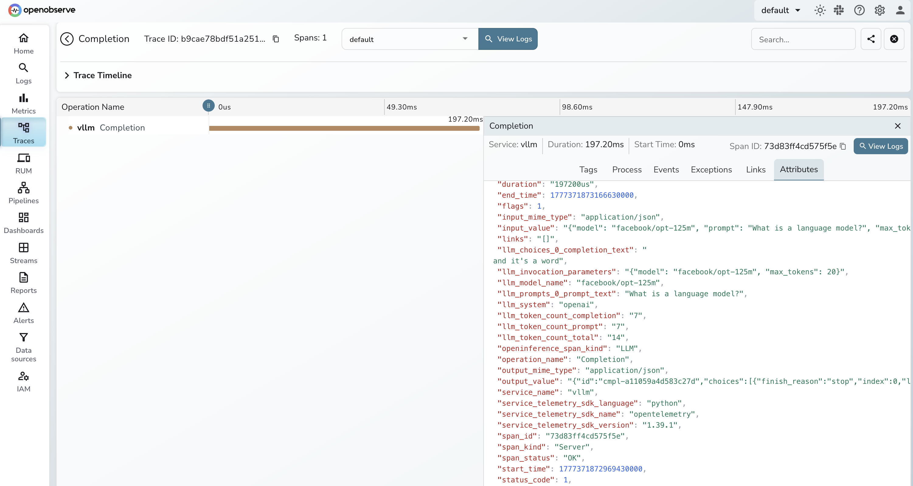

# **vLLM → OpenObserve**

Automatically capture token usage, latency, prompt text, and completion output for every vLLM inference call. vLLM serves an OpenAI-compatible API, so instrumentation uses `openinference-instrumentation-openai` pointed at your local vLLM server. No code changes to the server are needed.

## **Prerequisites**

* Python 3.10+
* vLLM server running locally
* An [OpenObserve](https://openobserve.ai/) account (cloud or self-hosted)
* Your OpenObserve **organisation ID** and **Base64-encoded auth token**

## **Installation**

```shell
pip install openobserve-telemetry-sdk openinference-instrumentation-openai openai python-dotenv
```

Install and start vLLM with a model of your choice:

```shell
pip install vllm
vllm serve facebook/opt-125m --port 8001
```

## **Configuration**

Create a `.env` file in your project root:

```
OPENOBSERVE_URL=https://api.openobserve.ai/
OPENOBSERVE_ORG=your_org_id
OPENOBSERVE_AUTH_TOKEN=Basic <your_base64_token>
VLLM_BASE_URL=http://localhost:8001/v1
```

## **Instrumentation**

Call `OpenAIInstrumentor().instrument()` before creating the OpenAI client. Point the client at your vLLM server using the `base_url` parameter.

```python
from dotenv import load_dotenv
load_dotenv()

from openinference.instrumentation.openai import OpenAIInstrumentor
OpenAIInstrumentor().instrument()

from openobserve import openobserve_init
openobserve_init(resource_attributes={"service.name": "vllm"})

import os
from openai import OpenAI

client = OpenAI(
    api_key="not-needed",
    base_url=os.environ.get("VLLM_BASE_URL", "http://localhost:8001/v1"),
)

models = client.models.list()
model_name = models.data[0].id

response = client.completions.create(
    model=model_name,
    prompt="Explain distributed tracing in one sentence.",
    max_tokens=20,
)
print(response.choices[0].text)
```

For models with a chat template (e.g. Llama, Mistral, Qwen), use `client.chat.completions.create()` with a `messages` list instead.

## **What Gets Captured**

| Attribute | Example Value |
| ----- | ----- |
| `operation_name` | `Completion` |
| `llm_model_name` | `facebook/opt-125m` |
| `llm_system` | `openai` |
| `llm_token_count_prompt` | `7` |
| `llm_token_count_completion` | `20` |
| `llm_token_count_total` | `27` |
| `llm_prompts_0_prompt_text` | The prompt sent to the model |
| `llm_choices_0_completion_text` | The generated response text |
| `llm_invocation_parameters` | JSON with model and max_tokens |
| `openinference_span_kind` | `LLM` |
| `span_status` | `OK` on success, `ERROR` on failure |
| `duration` | End-to-end request latency in microseconds |

## **Viewing Traces**

1. Log in to OpenObserve and navigate to **Traces**
2. Filter by `service_name = vllm` to see all inference calls
3. Click any span to inspect `llm_prompts_0_prompt_text`, token counts, and `llm_choices_0_completion_text`
4. Filter by `span_status = ERROR` to find failed requests
5. Sort by `duration` descending to identify the slowest inference calls



## **Next Steps**

With vLLM instrumented, every inference call is recorded in OpenObserve. From here you can measure throughput, compare latency across models, and monitor token usage trends over time.

## **Read More**

- [LLM Observability Overview](../llm-applications.md)
- [OpenAI (Python)](./openai.md)
- [Traces Ingestion with Python](../../../ingestion/traces/python.md)
- [Exploring Traces in OpenObserve](../../../user-guide/data-exploration/traces/)
