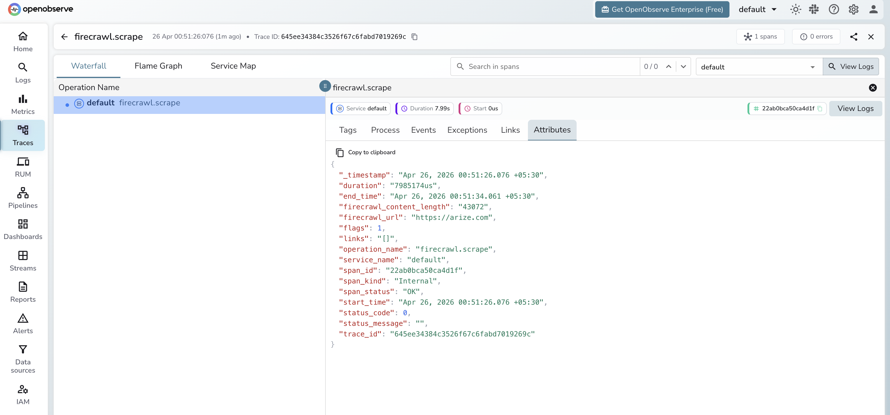

# **Firecrawl → OpenObserve**

Capture latency, target URL, and content length for every Firecrawl scrape or crawl call in your AI pipeline. Firecrawl does not have a dedicated OTel instrumentor, so instrumentation uses manual OpenTelemetry spans that wrap each request.

## **Prerequisites**

* Python 3.8+
* An [OpenObserve](https://openobserve.ai/) account (cloud or self-hosted)
* Your OpenObserve **organisation ID** and **Base64-encoded auth token**
* A [Firecrawl](https://www.firecrawl.dev/) API key

## **Installation**

```shell
pip install openobserve-telemetry-sdk firecrawl-py opentelemetry-api python-dotenv
```

## **Configuration**

Create a `.env` file in your project root:

```
OPENOBSERVE_URL=https://api.openobserve.ai/
OPENOBSERVE_ORG=your_org_id
OPENOBSERVE_AUTH_TOKEN=Basic <your_base64_token>
FIRECRAWL_API_KEY=your-firecrawl-api-key
```

## **Instrumentation**

Call `openobserve_init()` **before** importing Firecrawl. Wrap each scrape call in a `tracer.start_as_current_span()` block and record the URL and content size.

```python
from dotenv import load_dotenv
load_dotenv()

from openobserve import openobserve_init
openobserve_init()

from opentelemetry import trace
import os
from firecrawl import FirecrawlApp

tracer = trace.get_tracer(__name__)
app = FirecrawlApp(api_key=os.environ["FIRECRAWL_API_KEY"])

def scrape(url: str):
    with tracer.start_as_current_span("firecrawl.scrape") as span:
        span.set_attribute("firecrawl.url", url)
        result = app.scrape_url(url, formats=["markdown"])
        content_len = len(result.get("markdown", ""))
        span.set_attribute("firecrawl.content_length", content_len)
        return result

result = scrape("https://openobserve.ai")
print(result.get("markdown", "")[:500])
```

## **What Gets Captured**

| Attribute | Description |
| ----- | ----- |
| `firecrawl_url` | The URL being scraped |
| `firecrawl_content_length` | Character count of the returned markdown content |
| `span_status` | `OK` or error status |
| `duration` | End-to-end scrape latency |

## **Viewing Traces**

1. Log in to OpenObserve and navigate to **Traces**
2. Filter by span name `firecrawl.scrape` to see all scrape calls
3. Click a span to inspect the URL and content length
4. Sort by duration to find the slowest pages



## **Next Steps**

With Firecrawl instrumented, every scrape call in your data pipeline is recorded in OpenObserve. From here you can monitor scrape latency per domain, track content extraction volume, and alert on failed requests.

## **Read More**

- [LLM Observability Overview](../llm-applications.md)
- [Traces Ingestion with Python](../../../ingestion/traces/python.md)
- [Exploring Traces in OpenObserve](../../../user-guide/data-exploration/traces/)
- [Building Dashboards](../../../user-guide/analytics/dashboards/)
