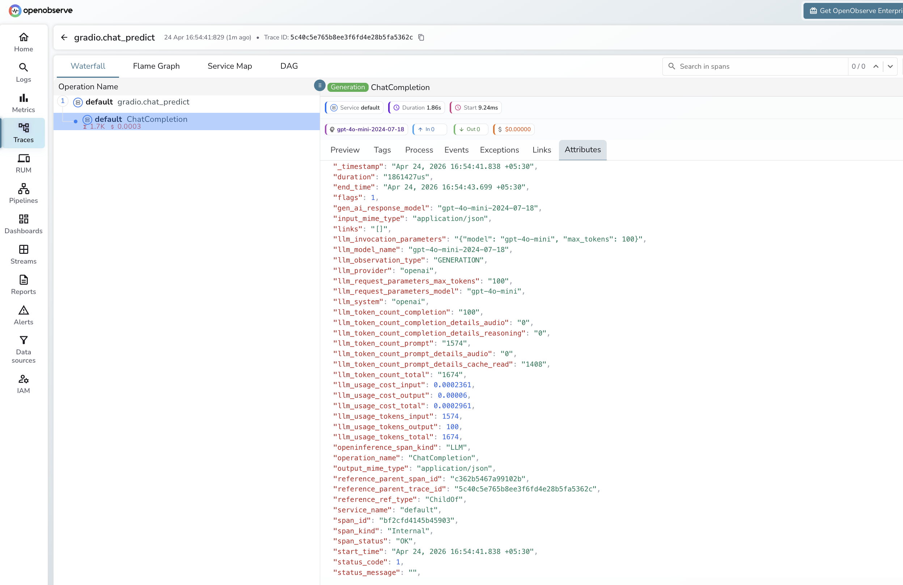

# **Gradio → OpenObserve**

Capture per-request latency, input length, and LLM spans for every Gradio chat or prediction call. Gradio does not emit OTel traces automatically, so instrumentation wraps the prediction function in a manual span and uses the OpenAI instrumentor for any LLM calls inside it.

## **Prerequisites**

* Python 3.8+
* An [OpenObserve](https://openobserve.ai/) account (cloud or self-hosted)
* Your OpenObserve **organisation ID** and **Base64-encoded auth token**
* An OpenAI API key (or another LLM provider)

## **Installation**

```shell
pip install openobserve-telemetry-sdk openinference-instrumentation-openai "gradio==4.20.0" "huggingface_hub<1.0" openai python-dotenv
```

## **Configuration**

Create a `.env` file in your project root:

```
OPENOBSERVE_URL=https://api.openobserve.ai/
OPENOBSERVE_ORG=your_org_id
OPENOBSERVE_AUTH_TOKEN=Basic <your_base64_token>
OPENAI_API_KEY=your-openai-api-key
```

## **Instrumentation**

Call `OpenAIInstrumentor().instrument()` and `openobserve_init()` **before** defining the Gradio interface. Wrap the prediction function body in a manual span to capture Gradio-level metadata alongside the LLM child spans.

```python
from dotenv import load_dotenv
load_dotenv()

from openinference.instrumentation.openai import OpenAIInstrumentor
from openobserve import openobserve_init

OpenAIInstrumentor().instrument()
openobserve_init()

from opentelemetry import trace
import os
import gradio as gr
from openai import OpenAI

tracer = trace.get_tracer(__name__)
client = OpenAI(api_key=os.environ["OPENAI_API_KEY"])


def chat(message: str, history: list) -> str:
    with tracer.start_as_current_span("gradio.chat_predict") as span:
        span.set_attribute("gradio.input_length", len(message))
        span.set_attribute("gradio.history_turns", len(history))
        messages = []
        for user_msg, ai_msg in history:
            messages.append({"role": "user", "content": user_msg})
            messages.append({"role": "assistant", "content": ai_msg})
        messages.append({"role": "user", "content": message})
        response = client.chat.completions.create(
            model="gpt-4o-mini",
            messages=messages,
            max_tokens=200,
        )
        reply = response.choices[0].message.content
        span.set_attribute("gradio.output_length", len(reply))
        return reply


gr.ChatInterface(chat).launch()
```

## **What Gets Captured**

Each chat turn produces a root `gradio.chat_predict` span with a child LLM span from the OpenAI instrumentor. OpenObserve stores dot-separated attribute names with underscores.

**Gradio root span**

| Attribute (in OpenObserve) | Description |
| ----- | ----- |
| `operation_name` | `gradio.chat_predict` |
| `gradio_input_length` | Character count of the user message |
| `gradio_history_turns` | Number of prior conversation turns |
| `gradio_output_length` | Character count of the assistant reply |
| `duration` | End-to-end span latency |
| `span_status` | `UNSET` on success, `ERROR` on failure |

**LLM child span (OpenAI instrumentor)**

| Attribute | Description |
| ----- | ----- |
| `openinference_span_kind` | `LLM` |
| `operation_name` | `ChatCompletion` |
| `llm_provider` | `openai` |
| `llm_system` | `openai` |
| `llm_model_name` | Resolved model version (e.g. `gpt-4o-mini-2024-07-18`) |
| `llm_token_count_prompt` | Input tokens |
| `llm_token_count_completion` | Output tokens |
| `llm_token_count_total` | Total tokens |
| `llm_token_count_prompt_details_cache_read` | Cached input tokens |
| `llm_usage_cost_input` | Estimated input cost in USD |
| `llm_usage_cost_output` | Estimated output cost in USD |
| `llm_invocation_parameters` | Model and parameters passed to the API |
| `span_status` | `OK` on success, `ERROR` on failure |

## **Viewing Traces**

1. Log in to OpenObserve and navigate to **Traces** in the left sidebar
2. Each chat turn appears as a root `gradio.chat_predict` span with a child `ChatCompletion` LLM span
3. Filter by `operation_name = gradio.chat_predict` to find all chat turns
4. Expand any span to inspect `gradio_input_length`, `gradio_output_length`, and token counts from the child span



## **Next Steps**

With Gradio instrumented, every user interaction in your ML demo is recorded in OpenObserve. From here you can monitor response latency, track token usage per session, and alert on prediction errors.

## **Read More**

- [LLM Observability Overview](../llm-applications.md)
- [OpenAI (Python)](../providers/openai.md)
- [Traces Ingestion with Python](../../../ingestion/traces/python.md)
- [Exploring Traces in OpenObserve](../../../user-guide/data-exploration/traces/)
