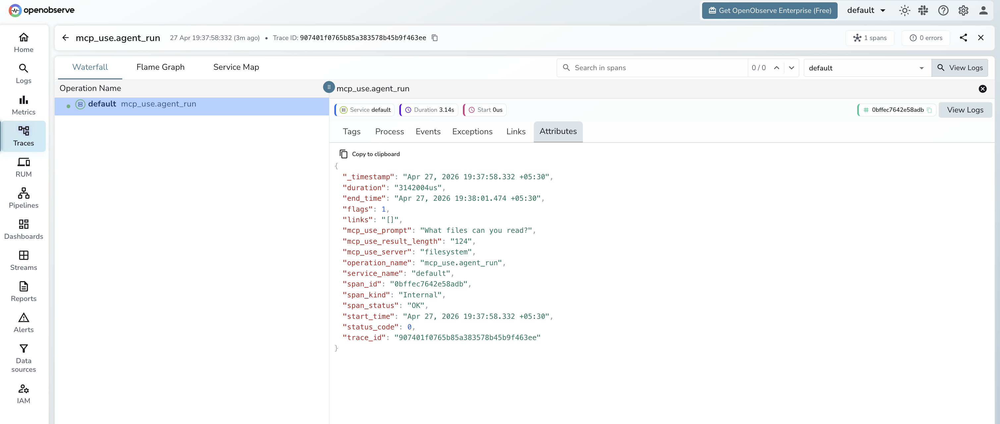

# **mcp-use → OpenObserve**

Capture agent run latency, prompt input, result length, and error details for every mcp-use agent invocation. mcp-use is a Python library that connects LLM agents to Model Context Protocol (MCP) servers. Instrumentation uses manual OpenTelemetry spans wrapping each agent run.

## **Prerequisites**

* Python 3.11+ (required by `mcp-use`)
* An [OpenObserve](https://openobserve.ai/) account (cloud or self-hosted)
* Your OpenObserve **organisation ID** and **Base64-encoded auth token**
* Node.js installed (for running MCP servers via `npx`)
* An OpenAI API key

## **Installation**

```shell
pip install openobserve-telemetry-sdk mcp-use langchain-openai opentelemetry-api python-dotenv
```

## **Configuration**

Create a `.env` file in your project root:

```
OPENOBSERVE_URL=http://localhost:5080/
OPENOBSERVE_ORG=default
OPENOBSERVE_AUTH_TOKEN=Basic <your_base64_token>
OPENAI_API_KEY=your-openai-api-key
```

## **Instrumentation**

Call `openobserve_init()` **before** importing `mcp_use`. Wrap each `agent.run()` call in a manual span.

```python
from dotenv import load_dotenv
load_dotenv()

from openobserve import openobserve_init
openobserve_init()

from opentelemetry import trace
import os
import asyncio
from mcp_use import MCPClient, MCPAgent
from langchain_openai import ChatOpenAI

tracer = trace.get_tracer(__name__)

config = {
    "mcpServers": {
        "filesystem": {
            "command": "npx",
            "args": ["-y", "@modelcontextprotocol/server-filesystem", "/tmp"],
        }
    }
}

llm = ChatOpenAI(model="gpt-4o-mini", api_key=os.environ["OPENAI_API_KEY"])

async def run(prompt: str):
    with tracer.start_as_current_span("mcp_use.agent_run") as span:
        span.set_attribute("mcp_use.prompt", prompt[:200])
        span.set_attribute("mcp_use.server", "filesystem")
        try:
            client = MCPClient(config)
            agent = MCPAgent(llm=llm, client=client, max_steps=5)
            result = await agent.run(prompt)
            span.set_attribute("mcp_use.result_length", len(str(result)))
            span.set_attribute("span_status", "OK")
            return result
        except Exception as e:
            span.set_attribute("span_status", "ERROR")
            span.set_attribute("error.message", str(e)[:200])
            raise

async def main():
    result = await run("What directories are available in /tmp?")
    print(result)
    trace.get_tracer_provider().force_flush()

asyncio.run(main())
```

## **What Gets Captured**

| Attribute | Description |
| ----- | ----- |
| `operation_name` | `mcp_use.agent_run` |
| `mcp_use_prompt` | The user prompt sent to the agent (truncated to 200 chars) |
| `mcp_use_server` | Name of the MCP server being used (e.g. `filesystem`) |
| `mcp_use_result_length` | Character count of the agent's final result |
| `span_status` | `OK` on success, `ERROR` on failure |
| `error_message` | Error detail when the agent run fails |
| `duration` | End-to-end agent execution latency |

## **Viewing Traces**

1. Log in to OpenObserve and navigate to **Traces**
2. Filter by `operation_name` = `mcp_use.agent_run` to see all agent runs
3. Filter by `span_status` = `ERROR` to find failed runs
4. Sort by duration to identify slow agent invocations



## **Next Steps**

With mcp-use instrumented, every agent run connecting to MCP servers is recorded in OpenObserve. From here you can monitor agent execution time, track error rates by server, and correlate runs with specific prompts.

## **Read More**

- [LLM Observability Overview](../llm-applications.md)
- [MCP Integration](../mcp/)
- [Traces Ingestion with Python](../../../ingestion/traces/python.md)
- [Exploring Traces in OpenObserve](../../../user-guide/data-exploration/traces/)
