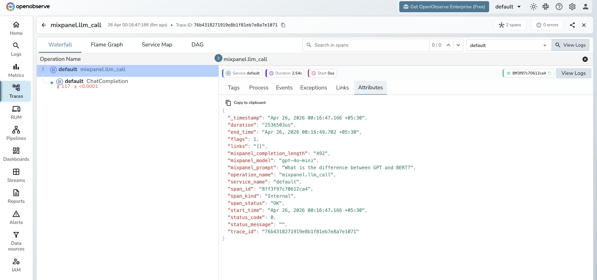

# **Mixpanel → OpenObserve**

Record LLM usage events in Mixpanel for product analytics while simultaneously exporting structured OTel traces to OpenObserve for observability. Mixpanel captures aggregated LLM usage per user or feature; OpenObserve stores the full span tree with token counts and latency.

## **Prerequisites**

* Python 3.8+
* An [OpenObserve](https://openobserve.ai/) account (cloud or self-hosted)
* Your OpenObserve **organisation ID** and **Base64-encoded auth token**
* A [Mixpanel](https://mixpanel.com/) project token
* An OpenAI API key (or another LLM provider)

## **Installation**

```shell
pip install openobserve-telemetry-sdk openinference-instrumentation-openai mixpanel openai python-dotenv
```

## **Configuration**

Create a `.env` file in your project root:

```
OPENOBSERVE_URL=https://api.openobserve.ai/
OPENOBSERVE_ORG=your_org_id
OPENOBSERVE_AUTH_TOKEN=Basic <your_base64_token>
OPENAI_API_KEY=your-openai-api-key
MIXPANEL_TOKEN=your-mixpanel-project-token
```

## **Instrumentation**

Call `OpenAIInstrumentor().instrument()` and `openobserve_init()` **before** creating any clients. Track each LLM call in both Mixpanel and OpenObserve.

```python
from dotenv import load_dotenv
load_dotenv()

from openinference.instrumentation.openai import OpenAIInstrumentor
from openobserve import openobserve_init

OpenAIInstrumentor().instrument()
openobserve_init()

from opentelemetry import trace
import os
import uuid
import mixpanel
from openai import OpenAI

tracer = trace.get_tracer(__name__)
mp = mixpanel.Mixpanel(os.environ["MIXPANEL_TOKEN"])
client = OpenAI(api_key=os.environ["OPENAI_API_KEY"])

def generate(prompt: str, user_id: str = None) -> str:
    with tracer.start_as_current_span("mixpanel.llm_call") as span:
        span.set_attribute("mixpanel.model", "gpt-4o-mini")
        span.set_attribute("mixpanel.prompt", prompt[:200])
        response = client.chat.completions.create(
            model="gpt-4o-mini",
            messages=[{"role": "user", "content": prompt}],
            max_tokens=200,
        )
        reply = response.choices[0].message.content
        trace_id = hex(span.get_span_context().trace_id)

        mp.track(user_id or str(uuid.uuid4()), "LLM Call", {
            "model": "gpt-4o-mini",
            "prompt_tokens": response.usage.prompt_tokens,
            "completion_tokens": response.usage.completion_tokens,
            "trace_id": trace_id,
        })
        return reply

result = generate("Explain distributed tracing in one sentence.", user_id="user-123")
print(result)
```

## **What Gets Captured**

**In OpenObserve (OTel traces):**

| Attribute | Description |
| ----- | ----- |
| `mixpanel_model` | The model used |
| `mixpanel_prompt` | The input prompt |
| `mixpanel_completion_length` | Character length of the model response |
| `llm_token_count_prompt` | Prompt tokens (from OpenAI instrumentor child span) |
| `llm_token_count_completion` | Completion tokens (from OpenAI instrumentor child span) |
| `duration` | Request latency |
| `span_status` | `OK` or error status |

**In Mixpanel (`LLM Call` event):**

| Property | Description |
| ----- | ----- |
| `model` | LLM model name |
| `prompt_tokens` | Input token count |
| `completion_tokens` | Output token count |
| `trace_id` | OpenObserve trace ID for cross-referencing |

## **Viewing Traces**

1. Log in to OpenObserve and navigate to **Traces**
2. Filter by span name `mixpanel.llm_call` to see all LLM calls
3. Use the `trace_id` property in Mixpanel to locate the full OTel trace in OpenObserve



## **Next Steps**

With Mixpanel and OpenObserve both instrumented, you get product analytics in Mixpanel and deep observability in OpenObserve. Use Mixpanel funnels to track feature adoption and OpenObserve dashboards to monitor LLM latency.

## **Read More**

- [LLM Observability Overview](../llm-applications.md)
- [Traces Ingestion with Python](../../../ingestion/traces/python.md)
- [Exploring Traces in OpenObserve](../../../user-guide/data-exploration/traces/)
- [Building Dashboards](../../../user-guide/analytics/dashboards/)
