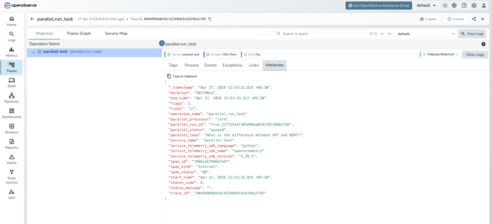

# **Parallel → OpenObserve**

Capture run IDs, processor tier, status, and latency for every Parallel AI task submission. Parallel does not ship a dedicated OTel instrumentor, so instrumentation uses manual OpenTelemetry spans wrapping the Parallel REST API.

## **Prerequisites**

* Python 3.8+
* An [OpenObserve](https://openobserve.ai/) account (cloud or self-hosted)
* Your OpenObserve **organisation ID** and **Base64-encoded auth token**
* A [Parallel](https://parallel.ai/) API key

## **Installation**

```shell
pip install openobserve-telemetry-sdk opentelemetry-api requests python-dotenv
```

## **Configuration**

Create a `.env` file in your project root:

```
OPENOBSERVE_URL=https://api.openobserve.ai/
OPENOBSERVE_ORG=your_org_id
OPENOBSERVE_AUTH_TOKEN=Basic <your_base64_token>
PARALLEL_API_KEY=your-parallel-api-key
```

## **Instrumentation**

Call `openobserve_init()` before making API calls. Pass `resource_attributes` to set the service name, then wrap each task submission in a manual span.

```python
from dotenv import load_dotenv
load_dotenv()

from openobserve import openobserve_init
openobserve_init(resource_attributes={"service.name": "my-app"})

from opentelemetry import trace
import os
import requests

tracer = trace.get_tracer(__name__)

api_key = os.environ["PARALLEL_API_KEY"]
BASE_URL = "https://api.parallel.ai/v1"

headers = {
    "x-api-key": api_key,
    "Content-Type": "application/json",
}

def run_task(task: str, processor: str = "core"):
    with tracer.start_as_current_span("parallel.run_task") as span:
        span.set_attribute("parallel.task", task[:100])
        span.set_attribute("parallel.processor", processor)
        resp = requests.post(
            f"{BASE_URL}/tasks/runs",
            headers=headers,
            json={"input": task, "processor": processor},
            timeout=30,
        )
        resp.raise_for_status()
        data = resp.json()
        span.set_attribute("parallel.run_id", data.get("run_id", ""))
        span.set_attribute("parallel.status", data.get("status", ""))
        return data

result = run_task("Explain distributed tracing in one sentence.")
print(result)
```

Parallel returns immediately with a `queued` status and a `run_id`. Poll `GET /tasks/runs/{run_id}` to retrieve the completed result. The `processor` field controls the capability tier: `core`, `base`, or `ultra`.

## **What Gets Captured**

| Attribute | Description |
| ----- | ----- |
| `parallel_task` | The task input text (truncated to 100 chars) |
| `parallel_run_id` | Unique run identifier returned by the API |
| `parallel_status` | Initial task status, typically `queued` |
| `parallel_processor` | Processor tier used (`core`, `base`, or `ultra`) |
| `parallel_status_code` | HTTP status code on error responses |
| `span_status` | `OK` or `ERROR` |
| `error_message` | Error detail on failed requests |
| `duration` | API call latency |

## **Viewing Traces**

1. Log in to OpenObserve and navigate to **Traces**
2. Filter by service name to find your Parallel spans
3. Click a `parallel.run_task` span to inspect the run ID, processor tier, and status
4. Filter by `span_status` = `ERROR` to identify failed submissions



## **Next Steps**

With Parallel instrumented, every task submission is recorded in OpenObserve. From here you can monitor submission latency, track error rates by processor tier, and correlate Parallel runs with other spans in your pipeline.

## **Read More**

- [LLM Observability Overview](../llm-applications.md)
- [Traces Ingestion with Python](../../../ingestion/traces/python.md)
- [Exploring Traces in OpenObserve](../../../user-guide/data-exploration/traces/)
- [Building Dashboards](../../../user-guide/analytics/dashboards/)
