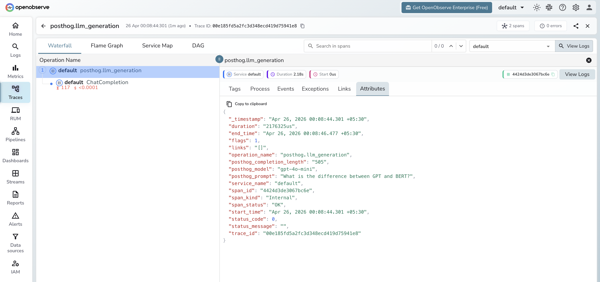

# **PostHog → OpenObserve**

Capture LLM generation events in PostHog for product analytics while simultaneously exporting structured OTel traces to OpenObserve for observability. The two platforms complement each other: PostHog tracks user behaviour and aggregates LLM usage; OpenObserve stores the full span tree with token counts and latency for debugging.

## **Prerequisites**

* Python 3.8+
* An [OpenObserve](https://openobserve.ai/) account (cloud or self-hosted)
* Your OpenObserve **organisation ID** and **Base64-encoded auth token**
* A [PostHog](https://posthog.com/) project API key
* An OpenAI API key (or another LLM provider)

## **Installation**

```shell
pip install openobserve-telemetry-sdk openinference-instrumentation-openai posthog openai python-dotenv
```

## **Configuration**

Create a `.env` file in your project root:

```
OPENOBSERVE_URL=https://api.openobserve.ai/
OPENOBSERVE_ORG=your_org_id
OPENOBSERVE_AUTH_TOKEN=Basic <your_base64_token>
OPENAI_API_KEY=your-openai-api-key
POSTHOG_API_KEY=phc_your_project_api_key
POSTHOG_HOST=https://app.posthog.com
```

## **Instrumentation**

Call `OpenAIInstrumentor().instrument()` and `openobserve_init()` **before** creating any clients. Track each LLM generation in both PostHog and OpenObserve.

```python
from dotenv import load_dotenv
load_dotenv()

from openinference.instrumentation.openai import OpenAIInstrumentor
from openobserve import openobserve_init

OpenAIInstrumentor().instrument()
openobserve_init()

from opentelemetry import trace
import os
import uuid
import posthog
from openai import OpenAI

tracer = trace.get_tracer(__name__)

posthog.api_key = os.environ["POSTHOG_API_KEY"]
posthog.host = os.environ.get("POSTHOG_HOST", "https://app.posthog.com")

client = OpenAI(api_key=os.environ["OPENAI_API_KEY"])

def generate(prompt: str, user_id: str = None) -> str:
    with tracer.start_as_current_span("posthog.llm_generation") as span:
        span.set_attribute("posthog.model", "gpt-4o-mini")
        span.set_attribute("posthog.prompt", prompt[:200])
        response = client.chat.completions.create(
            model="gpt-4o-mini",
            messages=[{"role": "user", "content": prompt}],
            max_tokens=200,
        )
        reply = response.choices[0].message.content
        trace_id = hex(span.get_span_context().trace_id)

        posthog.capture(user_id or str(uuid.uuid4()), "$ai_generation", {
            "$ai_provider": "openai",
            "$ai_model": "gpt-4o-mini",
            "$ai_input_tokens": response.usage.prompt_tokens,
            "$ai_output_tokens": response.usage.completion_tokens,
            "$ai_trace_id": trace_id,
        })
        return reply

result = generate("Explain distributed tracing in one sentence.", user_id="user-123")
print(result)
posthog.shutdown()
```

## **What Gets Captured**

**In OpenObserve (OTel traces):**

| Attribute | Description |
| ----- | ----- |
| `posthog_model` | The model used |
| `posthog_prompt` | The input prompt |
| `posthog_completion_length` | Character length of the model response |
| `llm_token_count_prompt` | Prompt tokens (from OpenAI instrumentor child span) |
| `llm_token_count_completion` | Completion tokens (from OpenAI instrumentor child span) |
| `duration` | Request latency |
| `span_status` | `OK` or error status |

**In PostHog (`$ai_generation` event):**

| Property | Description |
| ----- | ----- |
| `$ai_provider` | LLM provider name |
| `$ai_model` | Model used |
| `$ai_input_tokens` | Prompt token count |
| `$ai_output_tokens` | Completion token count |
| `$ai_trace_id` | Trace ID for cross-referencing with OpenObserve |

## **Viewing Traces**

1. Log in to OpenObserve and navigate to **Traces**
2. Filter by span name `posthog.llm_generation` to see all generations
3. Use `$ai_trace_id` in PostHog to cross-reference with the full OTel trace in OpenObserve



## **Next Steps**

With PostHog and OpenObserve both instrumented, you get product-level analytics in PostHog and deep observability in OpenObserve. Set alerts in OpenObserve on latency spikes and use PostHog dashboards to track per-user token spend.

## **Read More**

- [LLM Observability Overview](../llm-applications.md)
- [Traces Ingestion with Python](../../../ingestion/traces/python.md)
- [Exploring Traces in OpenObserve](../../../user-guide/data-exploration/traces/)
- [Building Dashboards](../../../user-guide/analytics/dashboards/)
