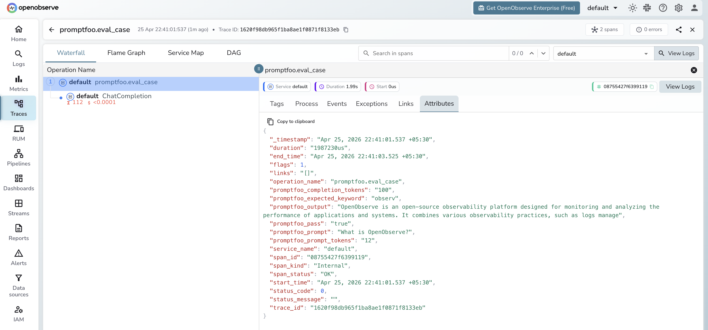

# **Promptfoo → OpenObserve**

Capture evaluation run spans, per-case pass/fail results, and token usage for every Promptfoo eval. Promptfoo is an LLM evaluation framework for testing prompt quality and model behaviour. Instrument it by wrapping eval cases in manual OTel spans using the OpenAI instrumentor for the underlying model calls.

## **Prerequisites**

* Python 3.8+
* An [OpenObserve](https://openobserve.ai/) account (cloud or self-hosted)
* Your OpenObserve **organisation ID** and **Base64-encoded auth token**
* An OpenAI API key

## **Installation**

```shell
pip install openobserve-telemetry-sdk openinference-instrumentation-openai openai opentelemetry-api python-dotenv
```

## **Configuration**

Create a `.env` file in your project root:

```
OPENOBSERVE_URL=https://api.openobserve.ai/
OPENOBSERVE_ORG=your_org_id
OPENOBSERVE_AUTH_TOKEN=Basic <your_base64_token>
OPENAI_API_KEY=your-openai-api-key
```

## **Instrumentation**

Call `OpenAIInstrumentor().instrument()` and `openobserve_init()` **before** running evaluations. Wrap each eval case in a `promptfoo.eval_case` span recording the prompt, output, and pass/fail result.

```python
from dotenv import load_dotenv
load_dotenv()

from openinference.instrumentation.openai import OpenAIInstrumentor
from openobserve import openobserve_init

OpenAIInstrumentor().instrument()
openobserve_init()

from opentelemetry import trace
import os
from openai import OpenAI

tracer = trace.get_tracer(__name__)
client = OpenAI(api_key=os.environ["OPENAI_API_KEY"])

eval_cases = [
    {"prompt": "What is distributed tracing?", "expected_keyword": "trace"},
    {"prompt": "Explain OpenTelemetry in one sentence.", "expected_keyword": "telemetry"},
    {"prompt": "What is a span?", "expected_keyword": "span"},
]

for case in eval_cases:
    with tracer.start_as_current_span("promptfoo.eval_case") as span:
        span.set_attribute("promptfoo.prompt", case["prompt"])
        span.set_attribute("promptfoo.expected_keyword", case["expected_keyword"])
        response = client.chat.completions.create(
            model="gpt-4o-mini",
            messages=[{"role": "user", "content": case["prompt"]}],
            max_tokens=100,
        )
        output = response.choices[0].message.content
        passed = case["expected_keyword"].lower() in output.lower()
        span.set_attribute("promptfoo.output", output[:300])
        span.set_attribute("promptfoo.pass", passed)
        span.set_attribute("promptfoo.prompt_tokens", response.usage.prompt_tokens)
        span.set_attribute("promptfoo.completion_tokens", response.usage.completion_tokens)
        span.set_attribute("span_status", "OK")
        print(f"{'PASS' if passed else 'FAIL'}: {output[:60]}...")
```

## **What Gets Captured**

| Attribute | Description |
| ----- | ----- |
| `promptfoo_prompt` | The eval prompt |
| `promptfoo_expected_keyword` | The keyword being asserted in the response |
| `promptfoo_output` | The model's response |
| `promptfoo_pass` | `true` if the assertion passed, `false` otherwise |
| `promptfoo_prompt_tokens` | Prompt tokens consumed |
| `promptfoo_completion_tokens` | Completion tokens consumed |
| `duration` | Per-case eval latency |
| `span_status` | `OK` or error status |

## **Viewing Traces**

1. Log in to OpenObserve and navigate to **Traces**
2. Filter by span name `promptfoo.eval_case` to see all eval cases
3. Filter by `promptfoo.pass` `false` to find failing cases
4. Sort by duration to identify slow eval cases



## **Next Steps**

With Promptfoo eval cases in OpenObserve, you can track pass rates over time, alert on regression when `promptfoo.pass` drops, and correlate eval failures with specific prompts or models.

## **Read More**

- [LLM Observability Overview](../llm-applications.md)
- [Traces Ingestion with Python](../../../ingestion/traces/python.md)
- [Exploring Traces in OpenObserve](../../../user-guide/data-exploration/traces/)
- [Alerts](../../../user-guide/analytics/alerts/)
