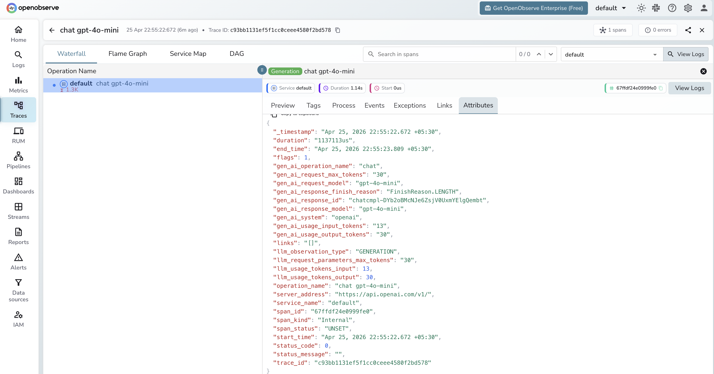

# **Trubrics → OpenObserve**

Capture LLM generation spans in OpenObserve while simultaneously recording user feedback events in Trubrics. Trubrics is a feedback collection platform for LLM applications. The two tools complement each other: Trubrics tracks thumbs up/down and free-text feedback; OpenObserve stores the full trace with token counts and latency.

## **Prerequisites**

* Python 3.8+
* An [OpenObserve](https://openobserve.ai/) account (cloud or self-hosted)
* Your OpenObserve **organisation ID** and **Base64-encoded auth token**
* A [Trubrics](https://trubrics.com/) API key
* An OpenAI API key

## **Installation**

```shell
pip install openobserve-telemetry-sdk openinference-instrumentation-openai trubrics openai python-dotenv
```

## **Configuration**

Create a `.env` file in your project root:

```
OPENOBSERVE_URL=https://api.openobserve.ai/
OPENOBSERVE_ORG=your_org_id
OPENOBSERVE_AUTH_TOKEN=Basic <your_base64_token>
OPENAI_API_KEY=your-openai-api-key
TRUBRICS_API_KEY=your-trubrics-api-key
```

## **Instrumentation**

Call `OpenAIInstrumentor().instrument()` and `openobserve_init()` **before** creating any clients. Record user feedback in Trubrics alongside OTel generation spans.

```python
from dotenv import load_dotenv
load_dotenv()

from openinference.instrumentation.openai import OpenAIInstrumentor
from openobserve import openobserve_init

OpenAIInstrumentor().instrument()
openobserve_init()

from opentelemetry import trace
import os
import uuid
from trubrics import Trubrics
from openai import OpenAI

tracer = trace.get_tracer(__name__)
tb = Trubrics(api_key=os.environ["TRUBRICS_API_KEY"])
client = OpenAI(api_key=os.environ["OPENAI_API_KEY"])

def generate_and_collect_feedback(prompt: str, user_id: str = None) -> str:
    with tracer.start_as_current_span("trubrics.llm_with_feedback") as span:
        span.set_attribute("trubrics.prompt", prompt[:200])
        span.set_attribute("trubrics.model", "gpt-4o-mini")

        response = client.chat.completions.create(
            model="gpt-4o-mini",
            messages=[{"role": "user", "content": prompt}],
            max_tokens=200,
        )
        reply = response.choices[0].message.content
        trace_id = hex(span.get_span_context().trace_id)
        span.set_attribute("trubrics.trace_id", trace_id)

        tb.track(
            user_id=user_id or str(uuid.uuid4()),
            prompt=prompt,
            generation=reply,
            tags={"model": "gpt-4o-mini", "trace_id": trace_id},
        )
        return reply

result = generate_and_collect_feedback(
    "Explain distributed tracing in one sentence.",
    user_id="user-123",
)
print(result)
```

## **What Gets Captured**

**In OpenObserve (OTel traces):**

| Attribute | Description |
| ----- | ----- |
| `trubrics_prompt` | The user prompt |
| `trubrics_model` | Model used for generation |
| `trubrics_completion_length` | Character length of the model response |
| `llm_token_count_prompt` | Prompt tokens (from OpenAI instrumentor child span) |
| `llm_token_count_completion` | Completion tokens (from OpenAI instrumentor child span) |
| `duration` | Request latency |
| `span_status` | `OK` or error status |

**In Trubrics:**

| Property | Description |
| ----- | ----- |
| `prompt` | The user's input |
| `generation` | The model's response |
| `trace_id` | OpenObserve trace ID for drill-down |

## **Viewing Traces**

1. Log in to OpenObserve and navigate to **Traces**
2. Filter by span name `trubrics.llm_with_feedback` to see all tracked generations
3. Use the `trace_id` in Trubrics to cross-reference with the OTel trace in OpenObserve



## **Next Steps**

With Trubrics and OpenObserve both instrumented, user feedback is correlated with detailed trace data. Use Trubrics dashboards to track satisfaction scores and OpenObserve to diagnose the specific requests users flagged negatively.

## **Read More**

- [LLM Observability Overview](../llm-applications.md)
- [Traces Ingestion with Python](../../../ingestion/traces/python.md)
- [Exploring Traces in OpenObserve](../../../user-guide/data-exploration/traces/)
- [Building Dashboards](../../../user-guide/analytics/dashboards/)
