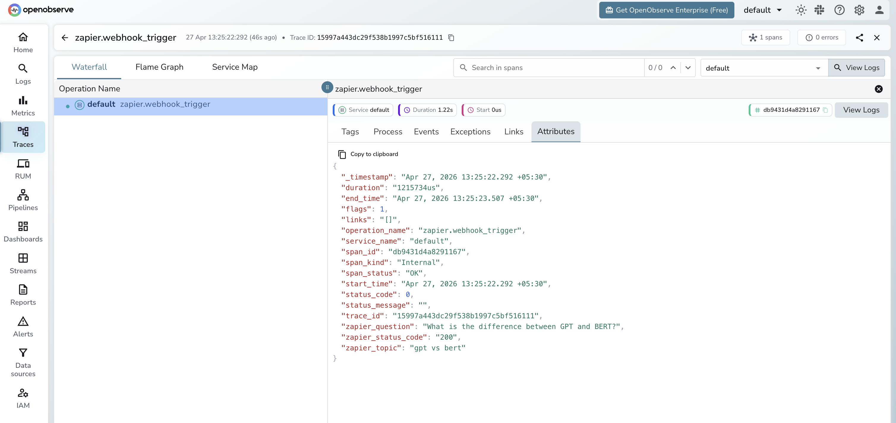

# **Zapier → OpenObserve**

Capture latency, payload metadata, and status codes for every Zapier webhook trigger fired from your AI application. Zapier's Catch Hook trigger accepts HTTP POST requests and routes them through any of Zapier's 5000+ app integrations. Instrumentation uses manual OpenTelemetry spans wrapping each webhook call.

## **Prerequisites**

* Python 3.8+
* An [OpenObserve](https://openobserve.ai/) account (cloud or self-hosted)
* Your OpenObserve **organisation ID** and **Base64-encoded auth token**
* A Zapier account with a Zap using **Webhooks by Zapier** (Catch Hook) as the trigger

## **Installation**

```shell
pip install openobserve opentelemetry-api requests python-dotenv
```

## **Configuration**

In Zapier, create a new Zap and select **Webhooks by Zapier** as the trigger with event **Catch Hook**. Copy the generated webhook URL from the setup screen.

Create a `.env` file in your project root:

```
OPENOBSERVE_URL=http://localhost:5080/
OPENOBSERVE_ORG=default
OPENOBSERVE_AUTH_TOKEN=Basic <your_base64_token>
ZAPIER_WEBHOOK_URL=https://hooks.zapier.com/hooks/catch/<your_hook_id>/
```

## **Instrumentation**

Call `openobserve_init()` before making requests. Wrap each webhook POST in a manual span.

```python
from dotenv import load_dotenv
load_dotenv()

from openobserve import openobserve_init
openobserve_init()

from opentelemetry import trace
import os
import requests

tracer = trace.get_tracer(__name__)
webhook_url = os.environ["ZAPIER_WEBHOOK_URL"]

def trigger_zap(topic: str, question: str):
    with tracer.start_as_current_span("zapier.webhook_trigger") as span:
        span.set_attribute("zapier.topic", topic)
        span.set_attribute("zapier.question", question[:100])
        resp = requests.post(
            webhook_url,
            json={"topic": topic, "question": question},
            timeout=15,
        )
        span.set_attribute("zapier.status_code", resp.status_code)
        span.set_attribute("span_status", "OK" if resp.ok else "ERROR")
        return resp.json()

result = trigger_zap("observability", "What is distributed tracing?")
print(result)

trace.get_tracer_provider().force_flush()
```

## **What Gets Captured**

| Attribute | Description |
| ----- | ----- |
| `operation_name` | `zapier.webhook_trigger` |
| `zapier_topic` | Topic label set on the span |
| `zapier_question` | Payload text passed to the webhook (truncated to 100 chars) |
| `zapier_status_code` | HTTP response status code from Zapier (e.g. `200`) |
| `span_status` | `OK` on success, `ERROR` on failure |
| `duration` | End-to-end webhook call latency |

## **Viewing Traces**

1. Log in to OpenObserve and navigate to **Traces**
2. Filter by `operation_name` = `zapier.webhook_trigger` to see all webhook calls
3. Expand a span to inspect `zapier_topic` and `zapier_question` alongside latency
4. Filter by `span_status` = `ERROR` to find failed webhook calls



## **Next Steps**

With Zapier instrumented, every webhook trigger is recorded in OpenObserve. From here you can monitor trigger latency, track payload metadata per event type, and alert on error rates across automations.

## **Read More**

- [LLM Observability Overview](../llm-applications.md)
- [Traces Ingestion with Python](../../../ingestion/traces/python.md)
- [Exploring Traces in OpenObserve](../../../user-guide/data-exploration/traces/)
- [Building Dashboards](../../../user-guide/analytics/dashboards/)
