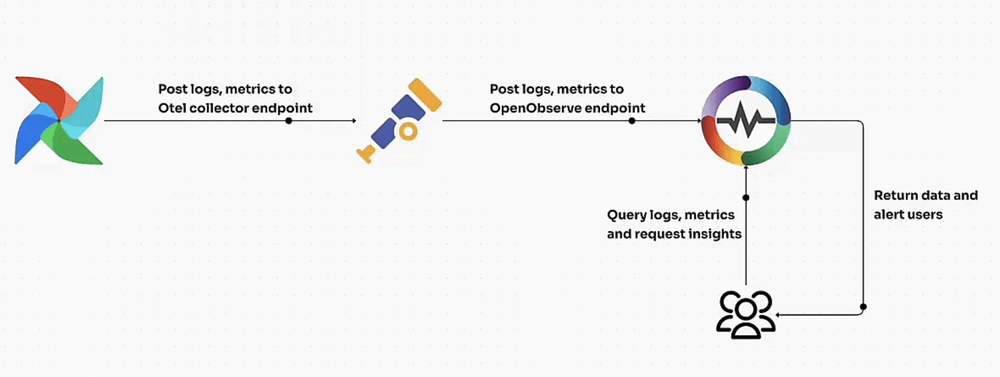
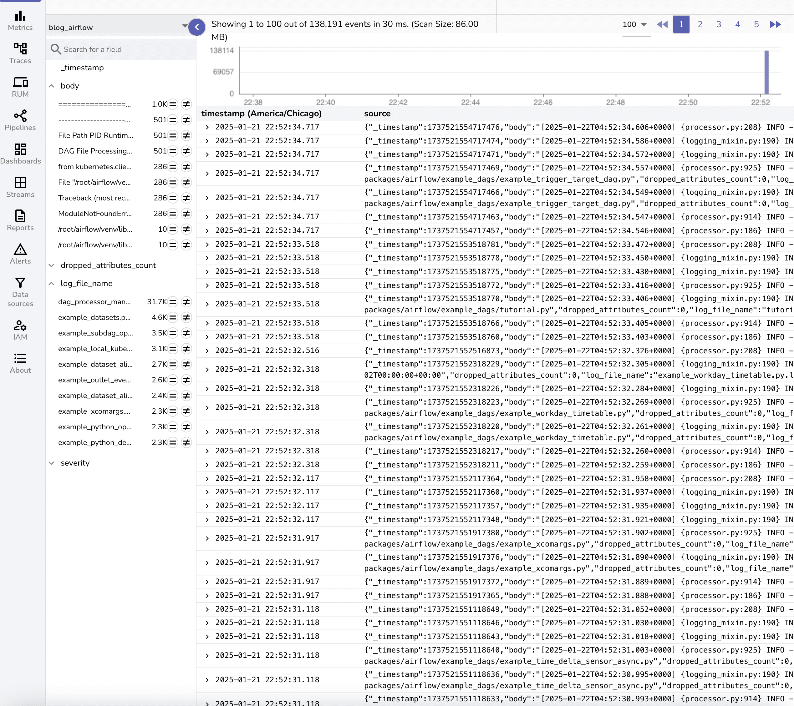

# Integration with Apache Airflow

This guide explains how to monitor **Apache Airflow** using the [OpenTelemetry Collector](https://opentelemetry.io/docs/collector/) (`otelcol`) and export logs, metrics, and traces to **OpenObserve** for visualization.

## Overview

Apache Airflow is a **workflow automation and orchestration tool** widely used for ETL pipelines, ML workflows, and data engineering tasks. Monitoring Airflow is critical for ensuring workflow reliability, debugging issues, and tracking system performance.
</br>

With OpenTelemetry and OpenObserve, you gain **real-time observability** into Airflow DAG runs, task execution, scheduler activity, and worker performance.



## Steps to Integrate

??? "Prerequisites"
    - OpenObserve account ([Cloud](https://cloud.openobserve.ai/web/) or [Self-Hosted](../../getting-started/#self-hosted-installation))
    - Apache Airflow installed and running
    - Basic understanding of Airflow configs (`airflow.cfg`)
    - OpenTelemetry Collector installed

??? "Step 1: Configure Airflow for OpenTelemetry"

    Edit `airflow.cfg` to enable OTel metrics:

    ```ini
    [metrics]
    otel_on = True
    otel_host = localhost
    otel_port = 4318
    ```

    Restart Airflow services after updating config:

    ```bash
    airflow db migrate
    airflow scheduler -D
    airflow webserver -D
    ```

??? "Step 2: Install OpenTelemetry Collector"

    1. Download and install the OTel Collector:
        ```bash
        wget https://github.com/open-telemetry/opentelemetry-collector-releases/releases/latest/download/otelcol-linux-amd64
        chmod +x otelcol-linux-amd64
        sudo mv otelcol-linux-amd64 /usr/local/bin/otelcol
        ```

    2. Verify installation:
        ```bash
        otelcol --version
        ```

??? "Step 3: Get OpenObserve Endpoint and Token"

    1. In OpenObserve: go to **Data Sources → Otel Collector**  
    2. Copy the **Ingestion URL** and **Access Token**  
    

??? "Step 4: Configure OpenTelemetry Collector"

    1. Create/edit config file:
        ```bash
        sudo vi /etc/otel-config.yaml
        ```

    2. Add Airflow configuration:
        ```yaml
        receivers:
          filelog/std:
            include:
              - /airflow/logs/*/*.log
              - /airflow/logs/scheduler/*/*/*/*.log
            start_at: beginning
          otlp:
            protocols:
              grpc:
              http:

        processors:
          batch:

        exporters:
          otlphttp/openobserve:
            endpoint: OPENOBSERVE_ENDPOINT
            headers:
              Authorization: "OPENOBSERVE_TOKEN"
              stream-name: airflow

        service:
          pipelines:
            metrics:
              receivers: [otlp]
              processors: [batch]
              exporters: [otlphttp/openobserve]
            logs:
              receivers: [filelog/std, otlp]
              processors: [batch]
              exporters: [otlphttp/openobserve]
            traces:
              receivers: [otlp]
              processors: [batch]
              exporters: [otlphttp/openobserve]
        ```

    Replace placeholders with your OpenObserve details:

    - `OPENOBSERVE_ENDPOINT` → API endpoint (e.g., `https://api.openobserve.ai`)
    - `OPENOBSERVE_TOKEN` → Access token

??? "Step 5: Start OpenTelemetry Collector"

    ```bash
    sudo systemctl start otel-collector
    sudo systemctl status otel-collector
    journalctl -u otel-collector -f
    ```

    > Check logs to confirm data is being sent to OpenObserve.

??? "Step 6: Visualize Logs in OpenObserve"

    1. Go to **Streams → airflow** in OpenObserve to query logs. Airflow logs collected include: DAG execution logs, Scheduler logs, Worker logs and Task execution logs
     
     
    

!!! tip "Prebuilt Dashboards"

    </br>
    [Prebuilt Airflow dashboards](https://github.com/openobserve/dashboards/tree/main/Airflow) are available. You can download the JSON file and import it.

## Troubleshooting

- **No Logs in OpenObserve**  

    - Ensure `filelog` receiver paths match your Airflow log directory.  
    - Verify Collector service is running.

- **Metrics Not Visible**  

    - Check `otel_on = True` in `airflow.cfg`.  
    - Confirm Airflow is sending metrics to `localhost:4318`.

- **Collector Fails to Start**  

    - Run dry check:
        ```bash
        otelcol --config /etc/otel-config.yaml --dry-run
        ```
    - Fix syntax or missing receivers.

