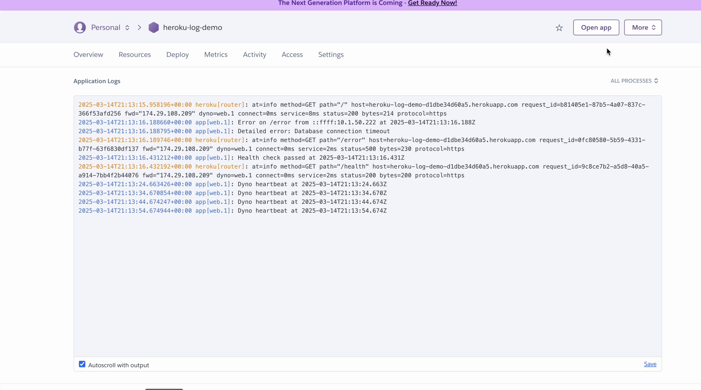

# Integration with Heroku Application Logs

This guide explains how to stream Heroku application logs—including app, router, error, and system logs—into OpenObserve using a forwarding app that parses Logplex syslogs into structured JSON.

## Overview

Heroku’s Logplex consolidates logs from your app (stdout/stderr), router (HTTP requests), and system events (dyno restarts). While convenient, it’s limited by retention length (1,500 lines or one week) and raw text format, which is hard to analyze.



OpenObserve ingests these logs in structured JSON format, enabling fast search, rich visualization, and proactive alerting.

## Steps to Integrate

??? "Prerequisites"
    - OpenObserve account ([Cloud](https://cloud.openobserve.ai/web/) or [Self-Hosted](../../../quickstart/#self-hosted-installation))
    - **An existing Heroku application** already deployed and generating logs
    - Heroku CLI installed and authenticated
    - Node.js, npm, Git, and terminal access

??? "Step 1: Retrieve OpenObserve Endpoint and Credentials"

    1. In OpenObserve: go to **Data Sources → Custom → Logs** → Syslog-NG section
     

    2. Keep the credentials handy.Construct the Heroku-specific ingestion endpoint:
        ```
        https://api.openobserve.ai/api/<organization_id>/<stream_name/_json
        ```

??? "Step 2: Build a Forwarding App to Parse and Send Logs"

    1. Initialize a new forwarding app:
        ```bash
        mkdir heroku-log-forwarder
        cd heroku-log-forwarder
        npm init -y
        npm install express body-parser node-fetch@2
        ```

    2. Create `index.js` and paste:

        ```javascript
        const express = require('express');
        const bodyParser = require('body-parser');
        const fetch = require('node-fetch');

        const app = express();
        app.use(bodyParser.text({ type: '*/*' }));

        const OPENOBSERVE_URL = 'https://api.openobserve.ai/api/<organization_id>/heroku_logs/_json';
        const OPENOBSERVE_USER = 'your-username@example.com';
        const OPENOBSERVE_PASS = 'your_password';

        const logRegex = /^(\d+) <\d+>1\s+([\d-:.+]+)\s+host\s+(\w+)\s+(\w+)\.(\d+)\s*-\s*(.*)$/;
        const routerRegex = /^(\d+) <\d+>1\s+([\d-:.+]+)\s+host\s+heroku\s+(\w+)\s*-\s+at=info\s+(.*)$/;

        app.post('/logs', async (req, res) => {
          const rawLogs = req.body.split('\n').filter(log => log.trim());
          const enriched = rawLogs.map(log => {
            let match = log.match(logRegex);
            if (match) {
              const [, , timestamp, source, dynoNum, dynoId, message] = match;
              return {
                app: "your-heroku-app-name",
                dyno: `${dynoNum}.${dynoId}`,
                message,
                source: source.toLowerCase(),
                timestamp
              };
            }
            match = log.match(routerRegex);
            if (match) {
              const [, , timestamp, source, details] = match;
              const params = details.split(' ').reduce((acc, pair) => {
                const [key, value] = pair.split('=');
                acc[key] = value.replace(/^"(.*)"$/, '$1');
                return acc;
              }, {});
              return {
                app: "your-heroku-app-name",
                dyno: params.dyno,
                message: details,
                source: source.toLowerCase(),
                timestamp,
                ...params
              };
            }
            console.warn(`Unparsed log: ${log}`);
            return { message: log, timestamp: new Date().toISOString() };
          });

          try {
            const resp = await fetch(OPENOBSERVE_URL, {
              method: 'POST',
              headers: {
                'Content-Type': 'application/json',
                'Authorization': `Basic ${Buffer.from(`${OPENOBSERVE_USER}:${OPENOBSERVE_PASS}`).toString('base64')}`
              },
              body: JSON.stringify(enriched)
            });
            if (!resp.ok) throw new Error(`Ingestion failed: ${resp.status}`);
            console.log(`Forwarded ${enriched.length} logs`);
            res.sendStatus(200);
          } catch (err) {
            console.error('Error forwarding logs:', err.message);
            res.status(500).send('Forwarding failed');
          }
        });

        app.listen(process.env.PORT || 3000, () => console.log(`Forwarder running on port ${process.env.PORT || 3000}`));
        ```

    3. Update placeholders (`<organization_id>`, credentials, and app name) accordingly
    4. Create a proc file `web: node index.js`
    5. Update `package.json` file:
        ```bash
        {
            "name": "heroku-log-forwarder",
            "version": "1.0.0",
            "main": "index.js",
            "scripts": {
                "start": "node index.js"
            },
            "dependencies": {
                "express": "^4.21.2",
                "body-parser": "^1.20.3",
                "node-fetch": "^2.6.7"
            }
        }
        ```

??? "Step 3: Deploy Forwarding App to Heroku and Configure Log Drain"

    1. Deploy the forwarding app:
        ```bash
        git init
        git add .
        git commit -m "Heroku log forwarder"
        heroku create heroku-log-forwarder
        git push heroku main
        ```

        Note the deployed URL (e.g., `https://heroku-log-forwarder.herokuapp.com`).

    2. Configure the log drain from your existing app:
        ```bash
        heroku drains:add "https://heroku-log-forwarder.herokuapp.com/logs" -a <your-heroku-app-name>
        ```
    3. Optionally, reduce sampling rate if you encounter buffer overflows:
        ```bash
        heroku drains:update --sampling-rate 25 <drain-id> -a <your-heroku-app-name>
        ```
    4. Verify drain setup:
        ```bash
        heroku drains -a <your-heroku-app-name>
        ``` 

??? "Step 4: Verify Logs in OpenObserve"

    1. In OpenObserve, go to **Logs → heroku_logs** and run a query to see structured entries.

    

## Troubleshooting

??? "**No logs or some log types missing**"
    - Check Heroku app logs (More → View logs) to confirm log generation (Router, App, Error types)
    - Confirm the drain is active:
        ```bash
        heroku drains -a <your-heroku-app-name>
        ```
    - Tail your forwarder logs for warnings or errors

??? "**Buffer overflow (Error L10)**"
    - Reduce sampling rate:
        ```bash
        heroku drains:update --sampling-rate 10 <drain-id> -a <your-heroku-app-name>
        ```

??? "**Unparsed logs**"
    - Review `Unparsed log` warnings in forwarder logs
    - Adjust regex patterns in `index.js`

??? "**Truncated logs**"
    - Heroku truncates lines >10 KB. Simplify log message content in forwarding app and redeploy

??? "**Slow log delivery**"
    - Increase heartbeat interval in `index.js` or reduce traffic volume
