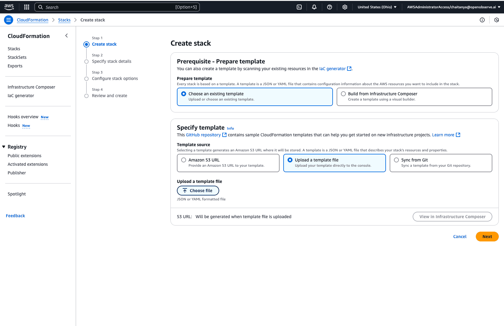

# Integration with AWS Application Load Balancer

This guide provides step-by-step instructions to integrate AWS Application Load Balancer (ALB) with OpenObserve.

## Overview

Ingest ALB access logs into OpenObserve for monitoring and troubleshooting. ALB access logs provide details such as client IPs, request paths, status codes, and processing times. Forwarding these logs to OpenObserve lets you store, search, and visualize ALB traffic to analyze usage, performance, and issues.


## Integration Options

You can integrate ALB logs with OpenObserve in **two ways**:

1. **Manually using Console**: good for testing, learning, small environments
2. **Automated Setup with CloudFormation**: best for repeatable, production-ready deployments


## Manually using Console
Use this flow if you want to get started step-by-step using the AWS Console.


??? "Prerequisites"
    - AWS account with an Application Load Balancer configured and serving traffic
    - S3 bucket for storing ALB logs
    - IAM permissions to configure ALB logging and bucket policies
    - OpenObserve account with valid API credentials
    - Lambda execution role with `s3:GetObject` and `s3:ListBucket` permissions


??? "Step 1: Enable ALB Access Logs"

    1. In the AWS Console, open **EC2 → Load Balancers**.
    2. Select your ALB → **Description → Edit attributes**.
    3. Enable **Access logs** and **Connection Logs**, enter your S3 bucket name, add a prefix if needed, and save.

    

??? "Step 2: Verify Logs in S3"

    1. Send traffic through your ALB (e.g., use `curl` on your ALB DNS name).
    2. In your **S3 bucket**, confirm that `.log.gz` files appear under the prefix.

    


??? "Step 3: Deploy a Lambda to Forward Logs"

    1. Use a Python handler that:

        - Reads the `.log.gz` from S3
        - Parses ALB log lines
        - POSTs JSON logs to your OpenObserve stream

        Example:
        ```python
        import boto3, gzip, urllib.parse, base64, requests

        s3 = boto3.client('s3')

        OPENOBSERVE_URL = 'https://<your-openobserve>/api/<org>/<stream>/_json'
        OPENOBSERVE_USER = 'your_username'
        OPENOBSERVE_PASS = 'your_password'

        def parse_alb_line(line):
            parts = line.split()
            if len(parts) < 12:
                return None
            return {
                "type": parts[0],
                "time": parts[1],
                "elb": parts[2],
                "client_ip": parts[3],
                "target_ip": parts[4],
                "request_processing_time": parts[5],
                "backend_processing_time": parts[6],
                "response_processing_time": parts[7],
                "elb_status_code": parts[8],
                "backend_status_code": parts[9],
                "received_bytes": parts[10],
                "sent_bytes": parts[11],
            }

        def lambda_handler(event, context):
            for record in event['Records']:
                bucket = record['s3']['bucket']['name']
                key = urllib.parse.unquote_plus(record['s3']['object']['key'])
                obj = s3.get_object(Bucket=bucket, Key=key)
                bytestream = obj['Body'].read()
                lines = gzip.decompress(bytestream).decode('utf-8').splitlines()

                logs = [parse_alb_line(l) for l in lines if parse_alb_line(l)]

                if logs:
                    auth = base64.b64encode(f"{OPENOBSERVE_USER}:{OPENOBSERVE_PASS}".encode()).decode()
                    headers = {"Authorization": f"Basic {auth}", "Content-Type": "application/json"}
                    r = requests.post(OPENOBSERVE_URL, headers=headers, json=logs)
                    print(f"Sent logs → Status: {r.status_code} Response: {r.text}")
        ```
    

    > The Python runtime **does not include `requests`**, you must package it. If using local OpenObserve, expose with `ngrok` or run on a public IP.

??? "Step 4: Attach an S3 Trigger in Lambda"

    - In Lambda, go to **Triggers → Add trigger**.
    - Select **S3**, pick your bucket.
    - Set **Event type** to **All object create events**.
    - (Optional) Add a prefix filter.
    - Click **Add**.

    

??? "Step 5: Verify"

    - In OpenObserve → Logs → filter your stream → logs should appear.

    


??? "Troubleshooting"

    **No logs in S3**

    * Confirm ALB logging is enabled.
    * Check the bucket policy.

    **Lambda permission error (`AccessDenied`)**

    * Add `s3:GetObject` + `s3:ListBucket` to your Lambda role.

    **`ImportModuleError: requests`**

    * Package `requests` in your `.zip`. Don’t use the inline editor.

    **`401 Unauthorized`**

    * Double-check OpenObserve username.
    * Verify Basic Auth: `username:password`.
    * Use `curl -u` to confirm credentials.
    * Make sure your OpenObserve is reachable from Lambda (not `localhost`).

## Automated Setup using CloudFormation

Use this option to automatically deploy the entire ALB → S3 → Lambda → OpenObserve pipeline using AWS CloudFormation.


??? "Step 1: Download the CloudFormation Template"

    - Download the prebuilt CloudFormation template from:
      [https://github.com/openobserve/cloudformation-templates/blob/main/aws_alb/alb.yaml](https://github.com/openobserve/cloudformation-templates/blob/main/aws_alb/alb.yaml)


??? "Step 2: Configure CloudFormation with Parameters"

    - In AWS Console → **CloudFormation** → **Create stack → With new resources (standard)**.
            
        

    - Upload the `alb.yaml` template.
    - Enter required parameters:

        - **ALB name**
        - **Target S3 bucket**
        - **IAM role**
        - **OpenObserve credentials** (username/password or token)
        - **ELBAccountId** 
            
    - Click **Next** → keep defaults → **Create stack**.


??? "Step 3: Validate the CloudFormation Deployment"

    - Once the stack is deployed, check the **CloudFormation Stacks** page and confirm the status is **CREATE_COMPLETE**.
    - Go to **S3** → verify the bucket was created.
    - Go to **Lambda** → verify the function exists.

    

??? "Step 4: Enable Monitoring in AWS ALB"

    - In AWS Console, go to **EC2 → Load Balancers**.
    - Select your ALB → **Edit attributes** 
    - Enable **Access Logs / Connection Logs**.
    - Pick the S3 bucket created by CloudFormation.
    - Add your chosen prefix and save the changes

        


??? "Step 5: Verify Logs in OpenObserve"

    - Go to **OpenObserve → Logs → your ALB stream → Run Query** to see ingested logs.

    

??? "Trobubleshooting"

    **CloudFormation stack failed or stuck**

    - Check the **Events** tab for detailed error messages.
    - Common causes: bad IAM role, missing required parameters, invalid bucket names.
    - Fix the issue → update or redeploy the stack.

    **No logs in OpenObserve**

    - check Lambda logs, permissions, and OpenObserve credentials.