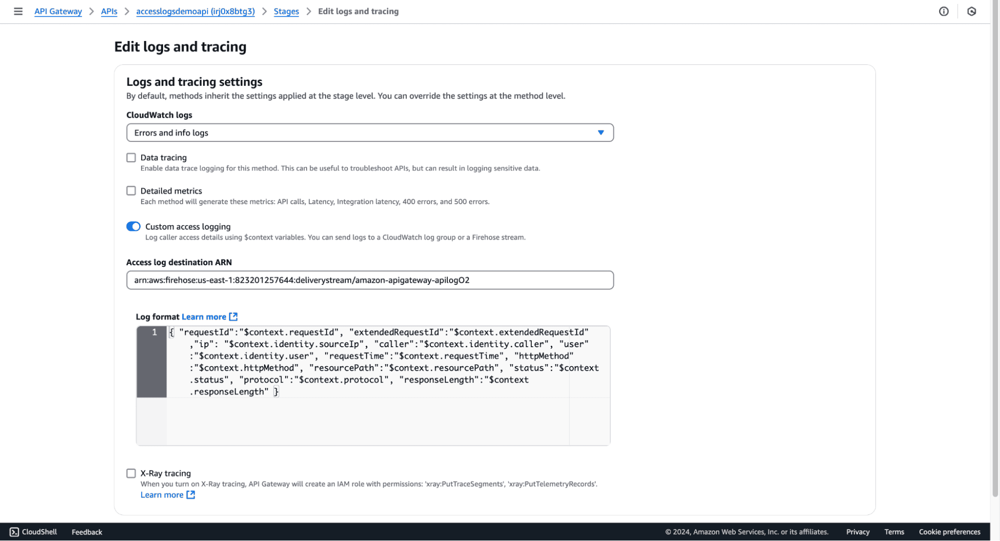
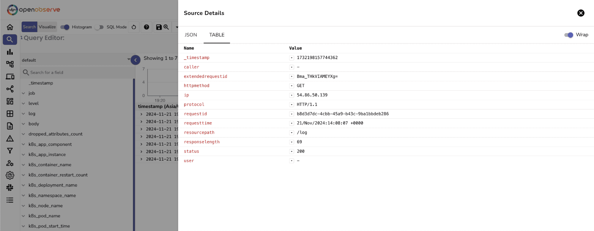

# Integration with API Gateway Access Logs via Kinesis Firehose

This guide explains how to stream AWS API Gateway access logs into OpenObserve using Amazon Kinesis Data Firehose and the HTTP endpoint ingestion method.

## Overview

API Gateway can send access logs directly to a Kinesis Firehose delivery stream. OpenObserve ingests these logs in real-time via an HTTP endpoint, allowing you to monitor API request rates, status codes, latency, and failure patterns.


## Steps to Integrate

??? "Prerequisites"
    - OpenObserve account ([Cloud](https://cloud.openobserve.ai/web/) or [Self-Hosted](../../../quickstart/#self-hosted-installation))
    - AWS API Gateway already configured
    - IAM permissions to manage API Gateway, Firehose, and roles
    - An S3 bucket for Firehose backup (optional but recommended)

??? "Step 1: Get OpenObserve Ingestion URL and Access Key"

    1. In OpenObserve: go to **Data Sources → Recommended → AWS**
    2. Copy the ingestion URL and Access Key

    

    > Update the URL to include your desired stream name:
    ```
    https://<your-openobserve-domain>/aws/default/<stream_name>/_kinesis_firehose
    ```

??? "Step 2: Create Kinesis Firehose Delivery Stream"

    1. Go to **Amazon Kinesis → Firehose → Create delivery stream**
    2. Choose:
        - **Source**: `Direct PUT`
        - **Destination**: `HTTP Endpoint`
    3. Provide:
        - **HTTP Endpoint URL**: the OpenObserve Firehose ingestion URL
        - **Access Key / Secret Key**: from OpenObserve
    4. Optional: Configure backup to an S3 bucket (recommended)
    5. Give it a name and complete creation of the stream

??? "Step 3: Enable Access Logging in API Gateway"

    1. Go to your API → **Stages → [Stage Name] → Logs/Tracing**
    2. Select **Error and Info logs** (collects all events) and Enable: **Custom Access Logging**
    3. Set **Log Destination ARN**: paste the ARN of the Firehose stream
    4. Set **Log Format**, for example:
        ```
        RequestId: $context.requestId, SourceIP: $context.identity.sourceIp, Method: $context.httpMethod, ResourcePath: $context.resourcePath, StatusCode: $context.status, ResponseLength: $context.responseLength, RequestTime: $context.requestTime
        ```
    5. Save changes

        


??? "Step 4: Generate API Traffic (Optional)" 

    Use curl, Postman, or your app to trigger API requests:

??? "Step 5: Verify Logs in OpenObserve"

    1. Go to **Logs** in Openobserve → select **stream** → set **time range** → **Run Query** to check for EC2 logs.

    

??? "Troubleshooting"

    **No logs?**
    
    - Confirm IAM role is attached and has correct permissions
    - Verify the log format and destination ARN in API Gateway
    - Check the Firehose delivery stream status for delivery failures
    - Inspect your S3 bucket for failed log records
    - Confirm the OpenObserve URL and credentials are valid

