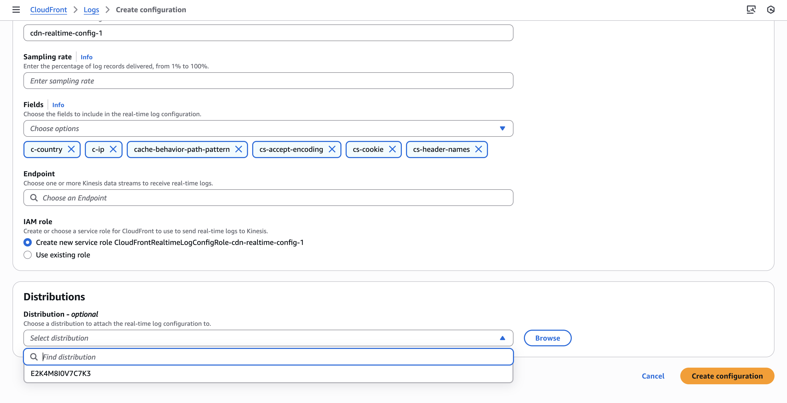

# Integration with Amazon CloudFront Logs

This guide explains how to ingest Amazon CloudFront access logs into OpenObserve using Amazon Kinesis Data Streams and Kinesis Firehose.

## Overview

CloudFront access logs contain detailed request-level data. By streaming them to OpenObserve, you can monitor CDN performance, detect anomalies, and build custom dashboards in real time.

## Steps to Integrate

??? "Prerequisites"
    - OpenObserve account ([Cloud](https://cloud.openobserve.ai/web/) or [Self-Hosted](../../../getting-started/#self-hosted-installation))
    - Amazon CloudFront distribution
    - S3 bucket to store CloudFront logs
    - IAM role with necessary permissions
    - AWS Kinesis Data Stream and Firehose access

??? "Step 1: Get OpenObserve Ingestion URL and Access Key"

    1. In OpenObserve: go to **Data Sources → Recommended → AWS**
    2. Copy the ingestion URL and Access Key

    
    
    > Update the URL to have the stream name of your choice:
        ```
        https://<your-openobserve-domain>/aws/default/<stream_name>/_kinesis_firehose
        ```

??? "Step 2: Create a Kinesis Data Stream"

    1. Navigate to **Kinesis → Data streams → Create data stream**
    2. Enter stream name: `cloudfront-stream`
    3. Choose number of shards (default 1 is fine for most use cases)
    4. Click **Create data stream**

??? "Step 3: Enable Real-Time Log Configuration in CloudFront"

    1. Go to **CloudFront → Telemetry → Logs → Real-time log configurations → Create configuration**
    2. Set configuration name: e.g., `cloudfront-realtime-logs`
    3. Choose fields to include in the logs, such as:
        - `timestamp`, `c-ip`, `cs-uri-stem`, `sc-status`, `cs(User-Agent)` (and others as needed)
    4. Set sampling rate: e.g., `100` (for 100% of requests)
    5. Select the **Kinesis data stream** created earlier as Endpoint
    6. Select the cloudfront distribution to which you want to apply this configuration
    7. Create the real-time log configuration

    

??? "Step 4: Create a Firehose Delivery Stream to OpenObserve"

    1. Go to **Kinesis → Delivery streams → Create delivery stream**
    2. Choose:
        - Source: `Kinesis Data Stream`
        - Stream name: the stream created in step 2
        - Destination: `HTTP Endpoint`
    3. In HTTP endpoint settings, provide OpenObserve's HTTP Endpoint URL and Access Key, and set an S3 backup bucket.
    4. Give the stream a meaningful name and Click **Create delivery stream**

??? "Step 5: Verify Logs in OpenObserve"

    1. Go to **Logs** → select your log stream → Set time range → Click **Run Query**
    

??? "Troubleshooting"

    **No logs visible?**
    
    - Check Firehose delivery status
    - Verify OpenObserve ingestion URL and access key
    - Check S3 backup for failed logs
