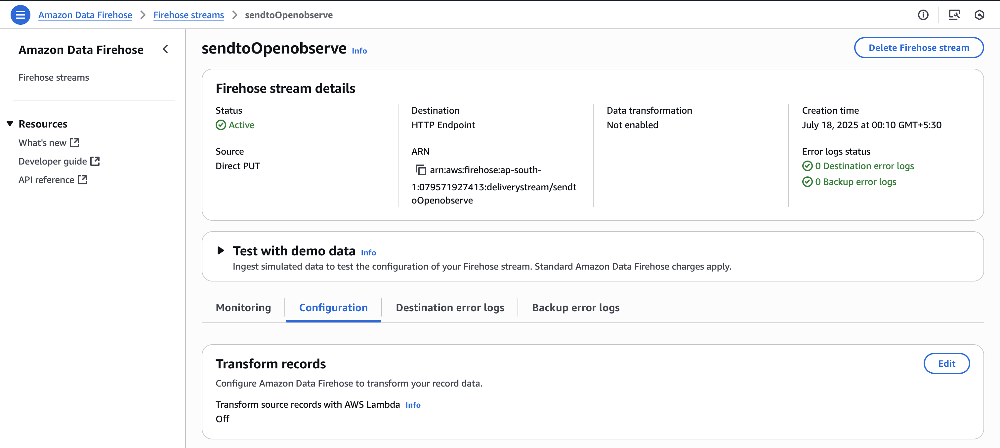
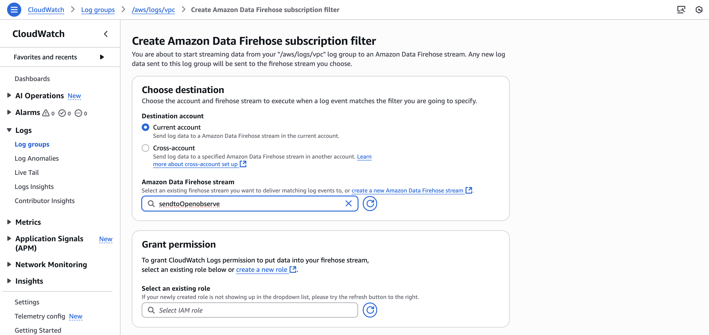
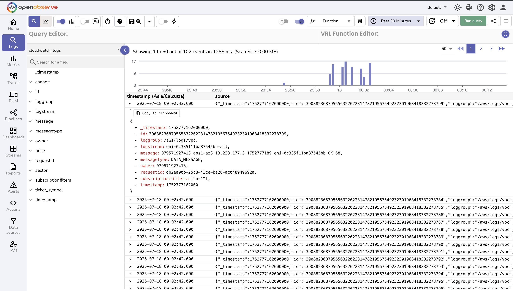

# Integration with AWS CloudWatch Logs

This guide explains how to *stream logs from AWS CloudWatch* to OpenObserve using Kinesis Firehose with an HTTP endpoint.

## Overview

Forward application or infrastructure logs from CloudWatch Logs to OpenObserve in near real-time.  
The integration uses **CloudWatch Logs subscriptions** to stream log data into **Kinesis Firehose**, which then delivers it to **OpenObserve over HTTP**.

This approach enables centralized log analysis, alerting, and visualization in OpenObserve without storing logs in S3 or managing Lambda transformations.

## Steps to Integrate

??? "Prerequisites"
    - OpenObserve account ([Cloud](https://cloud.openobserve.ai/web/) or [Self-Hosted](../../../getting-started/#self-hosted-installation))
    - AWS account with:
        - CloudWatch Log Group(s)
        - IAM permissions to create Firehose streams and set up log subscriptions

??? "Step 1: Get OpenObserve Ingestion URL and Access Key"

    1. In OpenObserve: go to **Data Sources → Recommended → AWS**
    2. Copy the ingestion HTTP URL and Access Key

        

    > Example format:
    > ```
    > https://<your-openobserve-domain>/aws/default/cloudwatch-logs/_kinesis_firehose
    > ```


??? "Step 2: Create a Kinesis Firehose Delivery Stream"

    1. In AWS Kinesis Firehose, Create delivery stream.
    2. Set Source: `Direct PUT` and Destination: `HTTP Endpoint`.
    3. Provide OpenObserve's HTTP Endpoint URL and Access Key, and set an S3 backup bucket.
    4. Give the stream a meaningful name and Create it.

        

??? "Step 3: Attach CloudWatch Logs to Firehose"

    1. Go to **CloudWatch → Log Groups**
    2. Select the log group you want to stream
    3. Click **Actions → Create subscription filter**
    4. Choose:
        - **Destination**: `Kinesis Firehose`
        - **Delivery stream**: the stream created in Step 2
    5. Set a filter pattern (e.g., `""` to send all logs)
    6. Click **Start streaming**

        

??? "Step 4: Verify Logs in OpenObserve"

    1. Go to **Logs** → select your log stream → Set time range → Click **Run Query**

        

??? "Troubleshooting"

    **Not seeing logs in OpenObserve?**
    
    Check the following:

    - **CloudWatch Logs**  
        - Ensure log events are being generated and the correct log group is selected.  
        - Verify that the subscription filter is active.
    - **Firehose**  
        - Confirm the delivery stream is active and not reporting errors.  
        - Review the Monitoring tab for delivery status.  
        - Check the backup S3 bucket (if configured) for failed records.
    - **OpenObserve**  
        - Validate the HTTP ingestion URL and access key.  
        - In the Logs view, select the correct stream and expand the time range.

    **Start Streaming Fails after creating Subscription Filter**

    Check the IAM role attached to the filter has full acess to Kinesis Firehose.