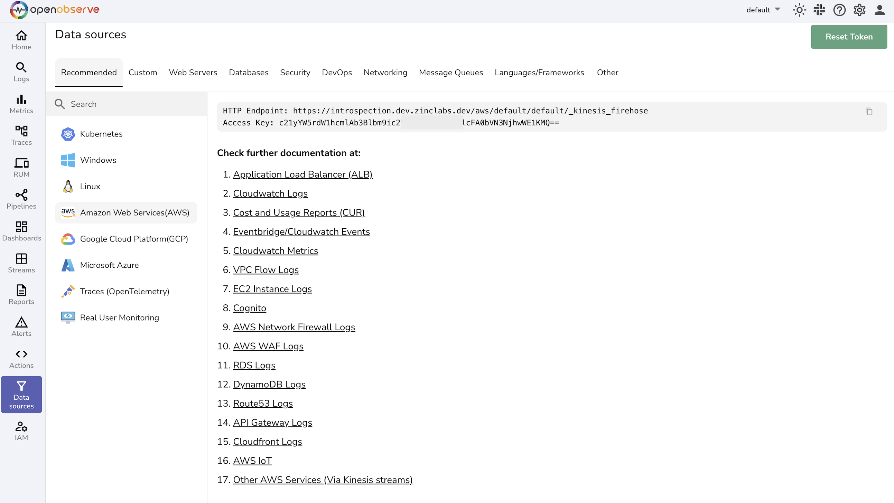
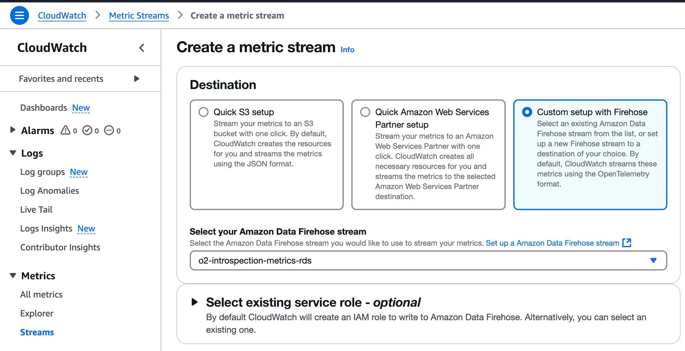

# Integration with AWS CloudWatch Metrics via Metric Stream

This guide explains how to stream AWS CloudWatch metrics (e.g., EC2, RDS, Lambda) into OpenObserve using CloudWatch Metric Streams and Kinesis Data Streams.

## Overview

CloudWatch Metric Streams allow efficient, near real-time delivery of metrics to a Kinesis Data Stream. OpenObserve pulls these metrics via an HTTP endpoint, enabling unified, real-time observability across your AWS infrastructure and applications.

## Steps to Integrate

??? "Prerequisites"
    - OpenObserve account ([Cloud](https://cloud.openobserve.ai/web/) or[Self-Hosted](../../../getting-started/#self-hosted-installation))
    - AWS IAM permissions for:
        - CloudWatch: `ListMetrics`, `GetMetricData`, `GetMetricStatistics`
        - Kinesis Data Streams: `CreateStream`, `PutRecord`
    - OpenObserve ingestion URL and Access Key

??? "Step 1: Get OpenObserve Ingestion URL and Access Key"

    1. In OpenObserve: go to **Data Sources → Recommended → AWS**
    2. Copy the ingestion HTTP URL and Access Key

        

    > Example format:
    > ```
    > https://<your-openobserve-domain>/aws/default/cloudwatch-logs/_kinesis_firehose
    > ```

??? "Step 2: Create a Kinesis Firehose Delivery Stream"

    1. In AWS Kinesis Firehose, Create delivery stream.
    2. Set Source: `Direct PUT` and Destination: `HTTP Endpoint`.
    3. Provide OpenObserve's HTTP Endpoint URL and Access Key, and set an S3 backup bucket.
    4. Give the stream a meaningful name and Create it.

    {: style="height:800px"}

??? "Step 3: Create CloudWatch Metric Stream"

    1. Navigate to **CloudWatch → Metric Streams → Create**
    2. Choose **Custom** setup
        
    3. For **Destination**, select **Kinesis Data Stream** → Select your newly created stream
    4. Choose AWS namespaces to monitor (e.g., `AWS/EC2`, `AWS/RDS`, `AWS/Lambda`)
    5. Optional: Filter specific metrics
    6. Name your stream and click **Create Stream**

    {: style="height:500px"}


??? "Step 4: Verify Metrics in OpenObserve"

    1. Go to **Logs** → select your stream → Set time range → Click **Run Query**

    

??? "Troubleshooting"

    **No metrics appearing?**
    
    - Confirm Kinesis Data Stream exists and is active
    - Verify Metric Stream configuration in CloudWatch
    - Check IAM permissions for CloudWatch and Kinesis
    - Validate ingestion URL and Access Key in OpenObserve

