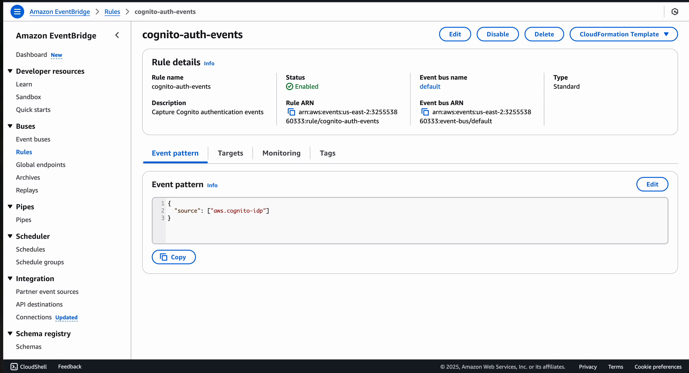
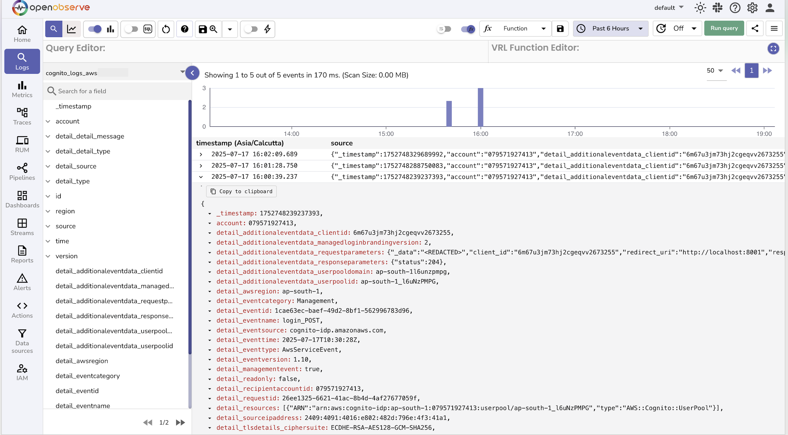

---

title: AWS Cognito Logs Integration Guide
description: Stream AWS Cognito authentication events to OpenObserve using CloudTrail, EventBridge, and Kinesis Firehose.

---

# Integration with AWS Cognito

This guide explains how to *stream* AWS Cognito authentication events to OpenObserve using Amazon CloudTrail, EventBridge, and Kinesis Firehose.

## Overview

Monitor login attempts, user activity, and authentication behavior from Amazon Cognito by streaming events into OpenObserve for analysis. This integration uses CloudTrail to capture Cognito API calls, EventBridge to route events, and Firehose to deliver them to OpenObserve.

## Steps to Integrate

??? "Prerequisites"
    - OpenObserve account ([Cloud](https://cloud.openobserve.ai/web/) or [Self-Hosted](../../../getting-started/#self-hosted-installation))
    - AWS account with:
        - Cognito User Pool
        - Permissions to create EventBridge rules and Firehose streams

??? "Step 1: Enable CloudTrail Management Events"

    1. Go to **AWS CloudTrail → Trails**
    2. Ensure you have a trail that logs **management events**
    3. If not:
        - Click **Create trail**
        - Name it (e.g., `CognitoTrail`)
        - Enable **Management events** (Read/Write or Write-only)
        - Choose a destination S3 bucket (new or existing)
        - Complete trail creation

??? "Step 2: Get OpenObserve Ingestion URL and Access Key"

    1. In OpenObserve: go to **Data Sources → Recommended → AWS**
    2. Copy the ingestion URL and Access Key

    

    > Update the URL to have the stream name of your choice:
    > ```
    > https://<your-openobserve-domain>/aws/default/<stream_name>/_kinesis_firehose
    > ```


??? "Step 3: Create Firehose Delivery Stream"

    1. In AWS Kinesis Firehose, Create delivery stream with Source: `Direct PUT` and Destination: `HTTP Endpoint`.
    2. Provide OpenObserve's HTTP Endpoint URL and Access Key, and set an S3 backup bucket.
    3. Give the stream a meaningful name and Create it.

??? "Step 4: Create EventBridge Rule to Capture Cognito Events"

    1. Go to **EventBridge > Rules** and click **Create rule**
    2. Name the rule (e.g., `CognitoToOpenObserve`)
    3. Set event pattern:
    ```json
    {
        "source": ["aws.cognito-idp"]
    }
    ```
    4. Set the target to **Kinesis Firehose** and choose the delivery stream
    5. Click **Create rule**

    


??? "Step 5: Verify Logs in OpenObserve"

    1. Go to **Logs** → select your log stream → Set time range → Click **Run Query**

    

??? "Troubleshooting"


    **No logs appearing?**

    - Ensure your CloudTrail is capturing **management events**
    - Confirm your EventBridge rule has **matched events** recently
    - Check if Firehose is delivering logs (see monitoring tab in Firehose)
    - Verify that the OpenObserve URL and Access Key are valid
    - Look for failed logs in your backup S3 bucket

