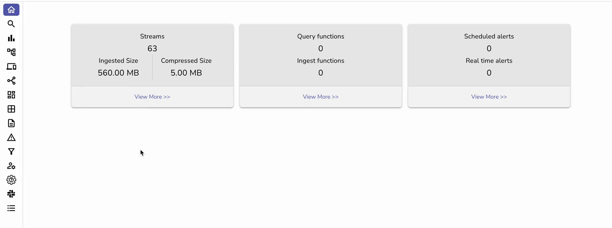
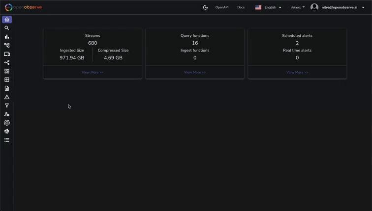

# Integration with AWS EC2
This guide provides step-by-step instructions to integrate AWS EC2 with OpenObserve.


## Overview
Stream system metrics and logs from EC2 Linux instances to OpenObserve using the OpenObserve Collector (based on OpenTelemetry).


## Steps to Integrate


??? "Prerequisites"
      - OpenObserve account ([Cloud](https://cloud.openobserve.ai/web/) or [Self-Hosted](../../../quickstart/#self-hosted-installation))
      - AWS EC2 Linux instance with SSH access


??? "Step 1: Connect to EC2 Instance"

      ```bash
      chmod 400 "your-key.pem"
      ssh -i /path/to/your-key.pem ec2-user@your-instance-public-dns
      ```


??? "Step 2: Install OpenObserve Collector"


      1. In OpenObserve: Data Sources → Linux → Copy curl command
      2. Execute the command on your EC2 instance.


      


??? "Step 3: Configure the OpenTelemetry Collector"


      The OpenObserve Collector is pre-configured during installation, but you can customize it for your specific needs.


      1. View the current configuration:
      ```bash
      sudo nano /etc/otel-collector/config.yaml
      ```
      2. To include additional log files, modify the `filelog` receiver:
      ```yaml
      filelog:
      include: ["/var/log/*.log", "/path/to/your/custom/app.log"]
      ```
      3. Restart the collector:
      ```bash
      sudo systemctl restart otel-collector
      ```


??? "Step 4: Generate Test Data (Optional)"


      Run `stress-ng` or `logger` to create test metrics and logs if needed:
      ```bash
      stress-ng --cpu 2 --timeout 60s
      logger "Test log message"
      ```


??? "Step 5: Verify Ingestion"


      **Logs**:
   
      Go to **Logs** in Openobserve → select **stream** → set **time range** → **Run Query** to check for EC2 logs.


      


      **Metrics**


      Go to **Metrics** in Openobserve → select **stream** → set **time range** → **Run Query** to check for EC2 metrics.


??? "Troubleshooting"


      **Otel Misconfiguration Issues**


      - If you're not seeing logs or metrics in OpenObserve, check the collector logs for errors:


      ```bash
      sudo journalctl -u otel-collector -f | grep Error
      ```


      - Look for issues such as misconfigurations, permission problems, or connectivity errors.


      **File Permission Issues**


      The collector may encounter "permission denied" errors when trying to access specific system logs:


      - Check the permissions of the log files: `sudo ls -l /var/log/`
      - If you see permission issues, update the permissions:
      ```bash
      # Adjust permissions for specific log files
      sudo chmod 644 /var/log/cloud-init.log /var/log/cloud-init-output.log /var/log/tallylog
      ```


      **Restart the Collector Service**


      - After making configuration changes or adjusting file permissions, restart the collector: `sudo systemctl restart otel-collector`
      - Verify that the collector is running without issues: `sudo systemctl status otel-collector`


      **No Data Appearing in OpenObserve**


      - Verify that the OpenObserve endpoint and authentication token are correct in the configuration file.
      - Check that the EC2 instance has internet connectivity to reach the OpenObserve API.
      - Ensure the collector service is running and not reporting any errors in the logs.
      - Verify that the log files specified in the configuration exist and are readable by the collector.
